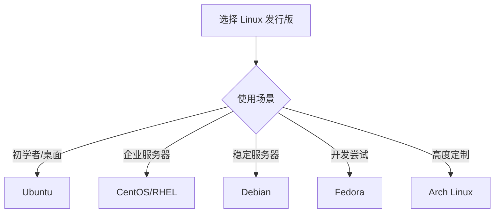

# Linux 操作系统

欢迎来到 Linux 完整学习指南！Linux 是一个开源的、强大的操作系统，广泛应用于服务器、开发环境和嵌入式系统。

## 🐧 什么是 Linux

Linux 是一个类 Unix 的操作系统内核，由 Linus Torvalds 于 1991 年创建。配合 GNU 工具和其他组件，形成了完整的操作系统（通常称为 GNU/Linux）。

### 核心特性

- **开源免费** - 源代码完全开放
- **稳定可靠** - 高稳定性和安全性
- **多用户多任务** - 支持多用户同时工作
- **强大的命令行** - 灵活高效的 Shell
- **广泛的应用** - 服务器、云计算、嵌入式设备

## 📊 Linux 发行版

### 主流发行版

| 发行版 | 特点 | 适用场景 |
|--------|------|----------|
| Ubuntu | 易用、社区活跃 | 桌面、服务器、初学者 |
| CentOS/RHEL | 稳定、企业级 | 企业服务器 |
| Debian | 稳定、纯粹 | 服务器、高级用户 |
| Fedora | 新技术、快速更新 | 开发者、尝鲜 |
| Arch Linux | 滚动更新、定制性强 | 高级用户 |

### 选择建议



## 📚 学习内容

### 基础知识

- **[基础命令](./basic-commands)** - 文件操作、目录管理、文本处理
- **[文件系统](./file-system)** - 目录结构、文件类型、挂载管理
- **[权限管理](./permissions)** - 用户权限、文件权限、ACL

### 系统管理

- **[进程管理](./process-management)** - 进程控制、任务调度、系统监控
- **[用户和组](./users-groups)** - 用户管理、组管理、sudo 配置
- **[系统管理](./system-admin)** - 服务管理、日志查看、系统优化

### 高级主题

- **[网络配置](./networking)** - 网络设置、防火墙、SSH
- **[Shell 脚本](./shell-scripting)** - Bash 编程、脚本自动化

## 🚀 快速开始

### 连接到 Linux 系统

```bash
# SSH 连接远程服务器
ssh username@hostname

# 使用密钥连接
ssh -i ~/.ssh/id_rsa username@hostname
```

### 第一个命令

```bash
# 查看当前目录
pwd

# 列出文件
ls -la

# 查看系统信息
uname -a

# 查看发行版信息
cat /etc/os-release
```

### 获取帮助

```bash
# 使用 man 手册
man ls

# 使用 --help 选项
ls --help

# 使用 info 命令
info coreutils
```

## 🎯 Linux 文件系统结构

```
/
├── bin/       # 基本命令二进制文件
├── boot/      # 启动文件
├── dev/       # 设备文件
├── etc/       # 系统配置文件
├── home/      # 用户主目录
├── lib/       # 系统库文件
├── media/     # 可移动媒体挂载点
├── mnt/       # 临时挂载点
├── opt/       # 可选应用程序
├── proc/      # 进程信息（虚拟文件系统）
├── root/      # root 用户主目录
├── sbin/      # 系统管理命令
├── tmp/       # 临时文件
├── usr/       # 用户程序
└── var/       # 可变数据
```

## 💡 核心概念

### 一切皆文件

在 Linux 中，一切都被视为文件：

- 普通文件
- 目录（特殊文件）
- 设备（如 /dev/sda）
- 进程（如 /proc/1234）
- 网络连接

### Shell 环境

```bash
# 查看当前 Shell
echo $SHELL

# 查看环境变量
env

# 设置环境变量
export PATH=$PATH:/new/path
```

### 管道和重定向

```bash
# 管道：将一个命令的输出作为另一个命令的输入
ls -l | grep ".txt"

# 输出重定向
echo "Hello" > file.txt      # 覆盖
echo "World" >> file.txt     # 追加

# 输入重定向
sort < input.txt

# 错误重定向
command 2> error.log
command &> all.log           # 标准输出和错误都重定向
```

## 🛠️ 常用工具

### 包管理器

```bash
# Ubuntu/Debian
apt update              # 更新软件包列表
apt install package     # 安装软件包
apt remove package      # 删除软件包
apt search keyword      # 搜索软件包

# CentOS/RHEL
yum install package
yum update
yum remove package

# Fedora (新版)
dnf install package
```

### 文本编辑器

- **vim/vi** - 强大的命令行编辑器
- **nano** - 简单易用的编辑器
- **emacs** - 功能丰富的编辑器

```bash
# Vim 基本操作
vim filename
# i - 进入插入模式
# Esc - 退出插入模式
# :w - 保存
# :q - 退出
# :wq - 保存并退出
```

## 📖 学习路径

### 初级用户

1. 熟悉基本命令（cd、ls、cp、mv、rm）
2. 理解文件系统结构
3. 掌握文件权限概念
4. 学会使用文本编辑器

### 中级用户

1. 进程管理和监控
2. 用户和组管理
3. 软件包管理
4. 基础 Shell 脚本
5. 网络配置

### 高级用户

1. 系统性能调优
2. 高级 Shell 脚本
3. 自动化部署
4. 内核参数调整
5. 安全加固

## 🔗 学习资源

- [Linux 命令大全](https://man.linuxde.net/)
- [The Linux Documentation Project](https://tldp.org/)
- [ArchWiki](https://wiki.archlinux.org/)
- [Ubuntu 文档](https://help.ubuntu.com/)

## ⚡ 最佳实践

### 1. 安全习惯

```bash
# 不要以 root 身份运行日常任务
# 使用 sudo 执行需要权限的操作
sudo command

# 定期更新系统
sudo apt update && sudo apt upgrade

# 使用 SSH 密钥而非密码
```

### 2. 备份重要数据

```bash
# 使用 rsync 备份
rsync -av --delete /source/ /backup/

# 使用 tar 创建归档
tar -czf backup.tar.gz /path/to/backup
```

### 3. 使用版本控制

```bash
# 配置文件使用 Git 管理
git init
git add .
git commit -m "Initial config"
```

## 🎓 学习提示

- **多实践** - 在虚拟机或云服务器上练习
- **阅读手册** - 善用 `man` 和 `--help`
- **理解原理** - 不只是记命令，理解背后的原理
- **保持耐心** - Linux 学习曲线陡峭但值得

开始你的 Linux 学习之旅吧！🐧
