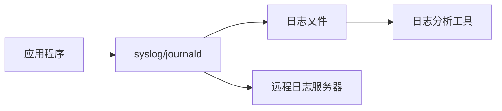

# Linux 日志管理

日志是系统运维和故障排查的重要依据，理解日志系统对于系统管理至关重要。

## 日志系统概述

### 日志架构



### 日志级别

| 级别    | 值  | 说明 | 用途             |
| ------- | --- | ---- | ---------------- |
| emerg   | 0   | 紧急 | 系统不可用       |
| alert   | 1   | 警报 | 必须立即采取行动 |
| crit    | 2   | 严重 | 严重错误         |
| err     | 3   | 错误 | 错误条件         |
| warning | 4   | 警告 | 警告条件         |
| notice  | 5   | 注意 | 正常但重要       |
| info    | 6   | 信息 | 信息性消息       |
| debug   | 7   | 调试 | 调试消息         |

## 系统日志文件

### 标准日志位置

```bash
# 主要日志目录
/var/log/

# 常见日志文件
/var/log/syslog          # 系统日志（Debian/Ubuntu）
/var/log/messages        # 系统日志（RHEL/CentOS）
/var/log/auth.log        # 认证日志（Debian/Ubuntu）
/var/log/secure          # 认证日志（RHEL/CentOS）
/var/log/kern.log        # 内核日志
/var/log/dmesg           # 启动消息
/var/log/boot.log        # 启动日志
/var/log/cron            # 计划任务日志
/var/log/maillog         # 邮件日志
/var/log/httpd/          # Apache 日志
/var/log/nginx/          # Nginx 日志
/var/log/mysql/          # MySQL 日志
```

### 查看日志

```bash
# 查看日志文件
cat /var/log/syslog
less /var/log/syslog
tail /var/log/syslog

# 实时查看
tail -f /var/log/syslog
tail -f /var/log/nginx/access.log

# 查看最后 N 行
tail -n 100 /var/log/syslog

# 过滤日志
grep "error" /var/log/syslog
grep -i "failed" /var/log/auth.log

# 查看内核启动日志
dmesg
dmesg | grep -i error
dmesg | less

# 清空 dmesg 缓冲区
sudo dmesg -c
```

## journalctl

### 基础使用

```bash
# 查看所有日志
journalctl

# 分页查看
journalctl | less

# 实时查看
journalctl -f

# 反向查看（最新在前）
journalctl -r

# 查看最后 N 行
journalctl -n 50
journalctl -n 100
```

### 按时间查询

```bash
# 查看今天的日志
journalctl --since today

# 查看昨天的日志
journalctl --since yesterday --until today

# 指定时间范围
journalctl --since "2024-12-10 09:00:00"
journalctl --since "2024-12-10" --until "2024-12-11"
journalctl --since "1 hour ago"
journalctl --since "30 min ago"

# 相对时间
journalctl --since "-1h"        # 最近1小时
journalctl --since "-30m"       # 最近30分钟
journalctl --since "-1d"        # 最近1天
```

### 按服务查询

```bash
# 查看特定服务
journalctl -u nginx
journalctl -u mysql
journalctl -u ssh

# 实时查看服务日志
journalctl -u nginx -f

# 多个服务
journalctl -u nginx -u mysql

# 查看服务最新日志
journalctl -u nginx -n 50
```

### 按级别查询

```bash
# 只看错误
journalctl -p err

# 只看错误和严重
journalctl -p crit

# 只看警告及以上
journalctl -p warning

# 级别范围
journalctl -p err..emerg
```

### 按进程查询

```bash
# 按 PID 查询
journalctl _PID=1234

# 按可执行文件
journalctl /usr/bin/nginx

# 按用户
journalctl _UID=1000
```

### 启动日志

```bash
# 查看本次启动日志
journalctl -b

# 查看上次启动日志
journalctl -b -1

# 查看前两次启动日志
journalctl -b -2

# 列出所有启动记录
journalctl --list-boots

# 指定启动ID查询
journalctl -b a1b2c3d4
```

### 内核日志

```bash
# 查看内核消息
journalctl -k
journalctl --dmesg

# 本次启动的内核消息
journalctl -k -b
```

### 输出格式

```bash
# 短格式（默认）
journalctl -o short

# 详细格式
journalctl -o verbose

# JSON 格式
journalctl -o json
journalctl -o json-pretty

# 导出格式
journalctl -o export

# 只显示消息
journalctl -o cat
```

### 日志管理

```bash
# 查看日志占用空间
journalctl --disk-usage

# 清理日志（按时间）
sudo journalctl --vacuum-time=7d     # 保留7天
sudo journalctl --vacuum-time=1month # 保留1个月

# 清理日志（按大小）
sudo journalctl --vacuum-size=1G     # 保留1GB
sudo journalctl --vacuum-size=500M   # 保留500MB

# 验证日志完整性
sudo journalctl --verify
```

### journald 配置

```bash
# 配置文件
/etc/systemd/journald.conf

# 编辑配置
sudo vim /etc/systemd/journald.conf

# 常用配置
[Journal]
# Storage=auto              # 存储位置（auto/volatile/persistent/none）
# Compress=yes              # 压缩
# SystemMaxUse=            # 最大磁盘使用
# SystemKeepFree=          # 保留空间
# RuntimeMaxUse=           # 运行时最大使用
# MaxRetentionSec=         # 最长保留时间
# MaxFileSec=1month        # 单个文件保留时间
# ForwardToSyslog=yes      # 转发到 syslog
# ForwardToKMsg=no         # 转发到内核日志

# 重启 journald
sudo systemctl restart systemd-journald
```

## rsyslog

### rsyslog 配置

```bash
# 配置文件
/etc/rsyslog.conf
/etc/rsyslog.d/

# 配置格式
# facility.priority  action
# 设施.级别  动作

# 示例配置
sudo vim /etc/rsyslog.d/50-default.conf
```

常用配置示例：

```bash
# 所有日志到 /var/log/syslog
*.*                         /var/log/syslog

# 认证日志
auth,authpriv.*             /var/log/auth.log

# 内核日志
kern.*                      /var/log/kern.log

# 邮件日志
mail.*                      /var/log/mail.log

# 紧急日志发送给所有用户
*.emerg                     :omusrmsg:*

# 远程日志记录
*.* @@remote-host:514       # TCP
*.* @remote-host:514        # UDP
```

### rsyslog 服务

```bash
# 重启 rsyslog
sudo systemctl restart rsyslog

# 查看状态
sudo systemctl status rsyslog

# 测试配置
rsyslogd -N1

# 发送测试日志
logger "Test message"
logger -p local0.info "Test info message"
```

## 日志轮转

### logrotate 配置

```bash
# 主配置文件
/etc/logrotate.conf

# 单独配置目录
/etc/logrotate.d/

# 查看配置
cat /etc/logrotate.conf

# 示例配置
/var/log/nginx/*.log {
    daily                    # 每天轮转
    missingok               # 文件不存在不报错
    rotate 14               # 保留14个归档
    compress                # 压缩
    delaycompress           # 延迟压缩
    notifempty              # 空文件不轮转
    create 0640 www-data adm  # 创建新文件的权限
    sharedscripts           # 共享脚本
    postrotate
        if [ -f /var/run/nginx.pid ]; then
            kill -USR1 `cat /var/run/nginx.pid`
        fi
    endscript
}
```

### logrotate 选项

```bash
# 轮转频率
daily           # 每天
weekly          # 每周
monthly         # 每月
yearly          # 每年

# 轮转条件
size 100M       # 大小达到100MB
rotate 7        # 保留7个副本
maxage 30       # 保留30天

# 压缩选项
compress        # 压缩
nocompress      # 不压缩
delaycompress   # 延迟一个周期压缩
compresscmd gzip  # 压缩命令

# 其他选项
missingok       # 文件缺失不报错
notifempty      # 空文件不轮转
create mode owner group  # 创建新文件
dateext         # 使用日期作为后缀
copytruncate    # 复制后清空原文件
```

### 手动执行轮转

```bash
# 测试配置
sudo logrotate -d /etc/logrotate.conf

# 强制轮转
sudo logrotate -f /etc/logrotate.conf

# 轮转特定配置
sudo logrotate -f /etc/logrotate.d/nginx

# 查看状态
cat /var/lib/logrotate/status
```

## 应用日志

### Nginx 日志

```bash
# 访问日志
tail -f /var/log/nginx/access.log

# 错误日志
tail -f /var/log/nginx/error.log

# 日志格式配置
# /etc/nginx/nginx.conf
log_format main '$remote_addr - $remote_user [$time_local] '
                '"$request" $status $body_bytes_sent '
                '"$http_referer" "$http_user_agent"';

access_log /var/log/nginx/access.log main;
```

### Apache 日志

```bash
# 访问日志
tail -f /var/log/apache2/access.log
tail -f /var/log/httpd/access_log

# 错误日志
tail -f /var/log/apache2/error.log
tail -f /var/log/httpd/error_log
```

### MySQL 日志

```bash
# 错误日志
/var/log/mysql/error.log

# 慢查询日志
/var/log/mysql/mysql-slow.log

# 开启慢查询日志（my.cnf）
slow_query_log = 1
slow_query_log_file = /var/log/mysql/mysql-slow.log
long_query_time = 2
```

## 日志分析

### 基础分析

```bash
# 统计IP访问次数
awk '{print $1}' /var/log/nginx/access.log | sort | uniq -c | sort -rn | head

# 统计状态码
awk '{print $9}' /var/log/nginx/access.log | sort | uniq -c | sort -rn

# 统计访问最多的URL
awk '{print $7}' /var/log/nginx/access.log | sort | uniq -c | sort -rn | head

# 统计访问流量
awk '{sum+=$10} END {print sum/1024/1024 " MB"}' /var/log/nginx/access.log
```

### 使用工具分析

```bash
# goaccess - 实时日志分析
sudo apt install goaccess

# 分析 Nginx 日志
goaccess /var/log/nginx/access.log

# 生成 HTML 报告
goaccess /var/log/nginx/access.log -o report.html --log-format=COMBINED

# 实时分析
tail -f /var/log/nginx/access.log | goaccess -
```

## 远程日志

### 配置远程日志服务器

```bash
# 服务器端配置（接收日志）
sudo vim /etc/rsyslog.conf

# 启用 TCP 接收
module(load="imtcp")
input(type="imtcp" port="514")

# 或 UDP 接收
module(load="imudp")
input(type="imudp" port="514")

# 重启 rsyslog
sudo systemctl restart rsyslog

# 开放防火墙端口
sudo ufw allow 514/tcp
```

### 客户端配置（发送日志）

```bash
# 编辑客户端 rsyslog 配置
sudo vim /etc/rsyslog.d/remote.conf

# 添加远程日志服务器
*.* @@log-server:514      # TCP
*.* @log-server:514       # UDP

# 重启 rsyslog
sudo systemctl restart rsyslog
```

## 最佳实践

### 1. 日志保留策略

```bash
# ✅ 设置合理的保留时间
# - 系统日志：30-90天
# - 应用日志：7-30天
# - 审计日志：更长时间

# ✅ 定期清理
# - 使用 logrotate
# - 使用 journalctl --vacuum-time
```

### 2. 日志监控

```bash
# ✅ 监控关键日志
# - 认证失败
# - 系统错误
# - 服务崩溃

# 示例：监控 SSH 登录失败
grep "Failed password" /var/log/auth.log | tail -20
```

### 3. 集中日志管理

```bash
# ✅ 使用集中日志系统
# - ELK Stack (Elasticsearch, Logstash, Kibana)
# - Graylog
# - Splunk
# - Loki + Grafana
```

## 故障排查

### 常见问题

```bash
# 磁盘空间被日志占满
df -h
du -sh /var/log/*
sudo journalctl --vacuum-size=500M

# 日志服务未运行
sudo systemctl status rsyslog
sudo systemctl status systemd-journald
sudo systemctl restart rsyslog

# 日志权限问题
ls -l /var/log/
sudo chmod 640 /var/log/syslog
```

## 总结

本文介绍了 Linux 日志管理：

- ✅ 系统日志文件和查看
- ✅ journalctl 详细使用
- ✅ rsyslog 配置
- ✅ 日志轮转（logrotate）
- ✅ 应用日志管理
- ✅ 日志分析和远程日志

继续学习 [磁盘管理](./disk-management) 和 [性能优化](./performance-tuning)。
