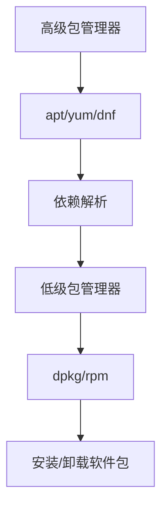

# Linux 软件包管理

软件包管理是 Linux 系统管理的重要组成部分，不同发行版使用不同的包管理器。

## 包管理器概述

### 主流包管理器

| 发行版        | 包管理器      | 软件包格式  | 示例命令               |
| ------------- | ------------- | ----------- | ---------------------- |
| Debian/Ubuntu | apt, dpkg     | .deb        | apt install package    |
| RHEL/CentOS   | yum, dnf, rpm | .rpm        | yum install package    |
| Fedora        | dnf           | .rpm        | dnf install package    |
| Arch Linux    | pacman        | .pkg.tar.xz | pacman -S package      |
| openSUSE      | zypper        | .rpm        | zypper install package |

### 包管理层次



## APT（Debian/Ubuntu）

### 基础操作

```bash
# 更新软件包列表
sudo apt update

# 升级所有软件包
sudo apt upgrade

# 升级系统（包括内核）
sudo apt full-upgrade
sudo apt dist-upgrade

# 安装软件包
sudo apt install package_name
sudo apt install package1 package2 package3

# 安装特定版本
sudo apt install package=version

# 重新安装
sudo apt reinstall package_name

# 卸载软件包（保留配置）
sudo apt remove package_name

# 完全卸载（删除配置）
sudo apt purge package_name

# 删除不需要的依赖
sudo apt autoremove

# 清理下载的包文件
sudo apt clean
sudo apt autoclean
```

### 搜索和查询

```bash
# 搜索软件包
apt search keyword
apt-cache search keyword

# 显示包信息
apt show package_name
apt-cache show package_name

# 列出所有可用包
apt list

# 列出已安装的包
apt list --installed

# 列出可升级的包
apt list --upgradable

# 查看包依赖
apt depends package_name

# 查看反向依赖
apt rdepends package_name

# 查看文件属于哪个包
dpkg -S /path/to/file

# 列出包的文件
dpkg -L package_name
```

### 软件源管理

```bash
# 软件源配置文件
/etc/apt/sources.list
/etc/apt/sources.list.d/

# 添加 PPA（Personal Package Archive）
sudo add-apt-repository ppa:user/ppa-name
sudo apt update

# 删除 PPA
sudo add-apt-repository --remove ppa:user/ppa-name

# 列出已添加的 PPA
ls /etc/apt/sources.list.d/

# 编辑软件源
sudo vim /etc/apt/sources.list

# 软件源格式
# deb http://archive.ubuntu.com/ubuntu/ focal main restricted
# deb-src http://archive.ubuntu.com/ubuntu/ focal main restricted
```

### 常用 APT 配置

```bash
# APT 配置文件
/etc/apt/apt.conf
/etc/apt/apt.conf.d/

# 配置代理
sudo vim /etc/apt/apt.conf.d/proxy.conf
# 添加：
# Acquire::http::Proxy "http://proxy:port";
# Acquire::https::Proxy "https://proxy:port";

# 配置保留内核数量
sudo vim /etc/apt/apt.conf.d/50unattended-upgrades
```

## YUM/DNF（RHEL/CentOS/Fedora）

### 基础操作

```bash
# YUM（旧版 CentOS）
# DNF（新版 CentOS、Fedora）- 语法基本相同

# 更新软件包列表
sudo yum check-update
sudo dnf check-update

# 升级所有软件包
sudo yum update
sudo dnf upgrade

# 安装软件包
sudo yum install package_name
sudo dnf install package_name

# 安装特定版本
sudo yum install package-version
sudo dnf install package-version

# 卸载软件包
sudo yum remove package_name
sudo dnf remove package_name

# 清理缓存
sudo yum clean all
sudo dnf clean all

# 自动删除不需要的依赖
sudo yum autoremove
sudo dnf autoremove
```

### 搜索和查询

```bash
# 搜索软件包
yum search keyword
dnf search keyword

# 显示包信息
yum info package_name
dnf info package_name

# 列出所有可用包
yum list available
dnf list available

# 列出已安装的包
yum list installed
dnf list installed

# 查看包提供的文件
yum provides /path/to/file
dnf provides /path/to/file

# 查看包依赖
yum deplist package_name
dnf repoquery --requires package_name

# 列出软件包组
yum grouplist
dnf group list

# 安装软件包组
sudo yum groupinstall "Development Tools"
sudo dnf group install "Development Tools"
```

### 软件源管理

```bash
# 软件源配置目录
/etc/yum.repos.d/

# 列出启用的软件源
yum repolist
dnf repolist

# 列出所有软件源
yum repolist all
dnf repolist --all

# 启用软件源
sudo yum-config-manager --enable repo_name
sudo dnf config-manager --set-enabled repo_name

# 禁用软件源
sudo yum-config-manager --disable repo_name
sudo dnf config-manager --set-disabled repo_name

# 添加软件源
sudo yum-config-manager --add-repo=URL
sudo dnf config-manager --add-repo URL

# 软件源文件示例
sudo vim /etc/yum.repos.d/custom.repo
```

## DPKG（Debian 底层包管理）

```bash
# 安装 .deb 包
sudo dpkg -i package.deb

# 卸载
sudo dpkg -r package_name

# 完全卸载
sudo dpkg -P package_name

# 列出已安装的包
dpkg -l
dpkg -l | grep keyword

# 显示包信息
dpkg -s package_name

# 列出包的文件
dpkg -L package_name

# 查找文件属于哪个包
dpkg -S /path/to/file

# 解包但不配置
sudo dpkg --unpack package.deb

# 配置已解包的包
sudo dpkg --configure package_name

# 修复损坏的包
sudo dpkg --configure -a
sudo apt-get install -f
```

## RPM（RHEL 底层包管理）

```bash
# 安装 .rpm 包
sudo rpm -ivh package.rpm
# -i: install
# -v: verbose
# -h: hash（进度条）

# 升级包
sudo rpm -Uvh package.rpm

# 卸载
sudo rpm -e package_name

# 查询已安装的包
rpm -qa
rpm -qa | grep keyword

# 显示包信息
rpm -qi package_name

# 列出包的文件
rpm -ql package_name

# 查找文件属于哪个包
rpm -qf /path/to/file

# 查看包依赖
rpm -qR package_name

# 验证包
rpm -V package_name

# 导入 GPG 密钥
sudo rpm --import /path/to/key
```

## Snap

Snap 是 Ubuntu 推出的通用包管理系统。

```bash
# 安装 snapd
sudo apt install snapd

# 查找软件
snap find keyword

# 安装软件
sudo snap install package_name

# 安装特定版本
sudo snap install package_name --channel=stable/edge/beta

# 列出已安装的 snap
snap list

# 更新 snap
sudo snap refresh package_name
sudo snap refresh    # 更新所有

# 卸载 snap
sudo snap remove package_name

# 查看 snap 信息
snap info package_name

# 查看 snap 服务
snap services

# 启用/禁用 snap
sudo snap disable package_name
sudo snap enable package_name
```

## Flatpak

Flatpak 是另一个通用包管理系统。

```bash
# 安装 Flatpak
sudo apt install flatpak

# 添加 Flathub 仓库
flatpak remote-add --if-not-exists flathub https://flathub.org/repo/flathub.flatpakrepo

# 搜索应用
flatpak search keyword

# 安装应用
flatpak install flathub app_name

# 运行应用
flatpak run app_name

# 列出已安装的应用
flatpak list

# 更新应用
flatpak update app_name
flatpak update    # 更新所有

# 卸载应用
flatpak uninstall app_name

# 删除未使用的运行时
flatpak uninstall --unused
```

## AppImage

```bash
# AppImage 是自包含的可执行文件，无需安装

# 下载 AppImage
wget https://example.com/app.AppImage

# 添加执行权限
chmod +x app.AppImage

# 运行
./app.AppImage

# 集成到系统（可选）
./app.AppImage --appimage-extract
# 或使用 AppImageLauncher
sudo apt install appimagelauncher
```

## 从源码编译

```bash
# 1. 安装编译工具
sudo apt install build-essential    # Debian/Ubuntu
sudo yum groupinstall "Development Tools"    # RHEL/CentOS

# 2. 安装依赖
sudo apt install libssl-dev libcurl4-openssl-dev

# 3. 下载源码
wget https://example.com/software-1.0.tar.gz
tar -xzf software-1.0.tar.gz
cd software-1.0

# 4. 配置
./configure --prefix=/usr/local

# 5. 编译
make

# 6. 安装
sudo make install

# 7. 卸载（如果支持）
sudo make uninstall

# 8. 清理编译文件
make clean
```

## 版本管理

### 包版本锁定

```bash
# APT 锁定版本
sudo apt-mark hold package_name

# 解除锁定
sudo apt-mark unhold package_name

# 查看锁定的包
apt-mark showhold

# YUM/DNF 锁定版本
sudo yum versionlock add package_name
sudo dnf versionlock add package_name

# 查看锁定列表
yum versionlock list
dnf versionlock list

# 删除锁定
sudo yum versionlock delete package_name
sudo dnf versionlock delete package_name
```

## 软件包创建

### 创建 DEB 包

```bash
# 安装工具
sudo apt install build-essential dh-make devscripts

# 创建包结构
mkdir mypackage-1.0
cd mypackage-1.0
dh_make --createorig

# 编辑 debian/ 目录下的文件
# - control: 包信息
# - rules: 构建规则
# - changelog: 更新日志

# 构建包
dpkg-buildpackage -us -uc

# 安装构建的包
sudo dpkg -i ../mypackage_1.0-1_amd64.deb
```

### 创建 RPM 包

```bash
# 安装工具
sudo yum install rpm-build rpmdevtools

# 创建构建环境
rpmdev-setuptree

# 目录结构
~/rpmbuild/
├── BUILD/
├── RPMS/
├── SOURCES/
├── SPECS/
└── SRPMS/

# 创建 spec 文件
rpmdev-newspec mypackage

# 编辑 spec 文件
vim ~/rpmbuild/SPECS/mypackage.spec

# 构建
rpmbuild -ba ~/rpmbuild/SPECS/mypackage.spec

# 安装
sudo rpm -ivh ~/rpmbuild/RPMS/x86_64/mypackage-1.0-1.x86_64.rpm
```

## 最佳实践

### 1. 定期更新

```bash
# 创建更新脚本
#!/bin/bash
# update-system.sh

sudo apt update
sudo apt upgrade -y
sudo apt autoremove -y
sudo apt autoclean

echo "系统更新完成: $(date)" >> /var/log/system-updates.log
```

### 2. 安全更新

```bash
# Ubuntu 自动安全更新
sudo apt install unattended-upgrades

# 配置
sudo dpkg-reconfigure unattended-upgrades

# 配置文件
sudo vim /etc/apt/apt.conf.d/50unattended-upgrades
```

### 3. 备份包列表

```bash
# Debian/Ubuntu
dpkg --get-selections > packages.list
sudo dpkg --set-selections < packages.list
sudo apt-get dselect-upgrade

# RHEL/CentOS
yum list installed > packages.list
dnf list installed > packages.list
```

### 4. 使用官方源

```bash
# ✅ 优先使用官方源
# ✅ 谨慎添加第三方源
# ✅ 验证软件包签名
# ❌ 避免使用未知源
```

## 故障排查

### APT 问题

```bash
# 修复损坏的包
sudo apt --fix-broken install
sudo dpkg --configure -a

# 清理并重建缓存
sudo rm -rf /var/lib/apt/lists/*
sudo apt clean
sudo apt update

# 解决依赖问题
sudo apt-get install -f

# 重置 sources.list
sudo cp /etc/apt/sources.list /etc/apt/sources.list.backup
sudo vim /etc/apt/sources.list
```

### YUM/DNF 问题

```bash
# 清理缓存
sudo yum clean all
sudo dnf clean all

# 重建缓存
sudo yum makecache
sudo dnf makecache

# 检查数据库
sudo rpm --rebuilddb
```

## 总结

本文介绍了 Linux 软件包管理：

- ✅ 主流包管理器（APT、YUM/DNF）
- ✅ 底层包管理（DPKG、RPM）
- ✅ 现代包管理（Snap、Flatpak、AppImage）
- ✅ 软件源管理和配置
- ✅ 从源码编译安装
- ✅ 包创建和版本管理

继续学习 [系统管理](/docs/linux/system-admin) 和 [文本编辑器](/docs/linux/text-editors)。
