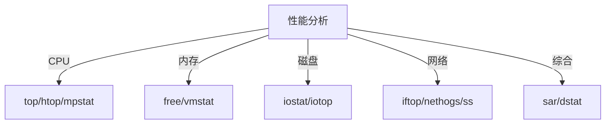

# Linux 性能优化

性能优化是系统调优的重要工作，包括 CPU、内存、磁盘 IO 和网络的优化。

## 性能分析方法

### 性能观察工具



### 系统负载

```bash
# 查看负载
uptime
w
top

# 负载平均值解读
load average: 0.50, 0.40, 0.30
#             1分钟 5分钟 15分钟

# 负载 > CPU核心数：系统过载
# 负载 = CPU核心数：系统满载
# 负载 < CPU核心数：系统正常

# 查看 CPU 核心数
nproc
lscpu | grep "^CPU(s):"
```

## CPU 优化

### CPU 分析

```bash
# 实时 CPU 使用
top
htop

# CPU 统计
mpstat 1
sar -u 1 5

# 查看CPU 密集进程
ps aux --sort=-%cpu | head
top -o %CPU

# CPU 详细信息
lscpu
cat /proc/cpuinfo
```

### CPU 调优

```bash
# 查看 CPU 调度器
cat /sys/block/sda/queue/scheduler

# 修改进程优先级
nice -n 10 command            # 低优先级启动
renice -n 5 -p PID            # 修改运行中进程

# CPU 亲和性
taskset -c 0,1 command        # 绑定到 CPU 0和1
taskset -p 0x3 PID            # 修改运行中进程

# 限制 CPU 使用（cgroups）
# 创建 cgroup
sudo cgcreate -g cpu:/limited

# 设置 CPU 限制（50%）
echo 50000 | sudo tee /sys/fs/cgroup/cpu/limited/cpu.cfs_quota_us

# 运行进程
sudo cgexec -g cpu:limited command
```

### CPU 频率调节

```bash
# 查看 CPU 频率
cat /proc/cpuinfo | grep MHz

# 查看调速器
cpufreq-info
cat /sys/devices/system/cpu/cpu0/cpufreq/scaling_governor

# 设置调速器
# performance: 最高性能
# powersave: 节能
# ondemand: 按需调整
# conservative: 保守调整
echo performance | sudo tee /sys/devices/system/cpu/cpu*/cpufreq/scaling_governor
```

## 内存优化

### 内存分析

```bash
# 查看内存使用
free -h
free -m

# 内存详细信息
cat /proc/meminfo

# 内存使用进程
ps aux --sort=-%mem | head
top -o %MEM

# 查看页面缓存
sync && echo 3 | sudo tee /proc/sys/vm/drop_caches
```

### Swap 优化

```bash
# 查看 swap
free -h
swapon --show

# 创建 swap 文件
sudo fallocate -l 2G /swapfile
sudo chmod 600 /swapfile
sudo mkswap /swapfile
sudo swapon /swapfile

# 永久启用
echo '/swapfile none swap sw 0 0' | sudo tee -a /etc/fstab

# 删除 swap
sudo swapoff /swapfile
sudo rm /swapfile

# 调整 swappiness
# 0-100，值越大越倾向使用 swap
cat /proc/sys/vm/swappiness
echo 10 | sudo tee /proc/sys/vm/swappiness

# 永久设置
echo 'vm.swappiness=10' | sudo tee -a /etc/sysctl.conf
```

### 内存调优

```bash
# 内存参数
sudo vim /etc/sysctl.conf

# 减少 swap 使用
vm.swappiness = 10

# 脏页比例
vm.dirty_ratio = 15                  # 脏页达到15%开始写入
vm.dirty_background_ratio = 5        # 脏页达到5%后台写入

# 应用配置
sudo sysctl -p
```

## 磁盘 IO 优化

### IO 分析

```bash
# IO 统计
iostat
iostat -x 1

# IO 密集进程
iotop
iotop -o        # 只显示有IO的进程

# 磁盘读写
sudo iotop -P

# 查看 IO 等待
vmstat 1
```

### IO 调优

```bash
# 查看 IO 调度器
cat /sys/block/sda/queue/scheduler

# 修改调度器
# noop: 不排队，适合 SSD
# deadline: 截止时间调度
# cfq: 完全公平队列
echo noop | sudo tee /sys/block/sda/queue/scheduler
echo deadline | sudo tee /sys/block/sda/queue/scheduler

# 读写优先级
ionice -c2 -n0 command    # 高优先级
ionice -c3 command        # 空闲优先级

# 文件系统挂载选项
# noatime: 不更新访问时间
# nodiratime: 不更新目录访问时间
/dev/sda1 / ext4 defaults,noatime,nodiratime 0 1
```

### SSD 优化

```bash
# 启用 TRIM
sudo fstrim -v /

# 定时 TRIM
sudo systemctl enable fstrim.timer
sudo systemctl start fstrim.timer

# 挂载选项
/dev/sda1 / ext4 defaults,noatime,discard 0 1
```

## 网络优化

### 网络分析

```bash
# 网络流量
iftop
nethogs
nload

# 连接统计
ss -s
netstat -s

# 带宽测试
iperf3 -s            # 服务器
iperf3 -c server     # 客户端
```

### 网络调优

```bash
# 网络参数
sudo vim /etc/sysctl.conf

# TCP 优化
net.core.rmem_max = 134217728                # 接收缓冲区最大值
net.core.wmem_max = 134217728                # 发送缓冲区最大值
net.ipv4.tcp_rmem = 4096 87380 67108864      # TCP 接收缓冲区
net.ipv4.tcp_wmem = 4096 65536 67108864      # TCP 发送缓冲区

# 连接优化
net.ipv4.tcp_max_syn_backlog = 8192          # SYN 队列长度
net.core.somaxconn = 1024                    # 监听队列长度
net.ipv4.tcp_tw_reuse = 1                    # TIME_WAIT 重用
net.ipv4.tcp_fin_timeout = 30                # FIN_WAIT 超时

# 拥塞控制
net.ipv4.tcp_congestion_control = bbr        # 使用 BBR 算法

# 应用配置
sudo sysctl -p
```

## 内核参数优化

### 文件描述符

```bash
# 查看当前限制
ulimit -n

# 查看所有限制
ulimit -a

# 临时修改
ulimit -n 65536

# 永久修改
sudo vim /etc/security/limits.conf

*  soft  nofile  65536
*  hard  nofile  65536
*  soft  nproc   65536
*  hard  nproc   65536

# 系统级限制
sudo vim /etc/sysctl.conf
fs.file-max = 2097152

# 查看当前打开的文件
cat /proc/sys/fs/file-nr
```

### 内核参数

```bash
# 编辑内核参数
sudo vim /etc/sysctl.conf

# 文件系统
fs.file-max = 2097152                        # 最大文件句柄数
fs.inotify.max_user_watches = 524288         # inotify 监控数

# 网络
net.ipv4.ip_local_port_range = 1024 65535    # 本地端口范围
net.ipv4.tcp_max_tw_buckets = 5000           # TIME_WAIT 数量
net.ipv4.tcp_keepalive_time = 600            # keepalive 时间
net.ipv4.tcp_keepalive_intvl = 30            # keepalive 间隔

# 虚拟内存
vm.overcommit_memory = 1                     # 允许过度分配内存

# 应用配置
sudo sysctl -p

# 查看参数
sysctl -a | grep keyword
```

## 应用程序优化

### Nginx 优化

```bash
# nginx.conf
worker_processes auto;                       # 自动设置worker数
worker_rlimit_nofile 65535;                 # 文件描述符限制

events {
    worker_connections 4096;                 # 每个worker连接数
    use epoll;                              # 使用epoll
    multi_accept on;                        # 同时接受多个连接
}

http {
    sendfile on;                            # 零拷贝
    tcp_nopush on;                          # 合并数据包
    tcp_nodelay on;                         # 立即发送
    keepalive_timeout 65;                   # keepalive超时

    gzip on;                                # 压缩
    gzip_comp_level 6;                      # 压缩级别
    gzip_types text/plain text/css application/json;
}
```

### MySQL/MariaDB 优化

```bash
# my.cnf
[mysqld]
innodb_buffer_pool_size = 2G                # 缓冲池大小（70%内存）
innodb_log_file_size = 512M                 # 日志文件大小
innodb_flush_log_at_trx_commit = 2          # 日志刷新策略
innodb_flush_method = O_DIRECT              # 刷新方法

max_connections = 500                        # 最大连接数
query_cache_size = 64M                      # 查询缓存
query_cache_type = 1                        # 启用查询缓存

tmp_table_size = 64M                        # 临时表大小
max_heap_table_size = 64M                   # 内存表大小
```

### Redis 优化

```bash
# redis.conf
maxmemory 2gb                               # 最大内存
maxmemory-policy allkeys-lru                # 淘汰策略

# 持久化
save 900 1                                  # 900秒内1次修改保存
save 300 10                                 # 300秒内10次修改保存
save 60 10000                               # 60秒内10000次修改保存

appendonly yes                              # 启用 AOF
appendfsync everysec                        # 每秒同步

# 网络
tcp-backlog 511                             # TCP backlog
timeout 300                                 # 客户端超时
```

## 性能监控

### System Monitoring

```bash
# 安装 sysstat
sudo apt install sysstat

# 启用数据收集
sudo systemctl enable sysstat
sudo systemctl start sysstat

# 查看历史数据
sar -u             # CPU
sar -r             # 内存
sar -b             # IO
sar -n DEV         # 网络

# 生成报告
sar -A > system_report.txt
```

### 实时监控工具

```bash
# glances - 综合监控
sudo apt install glances
glances

# dstat - 系统资源统计
sudo apt install dstat
dstat -cdngy

# netdata - Web 界面监控
bash <(curl -Ss https://my-netdata.io/kickstart.sh)
# 访问 http://localhost:19999
```

## 性能测试

### 压力测试

```bash
# stress - CPU/内存压力测试
sudo apt install stress
stress --cpu 4 --timeout 60s
stress --vm 2 --vm-bytes 1G --timeout 60s

# stress-ng - 增强版
sudo apt install stress-ng
stress-ng --cpu 4 --io 2 --vm 1 --vm-bytes 1G --timeout 60s

# Apache Bench - HTTP 压测
ab -n 10000 -c 100 http://localhost/

# wrk - 现代 HTTP 压测
sudo apt install wrk
wrk -t4 -c100 -d30s http://localhost/
```

## 最佳实践

### 1. 性能基线

```bash
# 建立性能基线
# - 记录正常负载下的性能指标
# - 定期对比检测异常
# - 在变更前后对比

# 记录基线
sar -A -o baseline.sar
```

### 2. 循序渐进

```bash
# ✅ 先分析后优化
# ✅ 一次改一项
# ✅ 测试验证效果
# ✅ 记录所有变更
```

### 3. 监控告警

```bash
# 设置告警阈值
# - CPU > 80%
# - 内存 > 90%
# - 磁盘 > 85%
# - 负载 > 核心数
```

## 总结

本文介绍了 Linux 性能优化：

- ✅ CPU 优化（调度、频率、亲和性）
- ✅ 内存优化（swap、缓存）
- ✅ 磁盘 IO 优化（调度器、文件系统）
- ✅ 网络优化（TCP 参数）
- ✅ 内核参数调优
- ✅ 应用程序优化

继续学习 [故障排查](/docs/linux/troubleshooting) 和 [最佳实践](/docs/linux/best-practices)。
