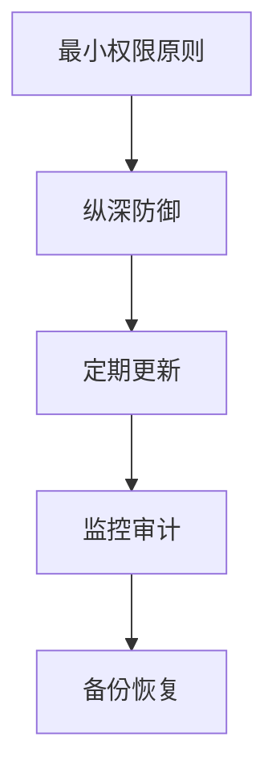

# Linux 系统安全

系统安全是 Linux 运维的重要组成部分，包括用户权限、防火墙、SELinux、SSH 加固等。

## 安全基础

### 安全原则



## 用户和权限安全

### 密码策略

```bash
# 安装密码质量检查
sudo apt install libpam-pwquality

# 配置密码策略
sudo vim /etc/security/pwquality.conf

# 配置项
minlen = 12              # 最小长度
dcredit = -1             # 至少1个数字
ucredit = -1             # 至少1个大写字母
lcredit = -1             # 至少1个小写字母
ocredit = -1             # 至少1个特殊字符
minclass = 3             # 至少3种字符类型
maxrepeat = 3            # 最多重复字符数
maxclassrepeat = 4       # 同类字符最大连续数

# 密码有效期
sudo chage -M 90 username    # 最长90天
sudo chage -m 7 username     # 最短7天
sudo chage -W 14 username    # 过期前14天警告

# 全局设置
sudo vim /etc/login.defs
PASS_MAX_DAYS   90
PASS_MIN_DAYS   7
PASS_WARN_AGE   14
```

### 账户安全

```bash
# 禁用不需要的账户
sudo usermod -L username
sudo passwd -l username

# 设置账户过期
sudo chage -E 2024-12-31 username

# 查找无密码账户
sudo awk -F: '($2 == "") {print $1}' /etc/shadow

# 查找 UID 为 0 的账户（除了 root）
sudo awk -F: '($3 == 0) {print $1}' /etc/passwd

# 禁用 root 直接登录
sudo passwd -l root

# 禁止 root SSH 登录
sudo vim /etc/ssh/sshd_config
PermitRootLogin no
```

## SSH 安全加固

### SSH 配置

```bash
# SSH 服务器配置
sudo vim /etc/ssh/sshd_config

# 推荐配置
Port 2222                          # 修改默认端口
PermitRootLogin no                 # 禁止 root 登录
PasswordAuthentication no          # 禁用密码认证
PubkeyAuthentication yes           # 启用密钥认证
PermitEmptyPasswords no            # 禁止空密码
MaxAuthTries 3                     # 最大认证尝试次数
LoginGraceTime 60                  # 登录超时时间
ClientAliveInterval 300            # 客户端存活检测
ClientAliveCountMax 2              # 最大无响应次数
AllowUsers user1 user2             # 允许的用户
DenyUsers baduser                  # 拒绝的用户
X11Forwarding no                   # 禁用 X11 转发

# 重启 SSH
sudo systemctl restart sshd
```

### SSH 密钥认证

```bash
# 生成密钥对
ssh-keygen -t ed25519 -C "comment"
ssh-keygen -t rsa -b 4096

# 复制公钥到服务器
ssh-copy-id -i ~/.ssh/id_ed25519.pub user@server
ssh-copy-id -p 2222 user@server

# 手动复制
cat ~/.ssh/id_ed25519.pub | ssh user@server "mkdir -p ~/.ssh && cat >> ~/.ssh/authorized_keys"

# 设置正确权限
chmod 700 ~/.ssh
chmod 600 ~/.ssh/authorized_keys

# 服务器端权限
chmod 700 ~/.ssh
chmod 600 ~/.ssh/authorized_keys
chmod 644 ~/.ssh/id_ed25519.pub
chmod 600 ~/.ssh/id_ed25519
```

### SSH 双因素认证

```bash
# 安装 Google Authenticator
sudo apt install libpam-google-authenticator

# 配置用户
google-authenticator

# 配置 PAM
sudo vim /etc/pam.d/sshd
# 添加
auth required pam_google_authenticator.so

# 配置 SSH
sudo vim /etc/ssh/sshd_config
ChallengeResponseAuthentication yes

# 重启 SSH
sudo systemctl restart sshd
```

## 防火墙

### UFW（Ubuntu）

```bash
# 启用防火墙
sudo ufw enable

# 默认策略
sudo ufw default deny incoming
sudo ufw default allow outgoing

# 允许服务
sudo ufw allow ssh
sudo ufw allow 22/tcp
sudo ufw allow 80/tcp
sudo ufw allow443/tcp
sudo ufw allow 3306/tcp

# 允许端口范围
sudo ufw allow 6000:6007/tcp

# 允许特定IP
sudo ufw allow from 192.168.1.100

# 允许特定IP访问特定端口
sudo ufw allow from 192.168.1.100 to any port 22

# 拒绝
sudo ufw deny 23

# 删除规则
sudo ufw delete allow 80

# 查看状态
sudo ufw status
sudo ufw status numbered

# 禁用防火墙
sudo ufw disable
```

### firewalld（CentOS/RHEL）

```bash
# 启动防火墙
sudo systemctl start firewalld
sudo systemctl enable firewalld

# 查看状态
sudo firewall-cmd --state

# 查看区域
sudo firewall-cmd --get-default-zone
sudo firewall-cmd --get-active-zones

# 添加服务
sudo firewall-cmd --add-service=http --permanent
sudo firewall-cmd --add-service=https --permanent
sudo firewall-cmd --add-service=ssh --permanent

# 添加端口
sudo firewall-cmd --add-port=8080/tcp --permanent
sudo firewall-cmd --add-port=3000-3010/tcp --permanent

# 添加富规则
sudo firewall-cmd --add-rich-rule='rule family="ipv4" source address="192.168.1.0/24" accept' --permanent

# 重新加载
sudo firewall-cmd --reload

# 查看规则
sudo firewall-cmd --list-all
```

### iptables

```bash
# 查看规则
sudo iptables -L -n -v
sudo iptables -L INPUT -v

# 允许回环接口
sudo iptables -A INPUT -i lo -j ACCEPT

# 允许已建立的连接
sudo iptables -A INPUT -m state --state ESTABLISHED,RELATED -j ACCEPT

# 允许 SSH
sudo iptables -A INPUT -p tcp --dport 22 -j ACCEPT

# 允许 HTTP/HTTPS
sudo iptables -A INPUT -p tcp --dport 80 -j ACCEPT
sudo iptables -A INPUT -p tcp --dport 443 -j ACCEPT

# 拒绝其他
sudo iptables -A INPUT -j DROP

# 保存规则
sudo iptables-save > /etc/iptables/rules.v4
sudo apt install iptables-persistent

# 恢复规则
sudo iptables-restore < /etc/iptables/rules.v4
```

## SELinux

### SELinux 基础

```bash
# 查看 SELinux 状态
sestatus
getenforce

# SELinux 模式
# Enforcing: 强制模式
# Permissive: 宽松模式（记录但不阻止）
# Disabled: 禁用

# 临时设置模式
sudo setenforce 0    # Permissive
sudo setenforce 1    # Enforcing

# 永久设置
sudo vim /etc/selinux/config
SELINUX=enforcing
# 或
SELINUX=permissive
# 或
SELINUX=disabled
```

### SELinux 上下文

```bash
# 查看文件上下文
ls -Z file
ls -lZ /var/www/html

# 查看进程上下文
ps -eZ

# 恢复默认上下文
sudo restorecon -Rv /var/www/html

# 修改文件上下文
sudo chcon -t httpd_sys_content_t /var/www/html/file

# 永久修改
sudo semanage fcontext -a -t httpd_sys_content_t "/custom/path(/.*)?"
sudo restorecon -Rv /custom/path
```

### SELinux 布尔值

```bash
# 查看所有布尔值
getsebool -a

# 查看特定布尔值
getsebool httpd_can_network_connect

# 设置布尔值
sudo setsebool -P httpd_can_network_connect on
```

## AppArmor（Ubuntu）

```bash
# 查看状态
sudo aa-status

# 查看配置文件
ls /etc/apparmor.d/

# 禁用配置
sudo aa-disable /etc/apparmor.d/usr.sbin.mysqld

# 启用配置
sudo aa-enforce /etc/apparmor.d/usr.sbin.mysqld

# 设置为宽松模式
sudo aa-complain /etc/apparmor.d/usr.sbin.mysqld
```

## 安全审计

### auditd

```bash
# 安装 auditd
sudo apt install auditd

# 启动服务
sudo systemctl start auditd
sudo systemctl enable auditd

# 查看审计规则
sudo auditctl -l

# 添加规则
sudo auditctl -w /etc/passwd -p wa -k passwd_changes
sudo auditctl -w /etc/shadow -p wa -k shadow_changes
sudo auditctl -w /var/log/auth.log -p wa -k auth_log

# 永久规则
sudo vim /etc/audit/rules.d/audit.rules

# 查看日志
sudo ausearch -k passwd_changes
sudo ausearch -ts today -k shadow_changes
```

### 文件完整性检查

```bash
# 安装 AIDE
sudo apt install aide

# 初始化数据库
sudo aideinit

# 移动数据库
sudo mv /var/lib/aide/aide.db.new /var/lib/aide/aide.db

# 检查文件完整性
sudo aide --check

# 更新数据库
sudo aide --update
```

## 网络安全

### Fail2ban

```bash
# 安装 Fail2ban
sudo apt install fail2ban

# 配置
sudo cp /etc/fail2ban/jail.conf /etc/fail2ban/jail.local
sudo vim /etc/fail2ban/jail.local

[DEFAULT]
bantime = 3600           # 封禁时间（秒）
findtime = 600           # 时间窗口
maxretry = 5             # 最大尝试次数

[sshd]
enabled = true
port = 22
logpath = /var/log/auth.log

# 启动服务
sudo systemctl start fail2ban
sudo systemctl enable fail2ban

# 查看状态
sudo fail2ban-client status
sudo fail2ban-client status sshd

# 解封 IP
sudo fail2ban-client set sshd unbanip 192.168.1.100
```

### 端口扫描检测

```bash
# 安装 portsentry
sudo apt install portsentry

# 配置
sudo vim /etc/portsentry/portsentry.conf

# 启动
sudo systemctl start portsentry
```

## 安全扫描

### 漏洞扫描

```bash
# 使用 Lynis
sudo apt install lynis

# 运行审计
sudo lynis audit system

# 查看报告
cat /var/log/lynis.log
```

### 病毒扫描

```bash
# 安装 ClamAV
sudo apt install clamav clamav-daemon

# 更新病毒库
sudo freshclam

# 扫描
sudo clamscan -r /home
sudo clamscan -r --infected --remove /path
```

## 最佳实践

### 1. 定期更新

```bash
# 自动安全更新
sudo apt install unattended-upgrades
sudo dpkg-reconfigure unattended-upgrades
```

### 2. 最小化服务

```bash
# 列出运行的服务
systemctl list-units --type=service --state=running

# 禁用不需要的服务
sudo systemctl disable service_name
sudo systemctl stop service_name
```

### 3. 监控日志

```bash
# 监控认证失败
sudo grep "Failed password" /var/log/auth.log

# 监控 sudo 使用
sudo grep sudo /var/log/auth.log

# 使用 logwatch
sudo apt install logwatch
sudo logwatch --detail high --mailto admin@example.com --range today
```

### 4. 备份

```bash
# 定期备份关键配置
/etc/passwd
/etc/shadow
/etc/group
/etc/ssh/
/etc/fstab
```

## 总结

本文介绍了 Linux 系统安全：

- ✅ 用户和权限安全
- ✅ SSH 安全加固
- ✅ 防火墙配置（UFW、firewalld、iptables）
- ✅ SELinux 和 AppArmor
- ✅ 安全审计和监控
- ✅ 入侵检测（Fail2ban）

继续学习 [性能优化](/docs/linux/performance-tuning) 和 [故障排查](/docs/linux/troubleshooting)。
