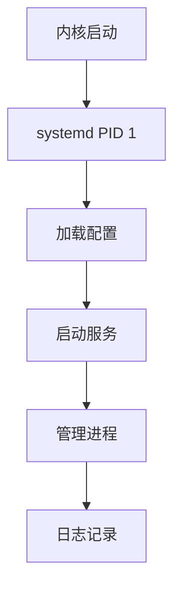

# Linux 服务管理

服务管理是 Linux 系统管理的核心技能，本文介绍 systemd 服务管理的完整知识。

## systemd 概述

### 什么是 systemd

systemd 是现代 Linux 系统的初始化系统和服务管理器，取代了传统的 SysVinit。



### systemd 特点

- **并行启动** - 加快系统启动速度
- **按需启动** - 服务按需加载
- **依赖管理** - 自动处理服务依赖
- **统一日志** - journald 集中管理日志
- **cgroups 支持** - 资源隔离和限制

## systemctl 命令

### 服务管理

```bash
# 启动服务
sudo systemctl start nginx

# 停止服务
sudo systemctl stop nginx

# 重启服务
sudo systemctl restart nginx

# 重新加载配置（不中断服务）
sudo systemctl reload nginx

# 查看服务状态
systemctl status nginx

# 启用开机自启
sudo systemctl enable nginx

# 禁用开机自启
sudo systemctl disable nginx

# 启用并立即启动
sudo systemctl enable --now nginx

# 禁用并立即停止
sudo systemctl disable --now nginx

# 检查是否启用
systemctl is-enabled nginx

# 检查是否运行
systemctl is-active nginx
```

### 查看服务

```bash
# 列出所有服务
systemctl list-units --type=service

# 列出运行中的服务
systemctl list-units --type=service --state=running

# 列出失败的服务
systemctl list-units --type=service --state=failed

# 列出所有服务（包括未加载的）
systemctl list-unit-files --type=service

# 查看服务依赖
systemctl list-dependencies nginx

# 查看反向依赖（谁依赖这个服务）
systemctl list-dependencies --reverse nginx
```

### 系统控制

```bash
# 重启系统
sudo systemctl reboot

# 关机
sudo systemctl poweroff

# 挂起
sudo systemctl suspend

# 休眠
sudo systemctl hibernate

# 进入救援模式
sudo systemctl rescue

# 进入紧急模式
sudo systemctl emergency

# 查看默认目标
systemctl get-default

# 设置默认目标
sudo systemctl set-default multi-user.target    # 命令行模式
sudo systemctl set-default graphical.target     # 图形界面
```

## 服务单元文件

### 单元文件位置

```bash
# 系统单元文件
/lib/systemd/system/          # 软件包安装的
/etc/systemd/system/          # 管理员创建/覆盖的

# 用户单元文件
~/.config/systemd/user/

# 运行时单元文件
/run/systemd/system/

# 优先级：/etc > /run > /lib
```

### 单元文件结构

```ini
# /etc/systemd/system/myapp.service

[Unit]
Description=My Application Service
Documentation=https://example.com/docs
After=network.target
Requires=mysql.service
Wants=redis.service

[Service]
Type=simple
User=myapp
Group=myapp
WorkingDirectory=/opt/myapp
Environment=NODE_ENV=production
ExecStart=/opt/myapp/start.sh
ExecStop=/opt/myapp/stop.sh
ExecReload=/bin/kill -HUP $MAINPID
Restart=on-failure
RestartSec=5

[Install]
WantedBy=multi-user.target
```

### [Unit] 部分

```ini
[Unit]
# 服务描述
Description=My Application

# 文档链接
Documentation=man:myapp(8) https://example.com

# 依赖关系
After=network.target           # 在 network 之后启动
Before=nginx.service           # 在 nginx 之前启动
Requires=mysql.service         # 强依赖，mysql 失败则此服务也失败
Wants=redis.service            # 弱依赖，redis 失败不影响此服务
BindsTo=docker.service         # 绑定，docker 停止则此服务也停止
Conflicts=other.service        # 冲突，不能同时运行
```

### [Service] 部分

```ini
[Service]
# 服务类型
Type=simple                    # 默认，ExecStart 是主进程
Type=forking                   # 进程会 fork，需要 PIDFile
Type=oneshot                   # 一次性任务
Type=notify                    # 服务会发送就绪通知
Type=dbus                      # 通过 D-Bus 激活
Type=idle                      # 等待其他任务完成

# 用户和组
User=myapp
Group=myapp

# 工作目录
WorkingDirectory=/opt/myapp

# 环境变量
Environment=KEY=value
EnvironmentFile=/etc/myapp/env

# 执行命令
ExecStartPre=/usr/bin/prepare.sh
ExecStart=/usr/bin/myapp
ExecStartPost=/usr/bin/notify.sh
ExecReload=/bin/kill -HUP $MAINPID
ExecStop=/bin/kill -TERM $MAINPID

# 重启策略
Restart=no                     # 不重启
Restart=on-success             # 正常退出时重启
Restart=on-failure             # 异常退出时重启
Restart=on-abnormal            # 信号导致退出时重启
Restart=on-abort               # 未捕获信号导致退出时重启
Restart=always                 # 总是重启

RestartSec=5                   # 重启间隔
StartLimitBurst=5              # 启动次数限制
StartLimitIntervalSec=60       # 时间窗口

# 超时设置
TimeoutStartSec=30
TimeoutStopSec=30

# 资源限制
LimitNOFILE=65535
LimitNPROC=4096
MemoryLimit=512M
CPUQuota=50%
```

### [Install] 部分

```ini
[Install]
# 定义服务在哪个目标下启动
WantedBy=multi-user.target     # 多用户模式
WantedBy=graphical.target      # 图形界面模式

# 服务别名
Alias=myapp.service

# 其他配置
Also=myapp-worker.service      # 同时启用的服务
```

## 创建自定义服务

### 简单服务示例

```ini
# /etc/systemd/system/myapp.service
[Unit]
Description=My Simple Application
After=network.target

[Service]
Type=simple
User=nobody
ExecStart=/usr/local/bin/myapp
Restart=on-failure
RestartSec=10

[Install]
WantedBy=multi-user.target
```

### Python/Node.js 应用

```ini
# /etc/systemd/system/flask-app.service
[Unit]
Description=Flask Web Application
After=network.target

[Service]
Type=simple
User=www-data
Group=www-data
WorkingDirectory=/var/www/flask-app
Environment=FLASK_ENV=production
ExecStart=/var/www/flask-app/venv/bin/python app.py
Restart=always
RestartSec=5

[Install]
WantedBy=multi-user.target
```

```ini
# /etc/systemd/system/node-app.service
[Unit]
Description=Node.js Application
After=network.target

[Service]
Type=simple
User=node
WorkingDirectory=/var/www/node-app
Environment=NODE_ENV=production
ExecStart=/usr/bin/node server.js
Restart=always
RestartSec=5

[Install]
WantedBy=multi-user.target
```

### Java 应用

```ini
# /etc/systemd/system/spring-app.service
[Unit]
Description=Spring Boot Application
After=network.target

[Service]
Type=simple
User=spring
WorkingDirectory=/opt/spring-app
Environment=JAVA_OPTS=-Xms512m -Xmx1024m
ExecStart=/usr/bin/java $JAVA_OPTS -jar app.jar
ExecStop=/bin/kill -TERM $MAINPID
Restart=on-failure
RestartSec=10
SuccessExitStatus=143

[Install]
WantedBy=multi-user.target
```

### 启用服务

```bash
# 重新加载 systemd 配置
sudo systemctl daemon-reload

# 启用服务
sudo systemctl enable myapp

# 启动服务
sudo systemctl start myapp

# 查看状态
systemctl status myapp
```

## 服务日志

### journalctl 命令

```bash
# 查看所有日志
journalctl

# 查看特定服务日志
journalctl -u nginx
journalctl -u nginx.service

# 实时查看日志
journalctl -u nginx -f

# 查看最近的日志
journalctl -u nginx -n 100

# 按时间过滤
journalctl -u nginx --since "2024-01-01"
journalctl -u nginx --since "1 hour ago"
journalctl -u nginx --since today
journalctl -u nginx --since yesterday --until today

# 按优先级过滤
journalctl -u nginx -p err         # 错误及以上
journalctl -u nginx -p warning     # 警告及以上

# 输出格式
journalctl -u nginx -o json        # JSON 格式
journalctl -u nginx -o json-pretty # 美化 JSON
journalctl -u nginx --no-pager     # 不分页

# 查看本次启动的日志
journalctl -b
journalctl -b -1                   # 上次启动

# 磁盘使用
journalctl --disk-usage

# 清理日志
sudo journalctl --vacuum-time=7d   # 保留7天
sudo journalctl --vacuum-size=1G   # 保留1GB
```

### 日志配置

```bash
# 编辑日志配置
sudo vim /etc/systemd/journald.conf

# 常用配置
[Journal]
Storage=persistent              # 持久化存储
Compress=yes                    # 压缩日志
SystemMaxUse=1G                 # 最大使用空间
SystemMaxFileSize=100M          # 单文件最大大小
MaxRetentionSec=1month          # 最大保留时间

# 重启 journald
sudo systemctl restart systemd-journald
```

## 故障排查

### 常见问题

```bash
# 查看服务状态和错误
systemctl status myapp

# 查看详细日志
journalctl -u myapp -xe

# 检查配置语法
systemd-analyze verify /etc/systemd/system/myapp.service

# 查看服务依赖树
systemctl list-dependencies myapp

# 检查启动时间
systemd-analyze blame

# 查看启动瓶颈
systemd-analyze critical-chain myapp.service
```

### 调试技巧

```bash
# 运行服务命令检查是否正常
sudo -u myuser /path/to/command

# 检查环境变量
systemctl show myapp --property=Environment

# 查看完整配置
systemctl show myapp

# 临时修改并测试
sudo systemctl edit myapp --force
# 添加调试配置后测试
```

### 恢复失败的服务

```bash
# 重置失败状态
sudo systemctl reset-failed myapp

# 强制停止
sudo systemctl kill myapp

# 发送信号
sudo systemctl kill -s SIGKILL myapp
```

## 高级功能

### 定时器集成

```ini
# /etc/systemd/system/backup.timer
[Unit]
Description=Daily backup timer

[Timer]
OnCalendar=daily
Persistent=true

[Install]
WantedBy=timers.target
```

```ini
# /etc/systemd/system/backup.service
[Unit]
Description=Backup service

[Service]
Type=oneshot
ExecStart=/usr/local/bin/backup.sh
```

### Socket 激活

```ini
# /etc/systemd/system/myapp.socket
[Unit]
Description=MyApp Socket

[Socket]
ListenStream=8080
Accept=false

[Install]
WantedBy=sockets.target
```

```ini
# /etc/systemd/system/myapp.service
[Unit]
Description=MyApp Service
Requires=myapp.socket

[Service]
Type=simple
ExecStart=/usr/bin/myapp
StandardInput=socket
```

### 模板服务

```ini
# /etc/systemd/system/myapp@.service
[Unit]
Description=MyApp Instance %i

[Service]
Type=simple
ExecStart=/usr/bin/myapp --instance=%i
User=%i

[Install]
WantedBy=multi-user.target
```

```bash
# 启动实例
sudo systemctl start myapp@user1
sudo systemctl start myapp@user2
```

## 总结

本文介绍了 Linux 服务管理：

- ✅ systemd 概述和特点
- ✅ systemctl 命令详解
- ✅ 服务单元文件编写
- ✅ 创建自定义服务
- ✅ 服务日志管理
- ✅ 故障排查技巧
- ✅ 高级功能（定时器、Socket 激活、模板）

继续学习 [定时任务](/docs/linux/cron-scheduling) 和 [系统管理](/docs/linux/system-admin)。
