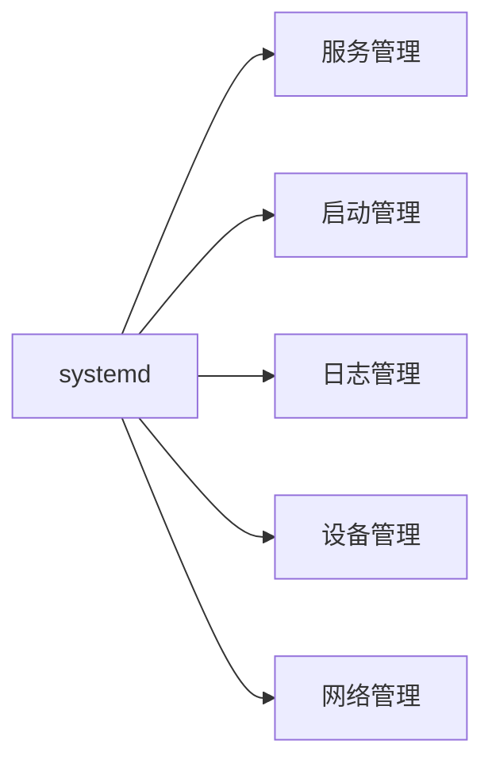
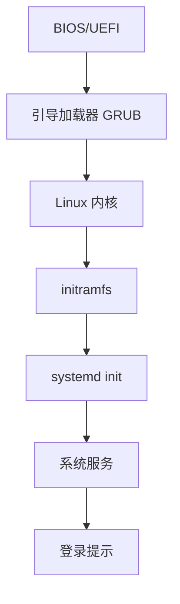

# Linux 系统管理

系统管理是 Linux 运维的核心内容，包括系统服务、启动管理、系统信息查看等。

## Systemd 管理

### Systemd 概述

Systemd 是现代 Linux 发行版的初始化系统和服务管理器。



### 服务管理

```bash
# 启动服务
sudo systemctl start service_name

# 停止服务
sudo systemctl stop service_name

# 重启服务
sudo systemctl restart service_name

# 重新加载配置
sudo systemctl reload service_name

# 查看服务状态
systemctl status service_name

# 启用开机自启
sudo systemctl enable service_name

# 禁用开机自启
sudo systemctl disable service_name

#启用并立即启动
sudo systemctl enable --now service_name

# 禁用并立即停止
sudo systemctl disable --now service_name

# 检查是否启用
systemctl is-enabled service_name

# 检查是否运行
systemctl is-active service_name
```

### 服务查询

```bash
# 列出所有服务
systemctl list-units --type=service
systemctl list-units --type=service --all

# 列出运行中的服务
systemctl list-units --type=service --state=running

# 列出失败的服务
systemctl list-units --type=service --state=failed
systemctl --failed

# 列出所有已安装的服务
systemctl list-unit-files --type=service

# 显示服务依赖
systemctl list-dependencies service_name

# 显示服务配置
systemctl cat service_name

# 查看服务日志
journalctl -u service_name
journalctl -u service_name -f    # 实时查看
```

### 创建服务单元

```bash
# 服务单元文件位置
/etc/systemd/system/         # 管理员创建的服务
/lib/systemd/system/         # 系统安装的服务
/usr/lib/systemd/system/     # 软件包安装的服务

# 创建服务文件
sudo vim /etc/systemd/system/myapp.service
```

服务单元文件示例：

```ini
[Unit]
Description=My Application
Documentation=https://example.com/docs
After=network.target
Requires=mysql.service

[Service]
Type=simple
User=myapp
Group=myapp
WorkingDirectory=/opt/myapp
ExecStart=/opt/myapp/bin/myapp --config /etc/myapp/config.yaml
ExecReload=/bin/kill -HUP $MAINPID
Restart=on-failure
RestartSec=5s
StandardOutput=journal
StandardError=journal

# 环境变量
Environment="NODE_ENV=production"
EnvironmentFile=/etc/myapp/environment

# 资源限制
LimitNOFILE=65536
LimitNPROC=4096

[Install]
WantedBy=multi-user.target
```

### Service 配置说明

```bash
# [Unit] 部分
Description=        # 服务描述
Documentation=      # 文档 URL
After=             # 在哪些服务之后启动
Before=            # 在哪些服务之前启动
Requires=          # 强依赖（无法启动则失败）
Wants=             # 弱依赖（无法启动仍继续）

# [Service] 部分
Type=              # 服务类型
  # simple: 默认，ExecStart 就是主进程
  # forking: fork 出子进程作为主进程
  # oneshot: 一次性任务
  # notify: 服务启动完成后通知 systemd
  # dbus: 通过 D-Bus 启动

ExecStart=         # 启动命令
ExecStop=          # 停止命令
ExecReload=        # 重载命令
Restart=           # 重启策略
  # no: 不重启
  # on-failure: 失败时重启
  # on-abnormal: 异常时重启
  # always: 总是重启

RestartSec=        # 重启间隔
User=              # 运行用户
Group=             # 运行组
WorkingDirectory=  # 工作目录

# [Install] 部分
WantedBy=          # 被哪个 target 需要
RequiredBy=        # 被哪个 target 强依赖
```

### Timer 定时任务

```bash
# 创建 timer 文件
sudo vim /etc/systemd/system/backup.timer
```

Timer 示例：

```ini
[Unit]
Description=Daily Backup Timer

[Timer]
OnCalendar=daily
OnCalendar=*-*-* 02:00:00
Persistent=true

[Install]
WantedBy=timers.target
```

对应的 service 文件：

```ini
[Unit]
Description=Backup Service

[Service]
Type=oneshot
ExecStart=/usr/local/bin/backup.sh
```

```bash
# 启用 timer
sudo systemctl daemon-reload
sudo systemctl enable backup.timer
sudo systemctl start backup.timer

# 查看 timer
systemctl list-timers
systemctl list-timers --all

# 查看 timer 状态
systemctl status backup.timer
```

## 系统启动

### 启动过程



### GRUB 配置

```bash
# GRUB 配置文件
/etc/default/grub           # 主配置
/boot/grub/grub.cfg         # 生成的配置（不要直接编辑）

# 编辑 GRUB 配置
sudo vim /etc/default/grub

# 常用参数
GRUB_TIMEOUT=5                      # 启动菜单超时
GRUB_DEFAULT=0                      # 默认启动项
GRUB_CMDLINE_LINUX=""              # 内核参数
GRUB_CMDLINE_LINUX_DEFAULT="quiet splash"

# 更新 GRUB 配置
sudo update-grub                    # Debian/Ubuntu
sudo grub2-mkconfig -o /boot/grub2/grub.cfg    # RHEL/CentOS
```

### Runlevel 和 Target

```bash
# 查看当前 runlevel/target
runlevel
systemctl get-default

# 切换 target
sudo systemctl isolate multi-user.target    # 多用户文本模式
sudo systemctl isolate graphical.target     # 图形界面

# 设置默认 target
sudo systemctl set-default multi-user.target
sudo systemctl set-default graphical.target

# Target 对应关系
# poweroff.target     → runlevel0 (关机)
# rescue.target       → runlevel1 (单用户模式)
# multi-user.target   → runlevel3 (多用户文本)
# graphical.target    → runlevel5 (图形界面)
# reboot.target       → runlevel6 (重启)
```

### 启动故障排查

```bash
# 进入单用户模式（GRUB）
# 1. 在 GRUB 菜单按 'e' 编辑
# 2. 找到 linux 开头的行，在末尾添加：
single
# 或
systemd.unit=rescue.target

# 3. 按 Ctrl+X 或 F10 启动

# 查看启动日志
journalctl -b              # 本次启动
journalctl -b -1           # 上次启动
journalctl --list-boots    # 所有启动记录
```

## 系统信息

### 基本信息

```bash
# 系统信息
uname -a               # 所有信息
uname -r               # 内核版本
uname -m               # 架构

# 发行版信息
cat /etc/os-release
lsb_release -a
hostnamectl

# 主机名
hostname
hostnamectl set-hostname newhostname

# 运行时间
uptime

# 当前日期时间
date
timedatectl
```

### 硬件信息

```bash
# CPU 信息
lscpu
cat /proc/cpuinfo
nproc                  # CPU 核心数

# 内存信息
free -h
cat /proc/meminfo

# 磁盘信息
lsblk
fdisk -l
df -h
du -sh /path

# PCI 设备
lspci
lspci -v

# USB 设备
lsusb
lsusb -v

# 硬件概览
sudo dmidecode
sudo lshw -short
```

### 系统资源

```bash
# CPU 使用
top
htop
mpstat 1

# 内存使用
free -h
vmstat 1

# 磁盘 IO
iostat
iotop

# 网络
iftop
nethogs
ss -tuln
```

## 时间和时区

### 时间管理

```bash
# 查看当前时间
date
timedatectl

# 设置时间
sudo timedatectl set-time "2024-12-10 19:30:00"

# 设置时区
sudo timedatectl set-timezone Asia/Shanghai
sudo timedatectl list-timezones    # 列出所有时区

# 启用 NTP 同步
sudo timedatectl set-ntp true

# 手动同步时间
sudo ntpdate ntp.ubuntu.com
sudo chronyc makestep
```

### NTP 配置

```bash
# 安装 NTP
sudo apt install ntp    # 使用 ntpd
sudo apt install chrony # 使用 chrony（推荐）

# Chrony 配置
sudo vim /etc/chrony/chrony.conf

# 添加 NTP 服务器
server ntp1.aliyun.com iburst
server ntp2.aliyun.com iburst

# 重启服务
sudo systemctl restart chronyd

# 查看状态
chronyc tracking
chronyc sources
```

## 系统关机和重启

```bash
# 立即关机
sudo shutdown -h now
sudo poweroff
sudo halt
sudo systemctl poweroff

# 定时关机
sudo shutdown -h +10        # 10分钟后关机
sudo shutdown -h 22:00      # 22:00关机

# 取消关机
sudo shutdown -c

# 立即重启
sudo reboot
sudo shutdown -r now
sudo systemctl reboot

# 定时重启
sudo shutdown -r +10

# 注销当前用户
exit
logout
```

## 模块管理

### 内核模块

```bash
# 查看已加载的模块
lsmod

# 查看模块信息
modinfo module_name

# 加载模块
sudo modprobe module_name

# 卸载模块
sudo modprobe -r module_name
sudo rmmod module_name

# 开机自动加载模块
echo "module_name" | sudo tee -a /etc/modules

# 禁止加载模块
echo "blacklist module_name" | sudo tee -a /etc/modprobe.d/blacklist.conf
```

## 系统日志

### 日志文件位置

```bash
/var/log/syslog          # 系统日志（Debian/Ubuntu）
/var/log/messages        # 系统日志（RHEL/CentOS）
/var/log/auth.log        # 认证日志
/var/log/kern.log        # 内核日志
/var/log/dmesg           # 启动日志
/var/log/boot.log        # 引导日志
/var/log/cron            # 计划任务日志
```

### journalctl 使用

```bash
# 查看所有日志
journalctl

# 查看最新日志
journalctl -n 50
journalctl -f              # 实时查看

# 按时间查询
journalctl --since "2024-12-10 09:00:00"
journalctl --since today
journalctl --since yesterday
journalctl --until "2024-12-10 18:00:00"

# 按服务查询
journalctl -u nginx
journalctl -u nginx -f

# 按优先级查询
journalctl -p err          # 错误级别
journalctl -p warning      # 警告级别

# 按进程查询
journalctl _PID=1234

# 内核消息
journalctl -k
journalctl --dmesg

# 清理日志
sudo journalctl --vacuum-time=7d    # 保留7天
sudo journalctl --vacuum-size=1G    # 保留1GB
```

## 性能监控

### 基本监控

```bash
# 系统负载
uptime
w
top

# 进程监控
ps aux
htop

# 内存监控
free -h
vmstat 1

# 磁盘监控
df -h
du -sh /*
iotop
```

### 系统统计

```bash
# 安装 sysstat
sudo apt install sysstat

# CPU 统计
sar -u 1 5              # 每秒一次，共5次
mpstat -P ALL 1

# 内存统计
sar -r 1 5

# IO 统计
sar -b 1 5
iostat -x 1

# 网络统计
sar -n DEV 1 5
```

## 最佳实践

### 1. 服务管理

```bash
# ✅ 使用 systemd 管理服务
# ✅ 创建专用用户运行服务
# ✅ 配置资源限制
# ✅ 实施日志管理
# ✅ 定期检查失败的服务
systemctl --failed
```

### 2. 自动化维护

```bash
# 创建维护脚本
sudo vim /usr/local/bin/system-maintenance.sh

#!/bin/bash
# 系统维护脚本

# 更新软件包
apt update && apt upgrade -y

# 清理旧内核
apt autoremove -y

# 清理日志
journalctl --vacuum-time=30d

# 检查磁盘空间
df -h

# 检查失败的服务
systemctl --failed

# 创建定时任务
sudo systemctl edit --force --full maintenance.timer
```

### 3. 监控告警

```bash
# 定期检查
- 磁盘空间
- 服务状态
- 系统负载
- 内存使用

# 设置告警阈值
# 使用监控工具（如 Prometheus、Zabbix）
```

## 总结

本文介绍了 Linux 系统管理：

- ✅ Systemd 服务管理
- ✅ 系统启动和 GRUB
- ✅ 系统信息查看
- ✅ 时间和时区管理
- ✅ 内核模块管理
- ✅ 性能监控

继续学习 [日志管理](./log-management) 和 [磁盘管理](./disk-management)。
