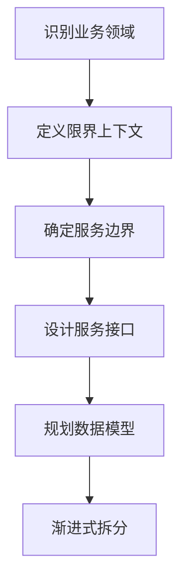
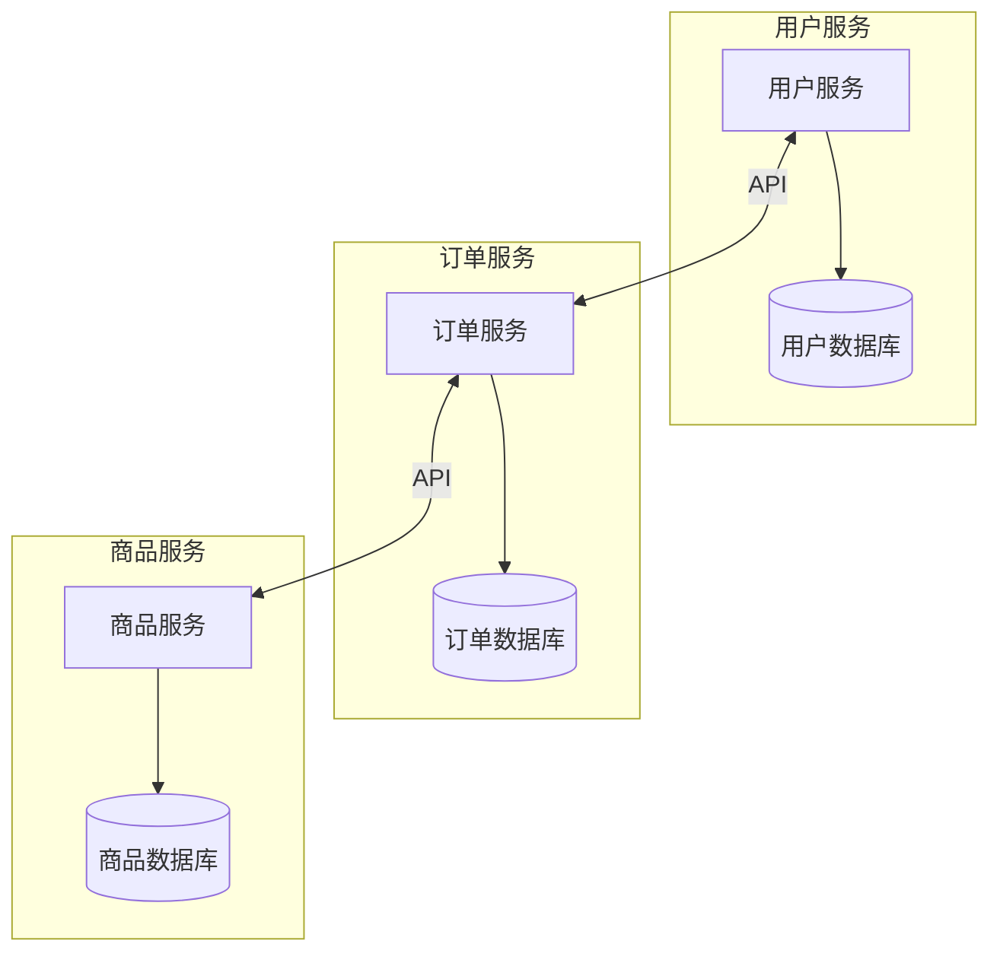
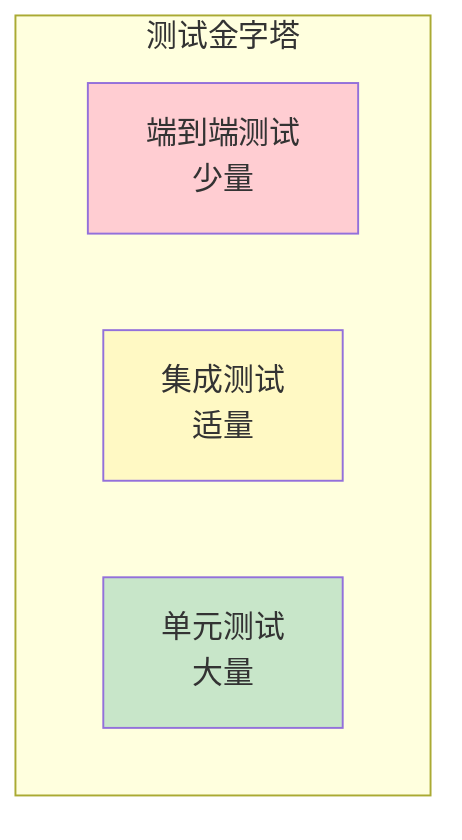
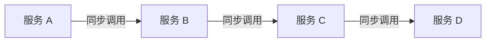

# 最佳实践

## 服务拆分最佳实践

### 拆分原则

| 原则 | 说明 | 示例 |
| ---- | ---- | ---- |
| **单一职责** | 每个服务只做一件事 | 用户服务只管用户 |
| **高内聚** | 相关功能放在一起 | 订单和订单项在同一服务 |
| **低耦合** | 服务间依赖最小化 | 通过事件而非直接调用 |
| **业务边界** | 按业务领域划分 | 使用 DDD 限界上下文 |
| **团队自治** | 一个团队负责一个服务 | 康威定律 |

### 拆分步骤



### 服务粒度

**过细的问题：**
- 网络开销大
- 分布式事务复杂
- 运维成本高

**过粗的问题：**
- 难以独立部署
- 扩展性差
- 团队协作困难

**合适的粒度：**
- 2-3 人团队可以维护
- 可以在 2 周内重写
- 有明确的业务边界

### 拆分示例

```
# 电商系统拆分

单体应用
├── 用户模块
├── 商品模块
├── 订单模块
├── 支付模块
├── 库存模块
└── 物流模块

↓ 拆分为微服务

用户服务 (user-service)
├── 用户注册/登录
├── 用户信息管理
└── 用户认证

商品服务 (product-service)
├── 商品管理
├── 分类管理
└── 商品搜索

订单服务 (order-service)
├── 订单创建
├── 订单查询
└── 订单状态管理

支付服务 (payment-service)
├── 支付处理
├── 退款处理
└── 支付记录

库存服务 (inventory-service)
├── 库存管理
├── 库存预占
└── 库存扣减

物流服务 (logistics-service)
├── 物流跟踪
├── 配送管理
└── 物流查询
```

## 数据管理最佳实践

### 数据库拆分

每个微服务应该拥有自己的数据库，实现数据自治。



### 数据一致性

#### 最终一致性

```java
// 使用事件驱动实现最终一致性
@Service
public class OrderService {
    
    @Transactional
    public Order createOrder(OrderDTO dto) {
        // 1. 创建订单（本地事务）
        Order order = orderRepository.save(new Order(dto));
        
        // 2. 发布事件（异步处理）
        eventPublisher.publish(new OrderCreatedEvent(order));
        
        return order;
    }
}

@Service
public class InventoryService {
    
    @EventListener
    @Transactional
    public void handleOrderCreated(OrderCreatedEvent event) {
        // 扣减库存（本地事务）
        inventoryRepository.deduct(event.getItems());
        
        // 发布库存扣减事件
        eventPublisher.publish(new InventoryDeductedEvent(event.getOrderId()));
    }
}
```

#### 补偿机制

```java
// Saga 补偿
@Service
public class OrderSaga {
    
    public void execute(OrderDTO dto) {
        try {
            // 步骤 1: 创建订单
            Order order = orderService.create(dto);
            
            // 步骤 2: 扣减库存
            inventoryService.deduct(order.getItems());
            
            // 步骤 3: 扣减余额
            paymentService.deduct(order.getUserId(), order.getAmount());
            
        } catch (InventoryException e) {
            // 补偿: 取消订单
            orderService.cancel(order.getId());
            throw e;
            
        } catch (PaymentException e) {
            // 补偿: 恢复库存 + 取消订单
            inventoryService.restore(order.getItems());
            orderService.cancel(order.getId());
            throw e;
        }
    }
}
```

### 跨服务查询

```java
// API 组合模式
@Service
public class OrderDetailService {
    
    @Autowired
    private OrderClient orderClient;
    
    @Autowired
    private UserClient userClient;
    
    @Autowired
    private ProductClient productClient;
    
    public OrderDetailDTO getOrderDetail(Long orderId) {
        // 并行调用多个服务
        CompletableFuture<Order> orderFuture = 
            CompletableFuture.supplyAsync(() -> orderClient.getOrder(orderId));
        
        Order order = orderFuture.join();
        
        CompletableFuture<User> userFuture = 
            CompletableFuture.supplyAsync(() -> userClient.getUser(order.getUserId()));
        
        CompletableFuture<List<Product>> productsFuture = 
            CompletableFuture.supplyAsync(() -> 
                productClient.getProducts(order.getProductIds()));
        
        // 组合结果
        return new OrderDetailDTO(
            order,
            userFuture.join(),
            productsFuture.join()
        );
    }
}
```

## 测试策略

### 测试金字塔



### 单元测试

```java
@ExtendWith(MockitoExtension.class)
class OrderServiceTest {
    
    @Mock
    private OrderRepository orderRepository;
    
    @Mock
    private EventPublisher eventPublisher;
    
    @InjectMocks
    private OrderService orderService;
    
    @Test
    void createOrder_shouldSaveAndPublishEvent() {
        // Given
        OrderDTO dto = new OrderDTO("user1", List.of(new OrderItem("product1", 2)));
        Order savedOrder = new Order(1L, dto);
        when(orderRepository.save(any())).thenReturn(savedOrder);
        
        // When
        Order result = orderService.createOrder(dto);
        
        // Then
        assertThat(result.getId()).isEqualTo(1L);
        verify(orderRepository).save(any(Order.class));
        verify(eventPublisher).publish(any(OrderCreatedEvent.class));
    }
}
```

### 集成测试

```java
@SpringBootTest
@Testcontainers
class OrderServiceIntegrationTest {
    
    @Container
    static MySQLContainer<?> mysql = new MySQLContainer<>("mysql:8.0");
    
    @Container
    static KafkaContainer kafka = new KafkaContainer(DockerImageName.parse("confluentinc/cp-kafka:latest"));
    
    @DynamicPropertySource
    static void configureProperties(DynamicPropertyRegistry registry) {
        registry.add("spring.datasource.url", mysql::getJdbcUrl);
        registry.add("spring.kafka.bootstrap-servers", kafka::getBootstrapServers);
    }
    
    @Autowired
    private OrderService orderService;
    
    @Test
    void createOrder_shouldPersistAndPublishEvent() {
        // Given
        OrderDTO dto = new OrderDTO("user1", List.of(new OrderItem("product1", 2)));
        
        // When
        Order result = orderService.createOrder(dto);
        
        // Then
        assertThat(result.getId()).isNotNull();
        // 验证数据库
        // 验证 Kafka 消息
    }
}
```

### 契约测试

```java
// 消费者端契约测试 (Pact)
@ExtendWith(PactConsumerTestExt.class)
class UserClientContractTest {
    
    @Pact(consumer = "order-service", provider = "user-service")
    public RequestResponsePact getUserPact(PactDslWithProvider builder) {
        return builder
            .given("用户存在")
            .uponReceiving("获取用户请求")
            .path("/api/users/1")
            .method("GET")
            .willRespondWith()
            .status(200)
            .body(new PactDslJsonBody()
                .integerType("id", 1)
                .stringType("name", "张三")
                .stringType("email", "zhangsan@example.com"))
            .toPact();
    }
    
    @Test
    @PactTestFor(pactMethod = "getUserPact")
    void getUser_shouldReturnUser(MockServer mockServer) {
        UserClient client = new UserClient(mockServer.getUrl());
        User user = client.getUser(1L);
        
        assertThat(user.getName()).isEqualTo("张三");
    }
}
```

## 常见反模式

### 1. 分布式单体

**问题：** 服务间紧密耦合，必须一起部署。



**解决方案：**
- 使用异步消息解耦
- 减少服务间直接依赖
- 引入 API 网关

### 2. 共享数据库

**问题：** 多个服务共享同一个数据库。

**解决方案：**
- 每个服务独立数据库
- 通过 API 或事件同步数据

### 3. 过度拆分

**问题：** 服务粒度过细，导致复杂度爆炸。

**解决方案：**
- 合并相关服务
- 按业务领域而非技术层拆分

### 4. 缺乏 API 版本控制

**问题：** API 变更导致消费者崩溃。

```java
// 正确做法：版本化 API
@RestController
@RequestMapping("/api/v1/users")
public class UserControllerV1 {
    // v1 版本
}

@RestController
@RequestMapping("/api/v2/users")
public class UserControllerV2 {
    // v2 版本，兼容 v1
}
```

### 5. 忽略网络问题

**问题：** 假设网络总是可靠的。

**解决方案：**
- 实现重试机制
- 使用断路器
- 设置合理超时

```java
@Retry(name = "userService", fallbackMethod = "fallback")
@CircuitBreaker(name = "userService")
@TimeLimiter(name = "userService")
public User getUser(Long id) {
    return userClient.getUser(id);
}
```

### 6. 日志和监控不足

**问题：** 无法追踪分布式请求。

**解决方案：**
- 统一日志格式
- 分布式追踪
- 集中监控告警

### 反模式检查清单

| 反模式 | 症状 | 解决方案 |
| ------ | ---- | ------- |
| 分布式单体 | 服务必须一起部署 | 异步解耦 |
| 共享数据库 | 多服务访问同一表 | 数据库拆分 |
| 过度拆分 | 服务数量爆炸 | 合并服务 |
| 缺乏版本控制 | API 变更导致故障 | 版本化 API |
| 忽略网络问题 | 级联故障 | 断路器、重试 |
| 监控不足 | 问题难以定位 | 可观测性建设 |
