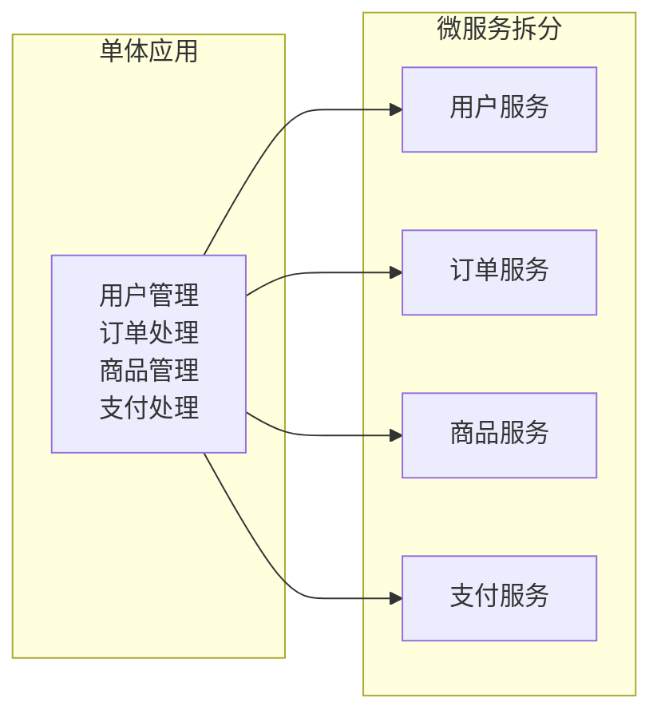
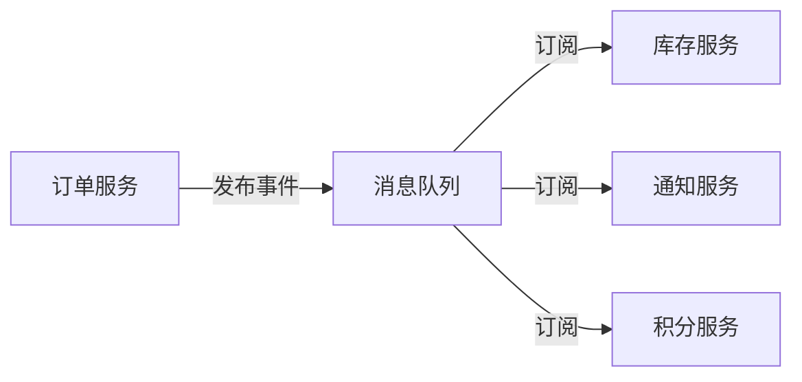
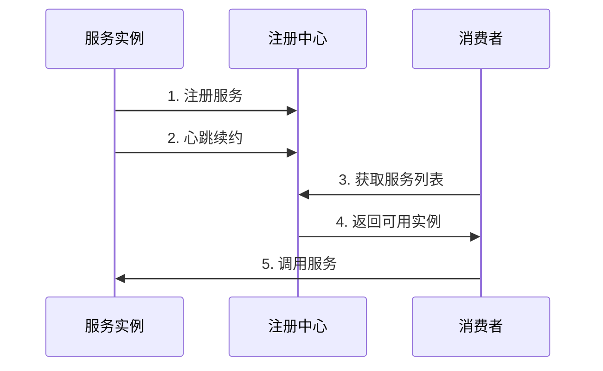

# 微服务核心概念

## 服务拆分原则

### 单一职责原则

每个微服务应该只负责一个特定的业务功能，遵循"做好一件事"的原则。



### 领域驱动设计（DDD）

使用 DDD 的限界上下文（Bounded Context）来划分服务边界：

| 概念 | 说明 | 示例 |
| ---- | ---- | ---- |
| **领域** | 业务问题空间 | 电商系统 |
| **子域** | 领域的细分 | 订单、库存、支付 |
| **限界上下文** | 模型的边界 | 订单上下文、支付上下文 |
| **聚合** | 数据一致性边界 | 订单聚合（订单+订单项） |

### 拆分策略

1. **按业务能力拆分**
   - 识别核心业务能力
   - 每个能力对应一个服务
   - 例：用户、订单、支付、物流

2. **按子域拆分**
   - 核心域：核心竞争力
   - 支撑域：支持核心业务
   - 通用域：通用功能

3. **拆分原则**
   - 高内聚、低耦合
   - 服务粒度适中
   - 数据独立性
   - 团队自治

## 服务通信方式

### 同步通信

#### REST API

最常用的同步通信方式，基于 HTTP 协议：

```java
// Spring Boot REST Controller
@RestController
@RequestMapping("/api/users")
public class UserController {
    
    @GetMapping("/{id}")
    public ResponseEntity<User> getUser(@PathVariable Long id) {
        User user = userService.findById(id);
        return ResponseEntity.ok(user);
    }
    
    @PostMapping
    public ResponseEntity<User> createUser(@RequestBody UserDTO dto) {
        User user = userService.create(dto);
        return ResponseEntity.status(HttpStatus.CREATED).body(user);
    }
}
```

#### gRPC

高性能的 RPC 框架，使用 Protocol Buffers：

```protobuf
// user.proto
syntax = "proto3";

service UserService {
    rpc GetUser(GetUserRequest) returns (User);
    rpc CreateUser(CreateUserRequest) returns (User);
}

message User {
    int64 id = 1;
    string name = 2;
    string email = 3;
}

message GetUserRequest {
    int64 id = 1;
}
```

#### 同步通信对比

| 特性 | REST | gRPC |
| ---- | ---- | ---- |
| **协议** | HTTP/1.1 或 HTTP/2 | HTTP/2 |
| **数据格式** | JSON/XML | Protocol Buffers |
| **性能** | 较低 | 高 |
| **浏览器支持** | 原生支持 | 需要 gRPC-Web |
| **学习曲线** | 低 | 中等 |
| **适用场景** | 公开 API | 内部服务通信 |

### 异步通信

#### 消息队列

使用消息中间件实现服务解耦：

```java
// 生产者 - 订单服务
@Service
public class OrderService {
    
    @Autowired
    private RabbitTemplate rabbitTemplate;
    
    public Order createOrder(OrderDTO dto) {
        Order order = orderRepository.save(new Order(dto));
        
        // 发送订单创建事件
        OrderCreatedEvent event = new OrderCreatedEvent(order);
        rabbitTemplate.convertAndSend("order.exchange", "order.created", event);
        
        return order;
    }
}

// 消费者 - 库存服务
@Component
public class InventoryListener {
    
    @RabbitListener(queues = "inventory.queue")
    public void handleOrderCreated(OrderCreatedEvent event) {
        // 扣减库存
        inventoryService.deduct(event.getItems());
    }
}
```

#### 事件驱动架构



### 通信方式选择

| 场景 | 推荐方式 | 原因 |
| ---- | ------- | ---- |
| 需要立即响应 | 同步（REST/gRPC） | 实时性要求 |
| 可以延迟处理 | 异步（消息队列） | 解耦、削峰 |
| 内部高频调用 | gRPC | 高性能 |
| 对外公开 API | REST | 通用性好 |
| 事件通知 | 异步消息 | 松耦合 |

## API 设计最佳实践

### RESTful API 设计

#### URL 设计规范

```
# 资源命名使用名词复数
GET    /api/users          # 获取用户列表
GET    /api/users/{id}     # 获取单个用户
POST   /api/users          # 创建用户
PUT    /api/users/{id}     # 更新用户
DELETE /api/users/{id}     # 删除用户

# 嵌套资源
GET    /api/users/{id}/orders    # 获取用户的订单
POST   /api/users/{id}/orders    # 为用户创建订单

# 查询参数
GET    /api/users?page=1&size=10&sort=name,asc
GET    /api/users?status=active&role=admin
```

#### 响应格式

```json
// 成功响应
{
    "code": 200,
    "message": "success",
    "data": {
        "id": 1,
        "name": "张三",
        "email": "zhangsan@example.com"
    }
}

// 分页响应
{
    "code": 200,
    "message": "success",
    "data": {
        "content": [...],
        "page": 1,
        "size": 10,
        "total": 100
    }
}

// 错误响应
{
    "code": 400,
    "message": "参数错误",
    "errors": [
        {"field": "email", "message": "邮箱格式不正确"}
    ]
}
```

#### HTTP 状态码

| 状态码 | 含义 | 使用场景 |
| ------ | ---- | ------- |
| 200 | OK | 请求成功 |
| 201 | Created | 资源创建成功 |
| 204 | No Content | 删除成功 |
| 400 | Bad Request | 请求参数错误 |
| 401 | Unauthorized | 未认证 |
| 403 | Forbidden | 无权限 |
| 404 | Not Found | 资源不存在 |
| 500 | Internal Server Error | 服务器错误 |

### API 版本控制

```java
// URL 路径版本
@RequestMapping("/api/v1/users")
@RequestMapping("/api/v2/users")

// 请求头版本
@GetMapping(headers = "X-API-Version=1")
@GetMapping(headers = "X-API-Version=2")

// Accept 头版本
@GetMapping(produces = "application/vnd.company.v1+json")
```

## 服务注册与发现

### 概念

服务注册与发现是微服务架构的核心组件，解决服务实例动态变化的问题。



### 服务注册

服务启动时向注册中心注册自己的信息：

```java
// Spring Cloud + Nacos 示例
@SpringBootApplication
@EnableDiscoveryClient
public class UserServiceApplication {
    public static void main(String[] args) {
        SpringApplication.run(UserServiceApplication.class, args);
    }
}
```

```yaml
# application.yml
spring:
  application:
    name: user-service
  cloud:
    nacos:
      discovery:
        server-addr: localhost:8848
        namespace: dev
```

### 服务发现

消费者从注册中心获取服务实例列表：

```java
// 使用 RestTemplate + 负载均衡
@Configuration
public class RestTemplateConfig {
    
    @Bean
    @LoadBalanced
    public RestTemplate restTemplate() {
        return new RestTemplate();
    }
}

@Service
public class OrderService {
    
    @Autowired
    private RestTemplate restTemplate;
    
    public User getUser(Long userId) {
        // 使用服务名调用，自动负载均衡
        return restTemplate.getForObject(
            "http://user-service/api/users/" + userId, 
            User.class
        );
    }
}
```

### 主流注册中心对比

| 特性 | Nacos | Consul | Eureka | Zookeeper |
| ---- | ----- | ------ | ------ | --------- |
| **一致性协议** | AP/CP 可切换 | CP | AP | CP |
| **健康检查** | TCP/HTTP/MySQL | TCP/HTTP/gRPC | 心跳 | 心跳 |
| **配置管理** | 支持 | 支持 | 不支持 | 支持 |
| **多数据中心** | 支持 | 支持 | 支持 | 不支持 |
| **管理界面** | 有 | 有 | 有 | 无 |
| **Spring Cloud 集成** | 好 | 好 | 好 | 一般 |
