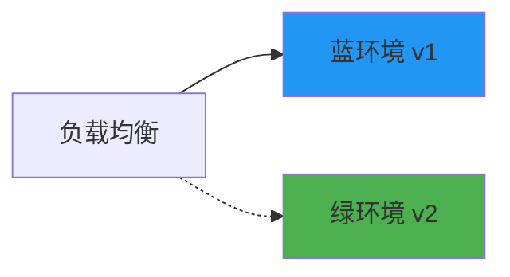
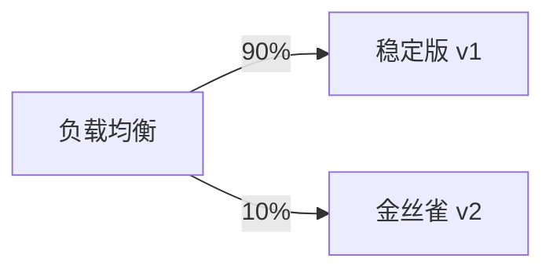

# 部署与运维

## 容器化部署

### Dockerfile 最佳实践

```dockerfile
# 多阶段构建
FROM maven:3.9-eclipse-temurin-21 AS builder
WORKDIR /app
COPY pom.xml .
RUN mvn dependency:go-offline
COPY src ./src
RUN mvn package -DskipTests

# 运行阶段
FROM eclipse-temurin:21-jre-alpine
WORKDIR /app

# 创建非 root 用户
RUN addgroup -S spring && adduser -S spring -G spring
USER spring:spring

# 复制构建产物
COPY --from=builder /app/target/*.jar app.jar

# 健康检查
HEALTHCHECK --interval=30s --timeout=3s \
  CMD wget -q --spider http://localhost:8080/actuator/health || exit 1

# JVM 优化参数
ENV JAVA_OPTS="-XX:+UseContainerSupport -XX:MaxRAMPercentage=75.0"

EXPOSE 8080
ENTRYPOINT ["sh", "-c", "java $JAVA_OPTS -jar app.jar"]
```

### Docker Compose 开发环境

```yaml
# docker-compose.yml
version: '3.8'

services:
  user-service:
    build: ./user-service
    ports:
      - "8081:8080"
    environment:
      - SPRING_PROFILES_ACTIVE=docker
      - SPRING_DATASOURCE_URL=jdbc:mysql://mysql:3306/users
    depends_on:
      - mysql
      - nacos
    networks:
      - microservices

  order-service:
    build: ./order-service
    ports:
      - "8082:8080"
    environment:
      - SPRING_PROFILES_ACTIVE=docker
    depends_on:
      - mysql
      - nacos
      - kafka
    networks:
      - microservices

  mysql:
    image: mysql:8.0
    environment:
      MYSQL_ROOT_PASSWORD: root
      MYSQL_DATABASE: microservices
    volumes:
      - mysql-data:/var/lib/mysql
    networks:
      - microservices

  nacos:
    image: nacos/nacos-server:latest
    environment:
      - MODE=standalone
    ports:
      - "8848:8848"
    networks:
      - microservices

  kafka:
    image: confluentinc/cp-kafka:latest
    environment:
      KAFKA_ZOOKEEPER_CONNECT: zookeeper:2181
      KAFKA_ADVERTISED_LISTENERS: PLAINTEXT://kafka:9092
    depends_on:
      - zookeeper
    networks:
      - microservices

  zookeeper:
    image: confluentinc/cp-zookeeper:latest
    environment:
      ZOOKEEPER_CLIENT_PORT: 2181
    networks:
      - microservices

networks:
  microservices:
    driver: bridge

volumes:
  mysql-data:
```

## Kubernetes 部署

### Deployment 配置

```yaml
# user-service-deployment.yaml
apiVersion: apps/v1
kind: Deployment
metadata:
  name: user-service
  labels:
    app: user-service
spec:
  replicas: 3
  selector:
    matchLabels:
      app: user-service
  template:
    metadata:
      labels:
        app: user-service
      annotations:
        prometheus.io/scrape: "true"
        prometheus.io/port: "8080"
        prometheus.io/path: "/actuator/prometheus"
    spec:
      containers:
        - name: user-service
          image: registry.example.com/user-service:v1.0.0
          ports:
            - containerPort: 8080
          env:
            - name: SPRING_PROFILES_ACTIVE
              value: "kubernetes"
            - name: JAVA_OPTS
              value: "-XX:+UseContainerSupport -XX:MaxRAMPercentage=75.0"
          envFrom:
            - configMapRef:
                name: user-service-config
            - secretRef:
                name: user-service-secrets
          resources:
            requests:
              memory: "512Mi"
              cpu: "250m"
            limits:
              memory: "1Gi"
              cpu: "500m"
          livenessProbe:
            httpGet:
              path: /actuator/health/liveness
              port: 8080
            initialDelaySeconds: 60
            periodSeconds: 10
          readinessProbe:
            httpGet:
              path: /actuator/health/readiness
              port: 8080
            initialDelaySeconds: 30
            periodSeconds: 5
      affinity:
        podAntiAffinity:
          preferredDuringSchedulingIgnoredDuringExecution:
            - weight: 100
              podAffinityTerm:
                labelSelector:
                  matchLabels:
                    app: user-service
                topologyKey: kubernetes.io/hostname
```

### Service 配置

```yaml
# user-service-service.yaml
apiVersion: v1
kind: Service
metadata:
  name: user-service
spec:
  selector:
    app: user-service
  ports:
    - port: 80
      targetPort: 8080
  type: ClusterIP

---
# Ingress 配置
apiVersion: networking.k8s.io/v1
kind: Ingress
metadata:
  name: microservices-ingress
  annotations:
    nginx.ingress.kubernetes.io/rewrite-target: /
spec:
  ingressClassName: nginx
  rules:
    - host: api.example.com
      http:
        paths:
          - path: /users
            pathType: Prefix
            backend:
              service:
                name: user-service
                port:
                  number: 80
          - path: /orders
            pathType: Prefix
            backend:
              service:
                name: order-service
                port:
                  number: 80
```

### ConfigMap 和 Secret

```yaml
# configmap.yaml
apiVersion: v1
kind: ConfigMap
metadata:
  name: user-service-config
data:
  SPRING_DATASOURCE_URL: jdbc:mysql://mysql:3306/users
  SPRING_REDIS_HOST: redis
  NACOS_SERVER_ADDR: nacos:8848

---
# secret.yaml
apiVersion: v1
kind: Secret
metadata:
  name: user-service-secrets
type: Opaque
stringData:
  SPRING_DATASOURCE_USERNAME: root
  SPRING_DATASOURCE_PASSWORD: password123
```

### HPA 自动扩缩容

```yaml
# hpa.yaml
apiVersion: autoscaling/v2
kind: HorizontalPodAutoscaler
metadata:
  name: user-service-hpa
spec:
  scaleTargetRef:
    apiVersion: apps/v1
    kind: Deployment
    name: user-service
  minReplicas: 2
  maxReplicas: 10
  metrics:
    - type: Resource
      resource:
        name: cpu
        target:
          type: Utilization
          averageUtilization: 70
    - type: Resource
      resource:
        name: memory
        target:
          type: Utilization
          averageUtilization: 80
```

## CI/CD 流水线

### GitHub Actions

```yaml
# .github/workflows/ci-cd.yml
name: CI/CD Pipeline

on:
  push:
    branches: [main, develop]
  pull_request:
    branches: [main]

env:
  REGISTRY: ghcr.io
  IMAGE_NAME: ${{ github.repository }}

jobs:
  test:
    runs-on: ubuntu-latest
    steps:
      - uses: actions/checkout@v4
      
      - name: Set up JDK 21
        uses: actions/setup-java@v4
        with:
          java-version: '21'
          distribution: 'temurin'
          cache: maven
      
      - name: Run tests
        run: mvn test
      
      - name: Upload coverage
        uses: codecov/codecov-action@v3

  build:
    needs: test
    runs-on: ubuntu-latest
    outputs:
      image-tag: ${{ steps.meta.outputs.tags }}
    steps:
      - uses: actions/checkout@v4
      
      - name: Set up Docker Buildx
        uses: docker/setup-buildx-action@v3
      
      - name: Login to Registry
        uses: docker/login-action@v3
        with:
          registry: ${{ env.REGISTRY }}
          username: ${{ github.actor }}
          password: ${{ secrets.GITHUB_TOKEN }}
      
      - name: Extract metadata
        id: meta
        uses: docker/metadata-action@v5
        with:
          images: ${{ env.REGISTRY }}/${{ env.IMAGE_NAME }}
          tags: |
            type=sha,prefix=
            type=ref,event=branch
      
      - name: Build and push
        uses: docker/build-push-action@v5
        with:
          context: .
          push: true
          tags: ${{ steps.meta.outputs.tags }}
          cache-from: type=gha
          cache-to: type=gha,mode=max

  deploy-staging:
    needs: build
    runs-on: ubuntu-latest
    if: github.ref == 'refs/heads/develop'
    environment: staging
    steps:
      - name: Deploy to Staging
        uses: azure/k8s-deploy@v4
        with:
          namespace: staging
          manifests: k8s/staging/
          images: ${{ needs.build.outputs.image-tag }}

  deploy-production:
    needs: build
    runs-on: ubuntu-latest
    if: github.ref == 'refs/heads/main'
    environment: production
    steps:
      - name: Deploy to Production
        uses: azure/k8s-deploy@v4
        with:
          namespace: production
          manifests: k8s/production/
          images: ${{ needs.build.outputs.image-tag }}
          strategy: canary
          percentage: 20
```

### Jenkins Pipeline

```groovy
// Jenkinsfile
pipeline {
    agent any
    
    environment {
        REGISTRY = 'registry.example.com'
        IMAGE_NAME = 'user-service'
    }
    
    stages {
        stage('Test') {
            steps {
                sh 'mvn test'
            }
            post {
                always {
                    junit 'target/surefire-reports/*.xml'
                }
            }
        }
        
        stage('Build') {
            steps {
                sh 'mvn package -DskipTests'
                sh "docker build -t ${REGISTRY}/${IMAGE_NAME}:${BUILD_NUMBER} ."
            }
        }
        
        stage('Push') {
            steps {
                withCredentials([usernamePassword(
                    credentialsId: 'docker-registry',
                    usernameVariable: 'USER',
                    passwordVariable: 'PASS'
                )]) {
                    sh "docker login ${REGISTRY} -u ${USER} -p ${PASS}"
                    sh "docker push ${REGISTRY}/${IMAGE_NAME}:${BUILD_NUMBER}"
                }
            }
        }
        
        stage('Deploy to Staging') {
            when { branch 'develop' }
            steps {
                sh "kubectl set image deployment/user-service user-service=${REGISTRY}/${IMAGE_NAME}:${BUILD_NUMBER} -n staging"
            }
        }
        
        stage('Deploy to Production') {
            when { branch 'main' }
            steps {
                input message: '确认部署到生产环境？'
                sh "kubectl set image deployment/user-service user-service=${REGISTRY}/${IMAGE_NAME}:${BUILD_NUMBER} -n production"
            }
        }
    }
}
```

## 发布策略

### 蓝绿部署



```yaml
# blue-green-deployment.yaml
apiVersion: v1
kind: Service
metadata:
  name: user-service
spec:
  selector:
    app: user-service
    version: blue  # 切换到 green 完成发布
  ports:
    - port: 80
      targetPort: 8080

---
apiVersion: apps/v1
kind: Deployment
metadata:
  name: user-service-blue
spec:
  replicas: 3
  selector:
    matchLabels:
      app: user-service
      version: blue
  template:
    metadata:
      labels:
        app: user-service
        version: blue
    spec:
      containers:
        - name: user-service
          image: user-service:v1.0.0

---
apiVersion: apps/v1
kind: Deployment
metadata:
  name: user-service-green
spec:
  replicas: 3
  selector:
    matchLabels:
      app: user-service
      version: green
  template:
    metadata:
      labels:
        app: user-service
        version: green
    spec:
      containers:
        - name: user-service
          image: user-service:v2.0.0
```

### 金丝雀发布



```yaml
# Istio 金丝雀发布
apiVersion: networking.istio.io/v1beta1
kind: VirtualService
metadata:
  name: user-service
spec:
  hosts:
    - user-service
  http:
    - route:
        - destination:
            host: user-service
            subset: stable
          weight: 90
        - destination:
            host: user-service
            subset: canary
          weight: 10

---
apiVersion: networking.istio.io/v1beta1
kind: DestinationRule
metadata:
  name: user-service
spec:
  host: user-service
  subsets:
    - name: stable
      labels:
        version: v1
    - name: canary
      labels:
        version: v2
```

### 滚动更新

```yaml
apiVersion: apps/v1
kind: Deployment
metadata:
  name: user-service
spec:
  replicas: 5
  strategy:
    type: RollingUpdate
    rollingUpdate:
      maxSurge: 1        # 最多额外创建 1 个 Pod
      maxUnavailable: 0  # 不允许不可用 Pod
  template:
    spec:
      containers:
        - name: user-service
          image: user-service:v2.0.0
```

## 发布策略对比

| 策略 | 优点 | 缺点 | 适用场景 |
| ---- | ---- | ---- | ------- |
| **蓝绿部署** | 快速回滚、零停机 | 资源消耗大 | 关键服务 |
| **金丝雀发布** | 风险可控、渐进式 | 复杂度高 | 大规模服务 |
| **滚动更新** | 资源效率高 | 回滚较慢 | 一般服务 |
| **A/B 测试** | 可对比效果 | 需要流量分发 | 功能验证 |
