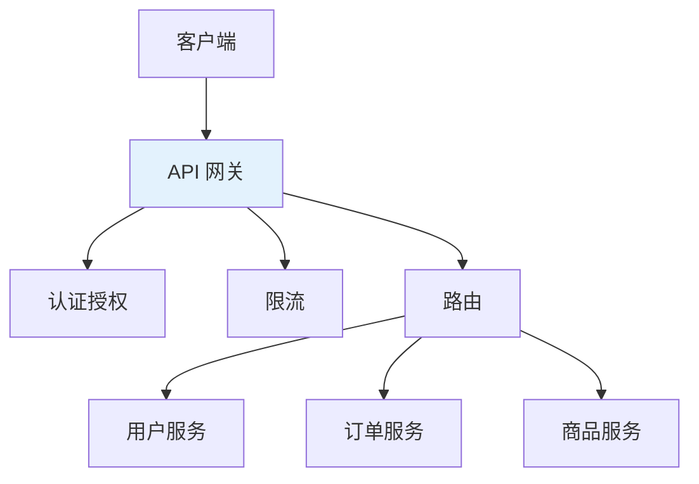
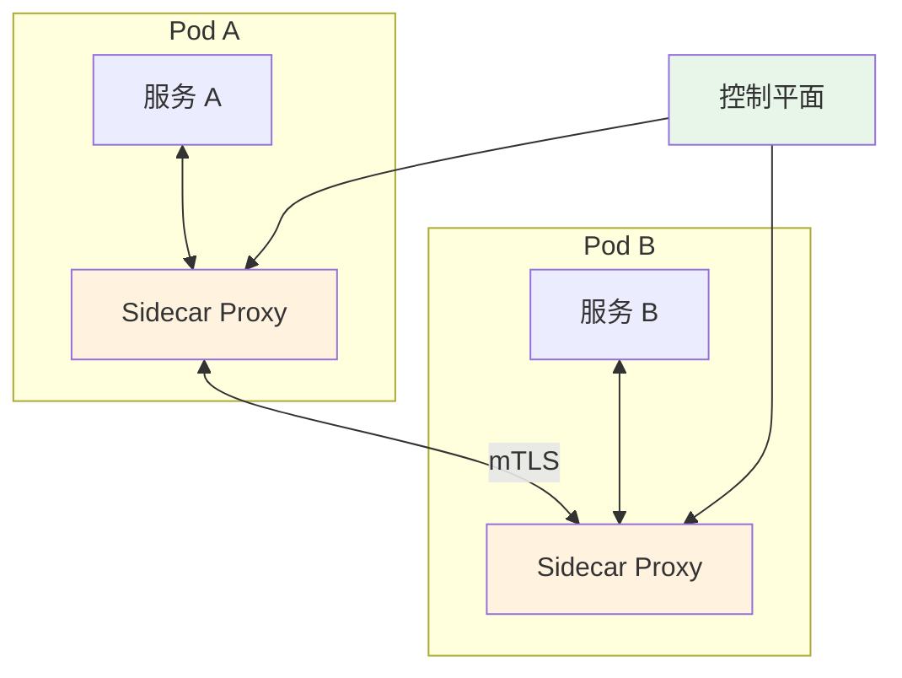
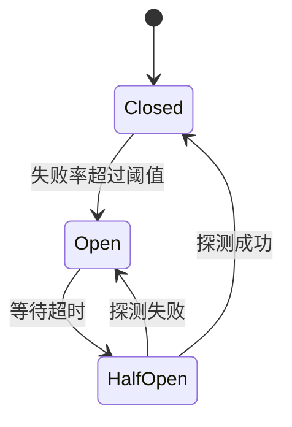
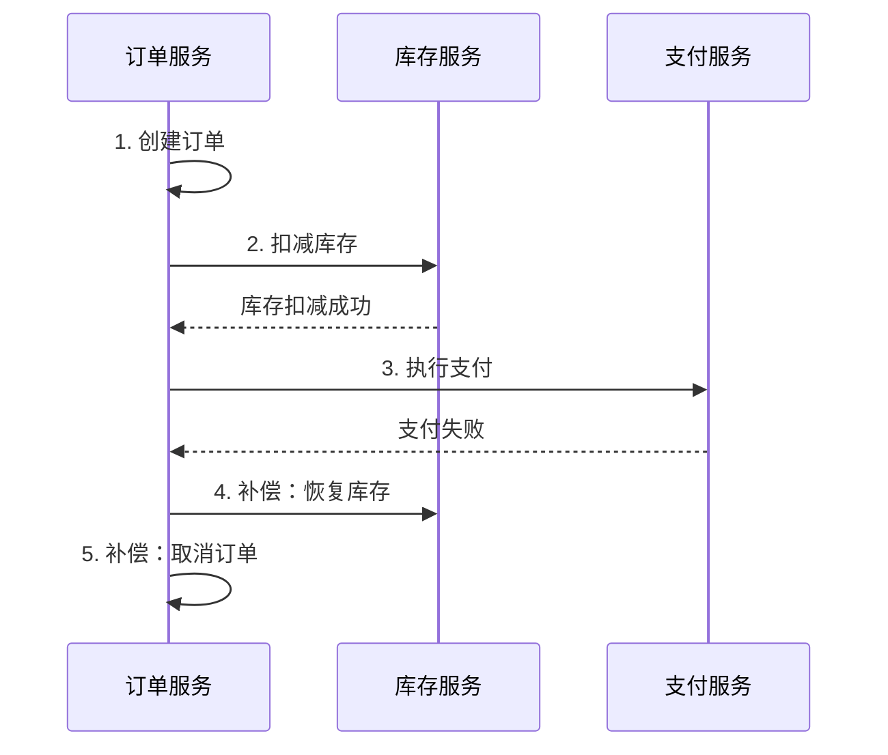
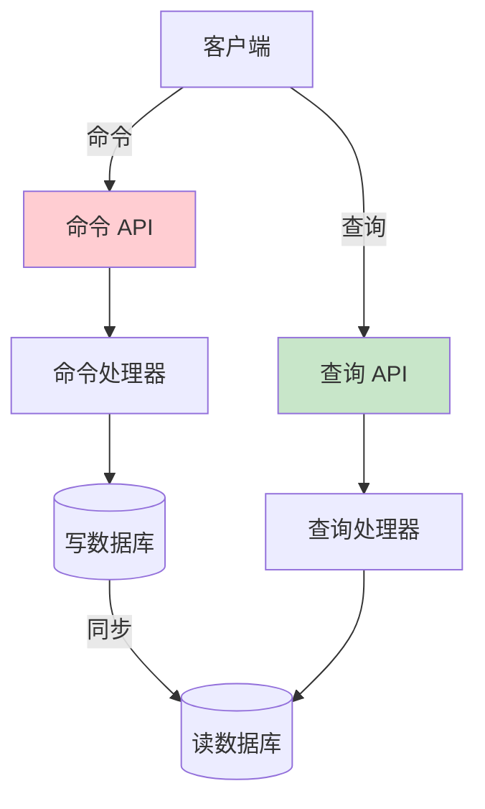

# 微服务设计模式

## API 网关模式

### 概述

API 网关是微服务架构的入口点，负责请求路由、认证授权、限流熔断等功能。



### 核心功能

| 功能 | 说明 |
| ---- | ---- |
| **请求路由** | 根据路径将请求转发到对应服务 |
| **负载均衡** | 在多个服务实例间分发请求 |
| **认证授权** | 统一的身份验证和权限控制 |
| **限流熔断** | 保护后端服务免受过载 |
| **协议转换** | HTTP/gRPC/WebSocket 转换 |
| **请求聚合** | 合并多个服务的响应 |
| **日志监控** | 统一的访问日志和监控 |

### Spring Cloud Gateway 示例

```yaml
# application.yml
spring:
  cloud:
    gateway:
      routes:
        - id: user-service
          uri: lb://user-service
          predicates:
            - Path=/api/users/**
          filters:
            - StripPrefix=1
            - name: RequestRateLimiter
              args:
                redis-rate-limiter.replenishRate: 10
                redis-rate-limiter.burstCapacity: 20
        
        - id: order-service
          uri: lb://order-service
          predicates:
            - Path=/api/orders/**
          filters:
            - StripPrefix=1
```

```java
// 自定义全局过滤器
@Component
public class AuthFilter implements GlobalFilter, Ordered {
    
    @Override
    public Mono<Void> filter(ServerWebExchange exchange, GatewayFilterChain chain) {
        String token = exchange.getRequest().getHeaders().getFirst("Authorization");
        
        if (token == null || !validateToken(token)) {
            exchange.getResponse().setStatusCode(HttpStatus.UNAUTHORIZED);
            return exchange.getResponse().setComplete();
        }
        
        return chain.filter(exchange);
    }
    
    @Override
    public int getOrder() {
        return -100;
    }
}
```

## 服务网格（Service Mesh）

### 概述

服务网格是一个专门处理服务间通信的基础设施层，通过 Sidecar 代理实现流量管理、安全和可观测性。



### Istio 架构

| 组件 | 功能 |
| ---- | ---- |
| **Envoy** | 数据平面代理，处理所有网络流量 |
| **Istiod** | 控制平面，管理配置和证书 |
| **Pilot** | 服务发现和流量管理 |
| **Citadel** | 证书管理和 mTLS |
| **Galley** | 配置验证和分发 |

### 流量管理示例

```yaml
# VirtualService - 流量路由
apiVersion: networking.istio.io/v1beta1
kind: VirtualService
metadata:
  name: user-service
spec:
  hosts:
    - user-service
  http:
    - match:
        - headers:
            x-version:
              exact: "v2"
      route:
        - destination:
            host: user-service
            subset: v2
    - route:
        - destination:
            host: user-service
            subset: v1
          weight: 90
        - destination:
            host: user-service
            subset: v2
          weight: 10

---
# DestinationRule - 目标规则
apiVersion: networking.istio.io/v1beta1
kind: DestinationRule
metadata:
  name: user-service
spec:
  host: user-service
  trafficPolicy:
    connectionPool:
      tcp:
        maxConnections: 100
      http:
        h2UpgradePolicy: UPGRADE
  subsets:
    - name: v1
      labels:
        version: v1
    - name: v2
      labels:
        version: v2
```

## 断路器模式（Circuit Breaker）

### 概述

断路器模式用于防止级联故障，当服务调用失败率达到阈值时，断路器打开，快速失败而不是等待超时。



### 断路器状态

| 状态 | 说明 |
| ---- | ---- |
| **Closed** | 正常状态，请求正常通过 |
| **Open** | 熔断状态，请求快速失败 |
| **Half-Open** | 半开状态，允许部分请求探测 |

### Resilience4j 实现

```java
// 配置断路器
@Configuration
public class CircuitBreakerConfig {
    
    @Bean
    public CircuitBreakerRegistry circuitBreakerRegistry() {
        CircuitBreakerConfig config = CircuitBreakerConfig.custom()
            .failureRateThreshold(50)           // 失败率阈值 50%
            .waitDurationInOpenState(Duration.ofSeconds(30))  // 熔断等待时间
            .slidingWindowSize(10)              // 滑动窗口大小
            .minimumNumberOfCalls(5)            // 最小调用次数
            .build();
        
        return CircuitBreakerRegistry.of(config);
    }
}

// 使用断路器
@Service
public class OrderService {
    
    private final CircuitBreaker circuitBreaker;
    private final UserClient userClient;
    
    public OrderService(CircuitBreakerRegistry registry, UserClient userClient) {
        this.circuitBreaker = registry.circuitBreaker("userService");
        this.userClient = userClient;
    }
    
    public User getUser(Long userId) {
        return circuitBreaker.executeSupplier(() -> userClient.getUser(userId));
    }
    
    // 使用注解方式
    @CircuitBreaker(name = "userService", fallbackMethod = "getUserFallback")
    public User getUserWithAnnotation(Long userId) {
        return userClient.getUser(userId);
    }
    
    public User getUserFallback(Long userId, Exception e) {
        return new User(userId, "Unknown", "降级用户");
    }
}
```

```yaml
# application.yml
resilience4j:
  circuitbreaker:
    instances:
      userService:
        registerHealthIndicator: true
        slidingWindowSize: 10
        minimumNumberOfCalls: 5
        failureRateThreshold: 50
        waitDurationInOpenState: 30s
        permittedNumberOfCallsInHalfOpenState: 3
```

## Saga 模式

### 概述

Saga 模式用于管理分布式事务，将长事务拆分为多个本地事务，通过补偿机制保证最终一致性。



### 实现方式

#### 编排式（Choreography）

服务通过事件相互协调，无中心协调者：

```java
// 订单服务 - 发布事件
@Service
public class OrderService {
    
    @Autowired
    private ApplicationEventPublisher eventPublisher;
    
    @Transactional
    public Order createOrder(OrderDTO dto) {
        Order order = orderRepository.save(new Order(dto));
        eventPublisher.publishEvent(new OrderCreatedEvent(order));
        return order;
    }
    
    @EventListener
    public void handlePaymentFailed(PaymentFailedEvent event) {
        // 补偿：取消订单
        Order order = orderRepository.findById(event.getOrderId()).orElseThrow();
        order.setStatus(OrderStatus.CANCELLED);
        orderRepository.save(order);
    }
}

// 库存服务 - 监听事件
@Service
public class InventoryService {
    
    @EventListener
    public void handleOrderCreated(OrderCreatedEvent event) {
        try {
            deductInventory(event.getItems());
            eventPublisher.publishEvent(new InventoryDeductedEvent(event.getOrderId()));
        } catch (Exception e) {
            eventPublisher.publishEvent(new InventoryDeductFailedEvent(event.getOrderId()));
        }
    }
}
```

#### 协调式（Orchestration）

使用中心协调者管理 Saga 流程：

```java
// Saga 协调者
@Service
public class OrderSagaOrchestrator {
    
    public void createOrderSaga(OrderDTO dto) {
        SagaBuilder.create()
            .step(orderService::createOrder)
            .compensate(orderService::cancelOrder)
            .step(inventoryService::deductInventory)
            .compensate(inventoryService::restoreInventory)
            .step(paymentService::processPayment)
            .compensate(paymentService::refund)
            .execute(dto);
    }
}
```

## CQRS 和事件溯源

### CQRS（命令查询职责分离）

将读操作和写操作分离到不同的模型：



```java
// 命令模型
@Service
public class OrderCommandService {
    
    @Autowired
    private OrderRepository orderRepository;
    
    @Autowired
    private EventPublisher eventPublisher;
    
    @Transactional
    public void createOrder(CreateOrderCommand command) {
        Order order = new Order(command);
        orderRepository.save(order);
        eventPublisher.publish(new OrderCreatedEvent(order));
    }
}

// 查询模型
@Service
public class OrderQueryService {
    
    @Autowired
    private OrderReadRepository readRepository;
    
    public OrderDTO getOrder(Long orderId) {
        return readRepository.findById(orderId)
            .map(this::toDTO)
            .orElseThrow();
    }
    
    public List<OrderDTO> getOrdersByUser(Long userId) {
        return readRepository.findByUserId(userId)
            .stream()
            .map(this::toDTO)
            .collect(Collectors.toList());
    }
}
```

### 事件溯源（Event Sourcing）

将状态变化存储为事件序列，通过重放事件恢复状态：

```java
// 事件存储
public interface EventStore {
    void save(String aggregateId, List<DomainEvent> events);
    List<DomainEvent> load(String aggregateId);
}

// 聚合根
public class Order {
    private String id;
    private OrderStatus status;
    private List<OrderItem> items;
    private List<DomainEvent> uncommittedEvents = new ArrayList<>();
    
    // 从事件重建状态
    public static Order fromEvents(List<DomainEvent> events) {
        Order order = new Order();
        events.forEach(order::apply);
        return order;
    }
    
    // 应用事件
    private void apply(DomainEvent event) {
        if (event instanceof OrderCreatedEvent) {
            this.id = ((OrderCreatedEvent) event).getOrderId();
            this.status = OrderStatus.CREATED;
            this.items = ((OrderCreatedEvent) event).getItems();
        } else if (event instanceof OrderPaidEvent) {
            this.status = OrderStatus.PAID;
        }
    }
    
    // 业务操作产生事件
    public void pay() {
        if (status != OrderStatus.CREATED) {
            throw new IllegalStateException("订单状态不允许支付");
        }
        OrderPaidEvent event = new OrderPaidEvent(this.id);
        apply(event);
        uncommittedEvents.add(event);
    }
}
```

### 模式对比

| 模式 | 优点 | 缺点 | 适用场景 |
| ---- | ---- | ---- | ------- |
| **CQRS** | 读写分离优化、独立扩展 | 复杂度增加、数据同步延迟 | 读写比例悬殊 |
| **事件溯源** | 完整审计日志、时间旅行 | 查询复杂、存储增长 | 需要审计追踪 |
| **CQRS + ES** | 结合两者优点 | 复杂度最高 | 复杂业务系统 |
