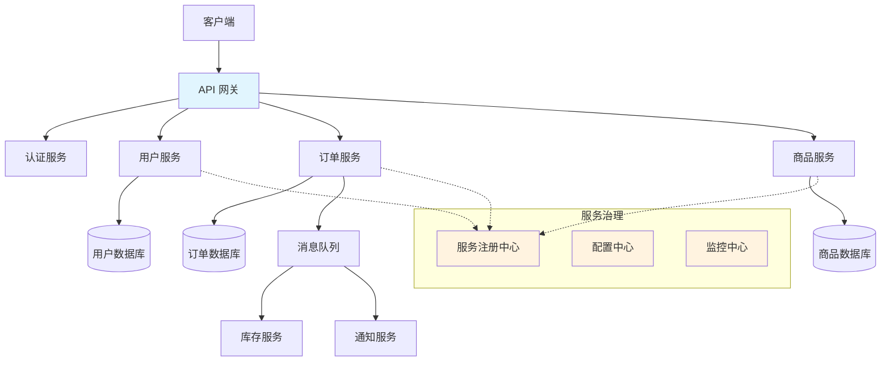

# 微服务架构

微服务架构是一种将应用程序构建为一组小型、独立服务的架构风格。每个服务运行在自己的进程中，通过轻量级机制（通常是 HTTP API）进行通信。

## 什么是微服务？

微服务是一种软件架构模式，它将单一应用程序划分为一组小的服务，每个服务：

- **独立部署**：可以独立开发、测试和部署
- **松耦合**：服务之间通过定义良好的 API 通信
- **围绕业务能力组织**：每个服务对应一个特定的业务功能
- **技术多样性**：不同服务可以使用不同的技术栈

## 核心特性

| 特性 | 说明 |
| ---- | ---- |
| **服务自治** | 每个服务独立开发、部署和扩展 |
| **去中心化** | 数据管理和治理去中心化 |
| **弹性设计** | 服务故障不会导致整个系统崩溃 |
| **可观测性** | 分布式追踪、日志聚合、指标监控 |
| **自动化** | CI/CD、基础设施即代码 |
| **演进式设计** | 支持渐进式重构和技术升级 |

## 微服务架构图

## 微服务 vs 单体架构

| 特性 | 微服务架构 | 单体架构 |
| ---- | --------- | ------- |
| **部署** | 独立部署各服务 | 整体部署 |
| **扩展** | 按需扩展特定服务 | 整体扩展 |
| **技术栈** | 可使用不同技术 | 统一技术栈 |
| **团队** | 小团队独立负责 | 大团队协作 |
| **复杂度** | 分布式系统复杂度 | 代码复杂度 |
| **数据一致性** | 最终一致性 | 强一致性 |
| **故障隔离** | 服务级别隔离 | 全局影响 |
| **开发效率** | 初期较慢，后期快 | 初期快，后期慢 |

## 适用场景

### ✅ 适合使用微服务

- 大型复杂应用，需要多团队协作
- 需要独立扩展不同业务模块
- 需要快速迭代和持续交付
- 团队具备 DevOps 能力
- 业务边界清晰

### ❌ 不适合使用微服务

- 小型简单应用
- 团队规模小，缺乏运维能力
- 业务边界不清晰
- 对延迟要求极高的场景
- 初创项目，需求不稳定

## 学习路线

### 推荐学习顺序

1. **入门阶段**
   - 理解微服务核心概念
   - 学习服务拆分原则
   - 掌握 REST API 设计

2. **进阶阶段**
   - 学习常用设计模式
   - 掌握服务治理技术
   - 实践可观测性方案

3. **实战阶段**
   - 容器化和 Kubernetes 部署
   - CI/CD 流水线搭建
   - 安全和性能优化

## 技术生态

### 服务框架
- **Spring Cloud** - Java 生态最流行的微服务框架
- **Spring Cloud Alibaba** - 阿里巴巴开源的微服务解决方案
- **Dubbo** - 高性能 RPC 框架
- **gRPC** - Google 开源的高性能 RPC 框架

### 服务治理
- **Nacos** - 服务发现和配置管理
- **Consul** - 服务网格和配置管理
- **Eureka** - Netflix 开源的服务注册中心

### 可观测性
- **Prometheus + Grafana** - 指标监控
- **Jaeger / Zipkin** - 分布式追踪
- **ELK Stack** - 日志聚合

### 容器编排
- **Kubernetes** - 容器编排平台
- **Docker** - 容器化技术
- **Istio** - 服务网格

## 文档导航

import DocCardList from '@theme/DocCardList';

<DocCardList />
