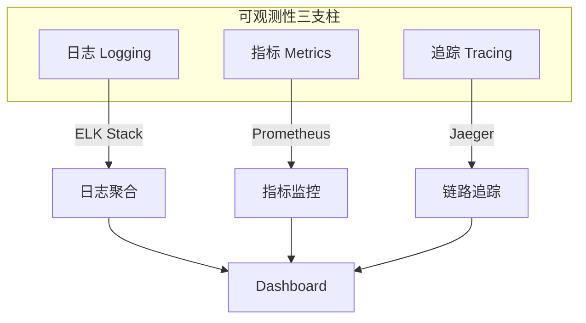
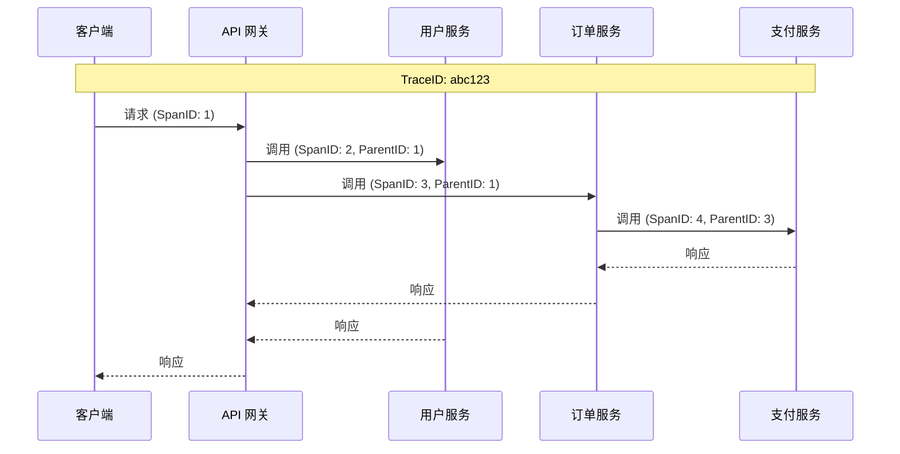
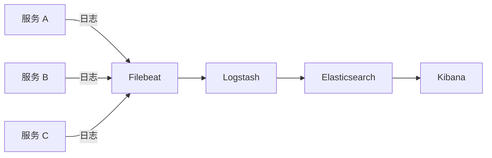
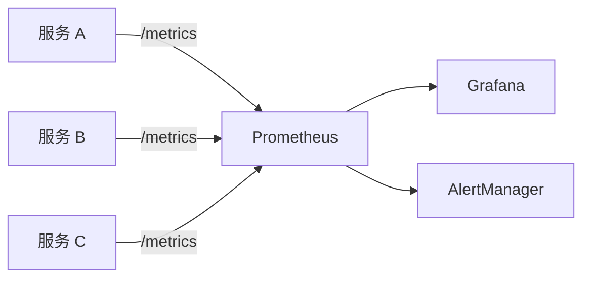

# 可观测性

可观测性是微服务架构的关键能力，包括三大支柱：日志（Logging）、指标（Metrics）、追踪（Tracing）。



## 分布式链路追踪

### 概述

分布式追踪用于跟踪请求在多个服务间的调用链路，帮助定位性能瓶颈和故障点。



### 核心概念

| 概念 | 说明 |
| ---- | ---- |
| **Trace** | 一次完整请求的调用链 |
| **Span** | 调用链中的一个操作单元 |
| **TraceID** | 唯一标识一个 Trace |
| **SpanID** | 唯一标识一个 Span |
| **ParentSpanID** | 父 Span 的 ID |

### Jaeger 集成

```bash
# 启动 Jaeger
docker run -d --name jaeger \
  -p 6831:6831/udp \
  -p 16686:16686 \
  jaegertracing/all-in-one:latest
```

```xml
<!-- pom.xml -->
<dependency>
    <groupId>io.opentelemetry</groupId>
    <artifactId>opentelemetry-api</artifactId>
</dependency>
<dependency>
    <groupId>io.opentelemetry</groupId>
    <artifactId>opentelemetry-sdk</artifactId>
</dependency>
<dependency>
    <groupId>io.opentelemetry</groupId>
    <artifactId>opentelemetry-exporter-jaeger</artifactId>
</dependency>
```

```java
// OpenTelemetry 配置
@Configuration
public class TracingConfig {
    
    @Bean
    public OpenTelemetry openTelemetry() {
        JaegerGrpcSpanExporter exporter = JaegerGrpcSpanExporter.builder()
            .setEndpoint("http://localhost:14250")
            .build();
        
        SdkTracerProvider tracerProvider = SdkTracerProvider.builder()
            .addSpanProcessor(BatchSpanProcessor.builder(exporter).build())
            .setResource(Resource.create(Attributes.of(
                ResourceAttributes.SERVICE_NAME, "user-service"
            )))
            .build();
        
        return OpenTelemetrySdk.builder()
            .setTracerProvider(tracerProvider)
            .buildAndRegisterGlobal();
    }
}

// 手动创建 Span
@Service
public class UserService {
    
    @Autowired
    private Tracer tracer;
    
    public User getUser(Long id) {
        Span span = tracer.spanBuilder("getUser")
            .setAttribute("user.id", id)
            .startSpan();
        
        try (Scope scope = span.makeCurrent()) {
            User user = userRepository.findById(id).orElseThrow();
            span.setAttribute("user.name", user.getName());
            return user;
        } catch (Exception e) {
            span.recordException(e);
            span.setStatus(StatusCode.ERROR, e.getMessage());
            throw e;
        } finally {
            span.end();
        }
    }
}
```

### Spring Cloud Sleuth（旧版本）

```yaml
# application.yml
spring:
  sleuth:
    sampler:
      probability: 1.0
  zipkin:
    base-url: http://localhost:9411
```

## 日志聚合

### ELK Stack

ELK（Elasticsearch + Logstash + Kibana）是最流行的日志聚合方案。



### 结构化日志

```java
// logback-spring.xml
@Configuration
public class LogConfig {
    // 使用 JSON 格式输出日志
}
```

```xml
<!-- logback-spring.xml -->
<configuration>
    <appender name="JSON" class="ch.qos.logback.core.ConsoleAppender">
        <encoder class="net.logstash.logback.encoder.LogstashEncoder">
            <includeMdcKeyName>traceId</includeMdcKeyName>
            <includeMdcKeyName>spanId</includeMdcKeyName>
            <customFields>{"service":"user-service"}</customFields>
        </encoder>
    </appender>
    
    <root level="INFO">
        <appender-ref ref="JSON"/>
    </root>
</configuration>
```

```java
// 使用 MDC 添加上下文
@Aspect
@Component
public class LoggingAspect {
    
    @Around("@annotation(org.springframework.web.bind.annotation.RequestMapping)")
    public Object logRequest(ProceedingJoinPoint joinPoint) throws Throwable {
        String requestId = UUID.randomUUID().toString();
        MDC.put("requestId", requestId);
        
        try {
            log.info("开始处理请求: {}", joinPoint.getSignature().getName());
            Object result = joinPoint.proceed();
            log.info("请求处理完成");
            return result;
        } finally {
            MDC.clear();
        }
    }
}
```

### Filebeat 配置

```yaml
# filebeat.yml
filebeat.inputs:
  - type: container
    paths:
      - /var/lib/docker/containers/*/*.log
    processors:
      - add_kubernetes_metadata:
          host: ${NODE_NAME}
          matchers:
            - logs_path:
                logs_path: "/var/lib/docker/containers/"

output.elasticsearch:
  hosts: ["elasticsearch:9200"]
  index: "microservices-%{+yyyy.MM.dd}"
```

## 指标监控

### Prometheus + Grafana



### Spring Boot Actuator

```xml
<dependency>
    <groupId>org.springframework.boot</groupId>
    <artifactId>spring-boot-starter-actuator</artifactId>
</dependency>
<dependency>
    <groupId>io.micrometer</groupId>
    <artifactId>micrometer-registry-prometheus</artifactId>
</dependency>
```

```yaml
# application.yml
management:
  endpoints:
    web:
      exposure:
        include: health,info,prometheus,metrics
  metrics:
    tags:
      application: ${spring.application.name}
    export:
      prometheus:
        enabled: true
```

### 自定义指标

```java
@Service
public class OrderService {
    
    private final Counter orderCounter;
    private final Timer orderTimer;
    private final Gauge activeOrders;
    
    public OrderService(MeterRegistry registry) {
        this.orderCounter = Counter.builder("orders.created")
            .description("创建的订单数量")
            .tag("service", "order-service")
            .register(registry);
        
        this.orderTimer = Timer.builder("orders.processing.time")
            .description("订单处理时间")
            .register(registry);
        
        this.activeOrders = Gauge.builder("orders.active", this, OrderService::getActiveOrderCount)
            .description("活跃订单数量")
            .register(registry);
    }
    
    public Order createOrder(OrderDTO dto) {
        return orderTimer.record(() -> {
            Order order = orderRepository.save(new Order(dto));
            orderCounter.increment();
            return order;
        });
    }
    
    private double getActiveOrderCount() {
        return orderRepository.countByStatus(OrderStatus.PROCESSING);
    }
}
```

### Prometheus 配置

```yaml
# prometheus.yml
global:
  scrape_interval: 15s

scrape_configs:
  - job_name: 'spring-boot'
    metrics_path: '/actuator/prometheus'
    static_configs:
      - targets: ['user-service:8080', 'order-service:8080']
    
  - job_name: 'kubernetes-pods'
    kubernetes_sd_configs:
      - role: pod
    relabel_configs:
      - source_labels: [__meta_kubernetes_pod_annotation_prometheus_io_scrape]
        action: keep
        regex: true
```

### 告警规则

```yaml
# alert-rules.yml
groups:
  - name: microservices
    rules:
      - alert: HighErrorRate
        expr: rate(http_server_requests_seconds_count{status=~"5.."}[5m]) > 0.1
        for: 5m
        labels:
          severity: critical
        annotations:
          summary: "高错误率告警"
          description: "服务 {{ $labels.application }} 错误率超过 10%"
      
      - alert: HighLatency
        expr: histogram_quantile(0.95, rate(http_server_requests_seconds_bucket[5m])) > 1
        for: 5m
        labels:
          severity: warning
        annotations:
          summary: "高延迟告警"
          description: "服务 {{ $labels.application }} P95 延迟超过 1 秒"
```

## 健康检查

### Spring Boot Health

```java
@Component
public class DatabaseHealthIndicator implements HealthIndicator {
    
    @Autowired
    private DataSource dataSource;
    
    @Override
    public Health health() {
        try (Connection conn = dataSource.getConnection()) {
            if (conn.isValid(1)) {
                return Health.up()
                    .withDetail("database", "MySQL")
                    .withDetail("status", "连接正常")
                    .build();
            }
        } catch (SQLException e) {
            return Health.down()
                .withDetail("error", e.getMessage())
                .build();
        }
        return Health.down().build();
    }
}

@Component
public class ExternalServiceHealthIndicator implements HealthIndicator {
    
    @Autowired
    private RestTemplate restTemplate;
    
    @Override
    public Health health() {
        try {
            ResponseEntity<String> response = restTemplate.getForEntity(
                "http://external-service/health", String.class);
            
            if (response.getStatusCode().is2xxSuccessful()) {
                return Health.up().build();
            }
        } catch (Exception e) {
            return Health.down()
                .withDetail("error", e.getMessage())
                .build();
        }
        return Health.down().build();
    }
}
```

### Kubernetes 健康检查

```yaml
# deployment.yaml
apiVersion: apps/v1
kind: Deployment
metadata:
  name: user-service
spec:
  template:
    spec:
      containers:
        - name: user-service
          image: user-service:latest
          ports:
            - containerPort: 8080
          livenessProbe:
            httpGet:
              path: /actuator/health/liveness
              port: 8080
            initialDelaySeconds: 30
            periodSeconds: 10
            failureThreshold: 3
          readinessProbe:
            httpGet:
              path: /actuator/health/readiness
              port: 8080
            initialDelaySeconds: 10
            periodSeconds: 5
            failureThreshold: 3
```

```yaml
# application.yml
management:
  endpoint:
    health:
      probes:
        enabled: true
      group:
        liveness:
          include: livenessState
        readiness:
          include: readinessState,db,redis
```

## 可观测性最佳实践

### 统一日志格式

```json
{
  "timestamp": "2024-01-15T10:30:00.000Z",
  "level": "INFO",
  "service": "user-service",
  "traceId": "abc123",
  "spanId": "def456",
  "message": "用户登录成功",
  "userId": 12345,
  "duration": 150
}
```

### 关键指标

| 类型 | 指标 | 说明 |
| ---- | ---- | ---- |
| **RED** | Rate | 请求速率 |
| | Errors | 错误率 |
| | Duration | 响应时间 |
| **USE** | Utilization | 资源利用率 |
| | Saturation | 饱和度 |
| | Errors | 错误数 |

### 告警策略

1. **分级告警**：P0（立即处理）、P1（1小时内）、P2（当天）
2. **告警收敛**：相同告警合并，避免告警风暴
3. **告警升级**：未处理的告警自动升级
4. **值班轮换**：建立 On-Call 机制
