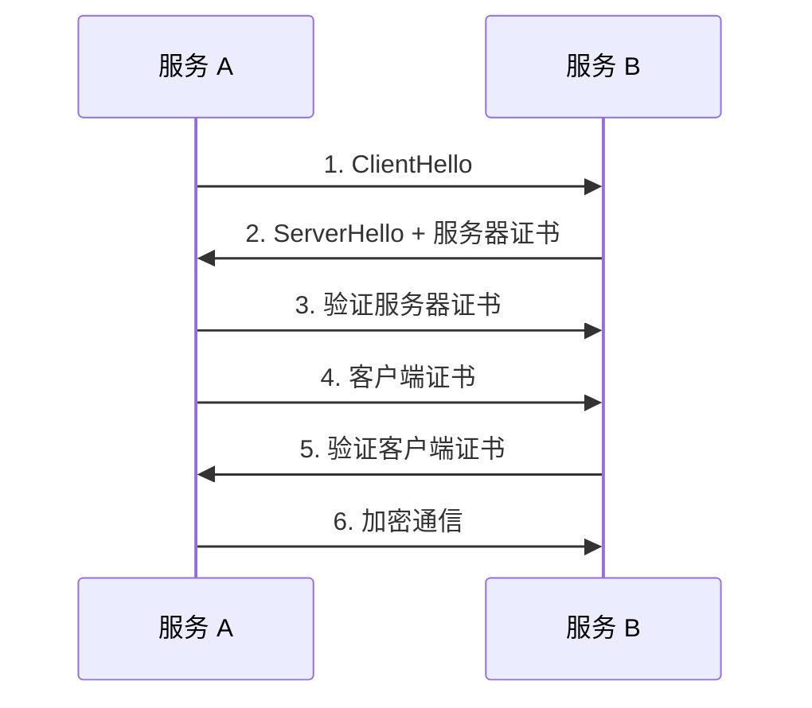
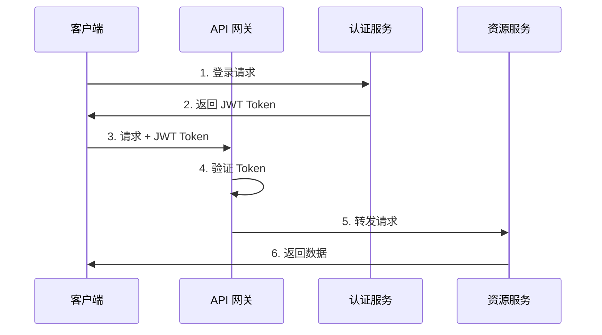

# 微服务安全

## 服务间认证（mTLS）

### 概述

mTLS（双向 TLS）确保服务间通信的双向身份验证和加密。



### Istio mTLS 配置

```yaml
# PeerAuthentication - 启用 mTLS
apiVersion: security.istio.io/v1beta1
kind: PeerAuthentication
metadata:
  name: default
  namespace: production
spec:
  mtls:
    mode: STRICT  # STRICT | PERMISSIVE | DISABLE

---
# DestinationRule - 客户端 mTLS
apiVersion: networking.istio.io/v1beta1
kind: DestinationRule
metadata:
  name: default
  namespace: production
spec:
  host: "*.production.svc.cluster.local"
  trafficPolicy:
    tls:
      mode: ISTIO_MUTUAL
```

### Spring Boot mTLS 配置

```yaml
# application.yml
server:
  ssl:
    enabled: true
    key-store: classpath:keystore.p12
    key-store-password: ${SSL_KEYSTORE_PASSWORD}
    key-store-type: PKCS12
    client-auth: need  # 要求客户端证书
    trust-store: classpath:truststore.p12
    trust-store-password: ${SSL_TRUSTSTORE_PASSWORD}
```

```java
// RestTemplate 配置 mTLS
@Configuration
public class RestTemplateConfig {
    
    @Bean
    public RestTemplate restTemplate() throws Exception {
        SSLContext sslContext = SSLContextBuilder.create()
            .loadKeyMaterial(
                new ClassPathResource("client.p12").getFile(),
                "password".toCharArray(),
                "password".toCharArray()
            )
            .loadTrustMaterial(
                new ClassPathResource("truststore.p12").getFile(),
                "password".toCharArray()
            )
            .build();
        
        HttpClient httpClient = HttpClients.custom()
            .setSSLContext(sslContext)
            .build();
        
        HttpComponentsClientHttpRequestFactory factory = 
            new HttpComponentsClientHttpRequestFactory(httpClient);
        
        return new RestTemplate(factory);
    }
}
```

## API 认证与授权

### OAuth2 + JWT



### Spring Security OAuth2 配置

```java
// 认证服务器配置
@Configuration
@EnableAuthorizationServer
public class AuthServerConfig extends AuthorizationServerConfigurerAdapter {
    
    @Autowired
    private AuthenticationManager authenticationManager;
    
    @Override
    public void configure(ClientDetailsServiceConfigurer clients) throws Exception {
        clients.inMemory()
            .withClient("web-client")
            .secret(passwordEncoder.encode("secret"))
            .authorizedGrantTypes("password", "refresh_token")
            .scopes("read", "write")
            .accessTokenValiditySeconds(3600)
            .refreshTokenValiditySeconds(86400);
    }
    
    @Override
    public void configure(AuthorizationServerEndpointsConfigurer endpoints) {
        endpoints
            .authenticationManager(authenticationManager)
            .tokenStore(tokenStore())
            .accessTokenConverter(jwtAccessTokenConverter());
    }
    
    @Bean
    public JwtAccessTokenConverter jwtAccessTokenConverter() {
        JwtAccessTokenConverter converter = new JwtAccessTokenConverter();
        converter.setSigningKey("your-secret-key");
        return converter;
    }
}
```

### 资源服务器配置

```java
@Configuration
@EnableResourceServer
public class ResourceServerConfig extends ResourceServerConfigurerAdapter {
    
    @Override
    public void configure(HttpSecurity http) throws Exception {
        http.authorizeRequests()
            .antMatchers("/api/public/**").permitAll()
            .antMatchers("/api/admin/**").hasRole("ADMIN")
            .antMatchers("/api/**").authenticated();
    }
    
    @Override
    public void configure(ResourceServerSecurityConfigurer resources) {
        resources.tokenStore(tokenStore());
    }
}
```

### JWT Token 结构

```json
// Header
{
  "alg": "RS256",
  "typ": "JWT"
}

// Payload
{
  "sub": "user123",
  "name": "张三",
  "roles": ["USER", "ADMIN"],
  "iat": 1704067200,
  "exp": 1704070800,
  "iss": "auth-service"
}

// Signature
RSASHA256(
  base64UrlEncode(header) + "." + base64UrlEncode(payload),
  privateKey
)
```

### API 网关 JWT 验证

```java
// Spring Cloud Gateway JWT 过滤器
@Component
public class JwtAuthFilter implements GlobalFilter, Ordered {
    
    @Value("${jwt.secret}")
    private String jwtSecret;
    
    @Override
    public Mono<Void> filter(ServerWebExchange exchange, GatewayFilterChain chain) {
        String path = exchange.getRequest().getPath().value();
        
        // 白名单路径
        if (isWhitelisted(path)) {
            return chain.filter(exchange);
        }
        
        String token = extractToken(exchange.getRequest());
        if (token == null) {
            return unauthorized(exchange);
        }
        
        try {
            Claims claims = Jwts.parserBuilder()
                .setSigningKey(jwtSecret.getBytes())
                .build()
                .parseClaimsJws(token)
                .getBody();
            
            // 将用户信息传递给下游服务
            ServerHttpRequest request = exchange.getRequest().mutate()
                .header("X-User-Id", claims.getSubject())
                .header("X-User-Roles", String.join(",", getRoles(claims)))
                .build();
            
            return chain.filter(exchange.mutate().request(request).build());
        } catch (JwtException e) {
            return unauthorized(exchange);
        }
    }
    
    @Override
    public int getOrder() {
        return -100;
    }
}
```

## 安全最佳实践

### 安全清单

| 类别 | 实践 | 说明 |
| ---- | ---- | ---- |
| **传输安全** | 使用 HTTPS/TLS | 所有通信加密 |
| | 启用 mTLS | 服务间双向认证 |
| **认证授权** | 使用 OAuth2/JWT | 标准化认证 |
| | 最小权限原则 | 只授予必要权限 |
| | Token 过期机制 | 设置合理过期时间 |
| **数据安全** | 敏感数据加密 | 数据库字段加密 |
| | 密钥管理 | 使用 Vault 等工具 |
| **输入验证** | 参数校验 | 防止注入攻击 |
| | 请求限流 | 防止 DDoS |
| **日志审计** | 安全日志 | 记录敏感操作 |
| | 脱敏处理 | 日志中隐藏敏感信息 |

### 密钥管理

```java
// 使用 HashiCorp Vault
@Configuration
public class VaultConfig {
    
    @Bean
    public VaultTemplate vaultTemplate() {
        VaultEndpoint endpoint = VaultEndpoint.create("vault.example.com", 8200);
        TokenAuthentication auth = new TokenAuthentication("your-token");
        return new VaultTemplate(endpoint, auth);
    }
}

@Service
public class SecretService {
    
    @Autowired
    private VaultTemplate vaultTemplate;
    
    public String getSecret(String path) {
        VaultResponseSupport<Map<String, Object>> response = 
            vaultTemplate.read("secret/data/" + path);
        return (String) response.getData().get("value");
    }
}
```

```yaml
# Kubernetes Secret 加密
apiVersion: v1
kind: Secret
metadata:
  name: db-credentials
type: Opaque
data:
  username: YWRtaW4=  # base64 编码
  password: cGFzc3dvcmQ=
```

### 输入验证

```java
@RestController
@Validated
public class UserController {
    
    @PostMapping("/users")
    public User createUser(@Valid @RequestBody UserDTO dto) {
        return userService.create(dto);
    }
}

public class UserDTO {
    
    @NotBlank(message = "用户名不能为空")
    @Size(min = 3, max = 50, message = "用户名长度 3-50")
    @Pattern(regexp = "^[a-zA-Z0-9_]+$", message = "用户名只能包含字母数字下划线")
    private String username;
    
    @NotBlank(message = "邮箱不能为空")
    @Email(message = "邮箱格式不正确")
    private String email;
    
    @NotBlank(message = "密码不能为空")
    @Size(min = 8, message = "密码至少 8 位")
    private String password;
}
```

### 安全响应头

```java
@Configuration
public class SecurityHeadersConfig {
    
    @Bean
    public SecurityFilterChain filterChain(HttpSecurity http) throws Exception {
        http.headers()
            .contentSecurityPolicy("default-src 'self'")
            .and()
            .xssProtection()
            .and()
            .contentTypeOptions()
            .and()
            .frameOptions().deny()
            .and()
            .httpStrictTransportSecurity()
                .includeSubDomains(true)
                .maxAgeInSeconds(31536000);
        
        return http.build();
    }
}
```

### 日志脱敏

```java
@Aspect
@Component
public class SensitiveDataMaskingAspect {
    
    @Around("@annotation(LogSensitive)")
    public Object maskSensitiveData(ProceedingJoinPoint joinPoint) throws Throwable {
        Object[] args = joinPoint.getArgs();
        Object[] maskedArgs = Arrays.stream(args)
            .map(this::maskIfSensitive)
            .toArray();
        
        log.info("方法调用: {} 参数: {}", 
            joinPoint.getSignature().getName(), 
            Arrays.toString(maskedArgs));
        
        return joinPoint.proceed();
    }
    
    private Object maskIfSensitive(Object obj) {
        if (obj instanceof String) {
            String str = (String) obj;
            // 手机号脱敏
            if (str.matches("\\d{11}")) {
                return str.substring(0, 3) + "****" + str.substring(7);
            }
            // 邮箱脱敏
            if (str.contains("@")) {
                int atIndex = str.indexOf("@");
                return str.substring(0, 2) + "***" + str.substring(atIndex);
            }
        }
        return obj;
    }
}
```

### RBAC 权限控制

```java
// 基于角色的访问控制
@PreAuthorize("hasRole('ADMIN')")
@GetMapping("/admin/users")
public List<User> getAllUsers() {
    return userService.findAll();
}

@PreAuthorize("hasPermission(#id, 'User', 'read')")
@GetMapping("/users/{id}")
public User getUser(@PathVariable Long id) {
    return userService.findById(id);
}

// 自定义权限评估器
@Component
public class CustomPermissionEvaluator implements PermissionEvaluator {
    
    @Override
    public boolean hasPermission(Authentication auth, Object targetId, 
            Object targetType, Object permission) {
        if (auth == null || targetType == null || permission == null) {
            return false;
        }
        
        String type = targetType.toString().toUpperCase();
        return hasPrivilege(auth, type, permission.toString().toUpperCase());
    }
    
    private boolean hasPrivilege(Authentication auth, String type, String permission) {
        return auth.getAuthorities().stream()
            .anyMatch(a -> a.getAuthority().equals(type + "_" + permission));
    }
}
```
