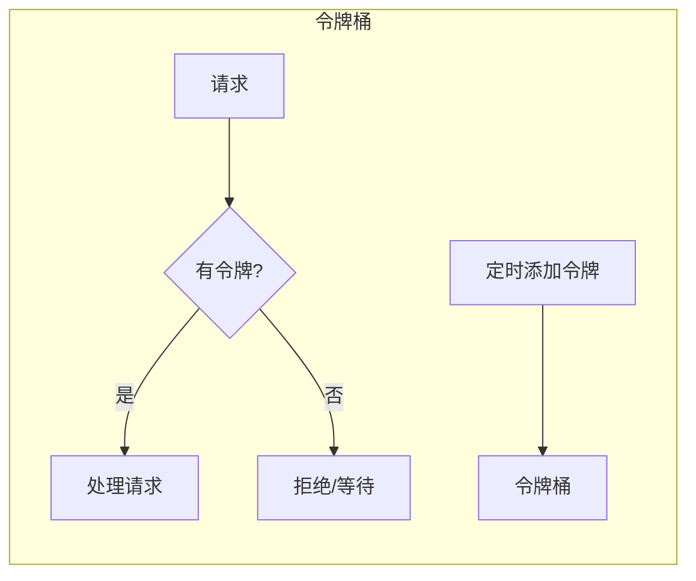

# 服务治理

## 服务注册与发现

### Nacos

Nacos 是阿里巴巴开源的服务发现和配置管理平台。

#### 快速开始

```bash
# 启动 Nacos（单机模式）
docker run -d --name nacos \
  -e MODE=standalone \
  -p 8848:8848 \
  nacos/nacos-server:latest
```

#### Spring Cloud 集成

```xml
<!-- pom.xml -->
<dependency>
    <groupId>com.alibaba.cloud</groupId>
    <artifactId>spring-cloud-starter-alibaba-nacos-discovery</artifactId>
</dependency>
```

```yaml
# application.yml
spring:
  application:
    name: user-service
  cloud:
    nacos:
      discovery:
        server-addr: localhost:8848
        namespace: dev
        group: DEFAULT_GROUP
        cluster-name: BJ
```

```java
@SpringBootApplication
@EnableDiscoveryClient
public class UserServiceApplication {
    public static void main(String[] args) {
        SpringApplication.run(UserServiceApplication.class, args);
    }
}
```

### Consul

Consul 是 HashiCorp 开源的服务网格解决方案。

```yaml
# application.yml
spring:
  cloud:
    consul:
      host: localhost
      port: 8500
      discovery:
        service-name: ${spring.application.name}
        health-check-path: /actuator/health
        health-check-interval: 10s
```

### 服务发现客户端

```java
// 使用 DiscoveryClient
@Service
public class ServiceDiscoveryExample {
    
    @Autowired
    private DiscoveryClient discoveryClient;
    
    public List<ServiceInstance> getInstances(String serviceName) {
        return discoveryClient.getInstances(serviceName);
    }
    
    public String getServiceUrl(String serviceName) {
        List<ServiceInstance> instances = discoveryClient.getInstances(serviceName);
        if (instances.isEmpty()) {
            throw new RuntimeException("No instances available");
        }
        ServiceInstance instance = instances.get(0);
        return instance.getUri().toString();
    }
}

// 使用 OpenFeign
@FeignClient(name = "user-service")
public interface UserClient {
    
    @GetMapping("/api/users/{id}")
    User getUser(@PathVariable("id") Long id);
    
    @PostMapping("/api/users")
    User createUser(@RequestBody UserDTO dto);
}
```

## 配置中心

### Nacos Config

```xml
<dependency>
    <groupId>com.alibaba.cloud</groupId>
    <artifactId>spring-cloud-starter-alibaba-nacos-config</artifactId>
</dependency>
```

```yaml
# bootstrap.yml
spring:
  application:
    name: user-service
  cloud:
    nacos:
      config:
        server-addr: localhost:8848
        namespace: dev
        group: DEFAULT_GROUP
        file-extension: yaml
        shared-configs:
          - data-id: common.yaml
            group: DEFAULT_GROUP
            refresh: true
```

```java
// 动态刷新配置
@RestController
@RefreshScope
public class ConfigController {
    
    @Value("${app.feature.enabled:false}")
    private boolean featureEnabled;
    
    @GetMapping("/config")
    public Map<String, Object> getConfig() {
        return Map.of("featureEnabled", featureEnabled);
    }
}

// 监听配置变化
@Component
public class ConfigChangeListener {
    
    @NacosConfigListener(dataId = "user-service.yaml", groupId = "DEFAULT_GROUP")
    public void onConfigChange(String config) {
        log.info("配置发生变化: {}", config);
    }
}
```

### Apollo

Apollo 是携程开源的配置管理中心。

```yaml
# application.yml
apollo:
  meta: http://localhost:8080
  bootstrap:
    enabled: true
    namespaces: application,common
```

```java
@Configuration
@EnableApolloConfig
public class ApolloConfig {
    
    @ApolloConfig
    private Config config;
    
    @ApolloConfigChangeListener
    public void onChange(ConfigChangeEvent event) {
        for (String key : event.changedKeys()) {
            ConfigChange change = event.getChange(key);
            log.info("配置变更 - key: {}, old: {}, new: {}", 
                key, change.getOldValue(), change.getNewValue());
        }
    }
}
```

## 负载均衡

### 负载均衡策略

| 策略 | 说明 | 适用场景 |
| ---- | ---- | ------- |
| **轮询（Round Robin）** | 依次分配请求 | 服务器性能相近 |
| **加权轮询** | 按权重分配 | 服务器性能不同 |
| **随机** | 随机选择 | 简单场景 |
| **最少连接** | 选择连接数最少的 | 长连接场景 |
| **一致性哈希** | 相同请求到相同服务器 | 需要会话保持 |

### Spring Cloud LoadBalancer

```java
// 自定义负载均衡策略
@Configuration
public class LoadBalancerConfig {
    
    @Bean
    public ReactorLoadBalancer<ServiceInstance> randomLoadBalancer(
            Environment environment,
            LoadBalancerClientFactory clientFactory) {
        String name = environment.getProperty(LoadBalancerClientFactory.PROPERTY_NAME);
        return new RandomLoadBalancer(
            clientFactory.getLazyProvider(name, ServiceInstanceListSupplier.class),
            name
        );
    }
}

// 使用 @LoadBalanced
@Configuration
public class RestTemplateConfig {
    
    @Bean
    @LoadBalanced
    public RestTemplate restTemplate() {
        return new RestTemplate();
    }
}

@Service
public class OrderService {
    
    @Autowired
    private RestTemplate restTemplate;
    
    public User getUser(Long userId) {
        // 自动负载均衡
        return restTemplate.getForObject(
            "http://user-service/api/users/" + userId,
            User.class
        );
    }
}
```

### Ribbon 配置（旧版本）

```yaml
user-service:
  ribbon:
    NFLoadBalancerRuleClassName: com.netflix.loadbalancer.WeightedResponseTimeRule
    ConnectTimeout: 1000
    ReadTimeout: 3000
    MaxAutoRetries: 1
    MaxAutoRetriesNextServer: 2
```

## 限流

### 限流算法



| 算法 | 说明 | 特点 |
| ---- | ---- | ---- |
| **计数器** | 固定窗口计数 | 简单，有临界问题 |
| **滑动窗口** | 滑动时间窗口 | 平滑，较复杂 |
| **漏桶** | 固定速率处理 | 平滑输出 |
| **令牌桶** | 令牌控制速率 | 允许突发流量 |

### Sentinel 限流

```xml
<dependency>
    <groupId>com.alibaba.cloud</groupId>
    <artifactId>spring-cloud-starter-alibaba-sentinel</artifactId>
</dependency>
```

```java
// 使用注解
@RestController
public class UserController {
    
    @GetMapping("/users/{id}")
    @SentinelResource(value = "getUser", 
        blockHandler = "getUserBlockHandler",
        fallback = "getUserFallback")
    public User getUser(@PathVariable Long id) {
        return userService.findById(id);
    }
    
    // 限流处理
    public User getUserBlockHandler(Long id, BlockException e) {
        return new User(id, "限流用户", "请求被限流");
    }
    
    // 降级处理
    public User getUserFallback(Long id, Throwable t) {
        return new User(id, "降级用户", "服务降级");
    }
}

// 编程式配置
@PostConstruct
public void initFlowRules() {
    List<FlowRule> rules = new ArrayList<>();
    
    FlowRule rule = new FlowRule();
    rule.setResource("getUser");
    rule.setGrade(RuleConstant.FLOW_GRADE_QPS);
    rule.setCount(100);  // QPS 限制
    rule.setControlBehavior(RuleConstant.CONTROL_BEHAVIOR_WARM_UP);
    rule.setWarmUpPeriodSec(10);
    
    rules.add(rule);
    FlowRuleManager.loadRules(rules);
}
```

```yaml
# application.yml
spring:
  cloud:
    sentinel:
      transport:
        dashboard: localhost:8080
      datasource:
        flow:
          nacos:
            server-addr: localhost:8848
            dataId: ${spring.application.name}-flow-rules
            groupId: SENTINEL_GROUP
            rule-type: flow
```

## 熔断降级

### Sentinel 熔断

```java
// 熔断规则配置
@PostConstruct
public void initDegradeRules() {
    List<DegradeRule> rules = new ArrayList<>();
    
    DegradeRule rule = new DegradeRule();
    rule.setResource("getUser");
    rule.setGrade(CircuitBreakerStrategy.SLOW_REQUEST_RATIO.getType());
    rule.setCount(0.5);  // 慢调用比例阈值
    rule.setTimeWindow(30);  // 熔断时长（秒）
    rule.setMinRequestAmount(5);  // 最小请求数
    rule.setStatIntervalMs(10000);  // 统计时长
    rule.setSlowRatioThreshold(0.5);  // 慢调用比例
    
    rules.add(rule);
    DegradeRuleManager.loadRules(rules);
}
```

### Resilience4j 熔断

```yaml
resilience4j:
  circuitbreaker:
    instances:
      userService:
        registerHealthIndicator: true
        slidingWindowSize: 10
        minimumNumberOfCalls: 5
        failureRateThreshold: 50
        waitDurationInOpenState: 30s
        permittedNumberOfCallsInHalfOpenState: 3
        slowCallRateThreshold: 100
        slowCallDurationThreshold: 2s
  
  retry:
    instances:
      userService:
        maxAttempts: 3
        waitDuration: 1s
        retryExceptions:
          - java.io.IOException
  
  ratelimiter:
    instances:
      userService:
        limitForPeriod: 10
        limitRefreshPeriod: 1s
        timeoutDuration: 500ms
```

```java
@Service
public class UserService {
    
    @CircuitBreaker(name = "userService", fallbackMethod = "fallback")
    @Retry(name = "userService")
    @RateLimiter(name = "userService")
    public User getUser(Long id) {
        return userClient.getUser(id);
    }
    
    public User fallback(Long id, Exception e) {
        log.warn("服务降级: {}", e.getMessage());
        return new User(id, "降级用户", "服务暂时不可用");
    }
}
```

## 服务治理最佳实践

### 健康检查

```java
@Component
public class CustomHealthIndicator implements HealthIndicator {
    
    @Override
    public Health health() {
        // 检查依赖服务
        boolean dbHealthy = checkDatabase();
        boolean redisHealthy = checkRedis();
        
        if (dbHealthy && redisHealthy) {
            return Health.up()
                .withDetail("database", "UP")
                .withDetail("redis", "UP")
                .build();
        }
        
        return Health.down()
            .withDetail("database", dbHealthy ? "UP" : "DOWN")
            .withDetail("redis", redisHealthy ? "UP" : "DOWN")
            .build();
    }
}
```

### 优雅停机

```yaml
# application.yml
server:
  shutdown: graceful

spring:
  lifecycle:
    timeout-per-shutdown-phase: 30s
```

```java
@Component
public class GracefulShutdown implements ApplicationListener<ContextClosedEvent> {
    
    @Override
    public void onApplicationEvent(ContextClosedEvent event) {
        log.info("开始优雅停机...");
        // 1. 从注册中心注销
        // 2. 等待正在处理的请求完成
        // 3. 关闭连接池
        log.info("优雅停机完成");
    }
}
```
