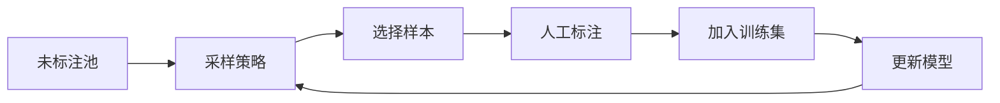

# 主动学习

主动学习智能选择最有价值的样本进行标注，减少标注成本。

## 核心思想



## 采样策略

### 不确定性采样

```python
import numpy as np

def uncertainty_sampling(model, unlabeled_data, n_samples):
    probs = model.predict_proba(unlabeled_data)

    # 最小置信度
    confidence = np.max(probs, axis=1)
    uncertain_idx = np.argsort(confidence)[:n_samples]

    return uncertain_idx

def entropy_sampling(model, unlabeled_data, n_samples):
    probs = model.predict_proba(unlabeled_data)
    entropy = -np.sum(probs * np.log(probs + 1e-10), axis=1)
    return np.argsort(entropy)[-n_samples:]

def margin_sampling(model, unlabeled_data, n_samples):
    probs = model.predict_proba(unlabeled_data)
    sorted_probs = np.sort(probs, axis=1)
    margin = sorted_probs[:, -1] - sorted_probs[:, -2]
    return np.argsort(margin)[:n_samples]
```

### 多样性采样

```python
from sklearn.cluster import KMeans

def diversity_sampling(features, n_samples):
    # K-Means 聚类选择代表性样本
    kmeans = KMeans(n_clusters=n_samples)
    kmeans.fit(features)

    # 选择最接近中心的样本
    selected = []
    for i in range(n_samples):
        cluster_mask = kmeans.labels_ == i
        cluster_features = features[cluster_mask]
        distances = np.linalg.norm(cluster_features - kmeans.cluster_centers_[i], axis=1)
        selected.append(np.where(cluster_mask)[0][np.argmin(distances)])

    return selected
```

### 混合策略

```python
def hybrid_sampling(model, features, unlabeled_data, n_samples, alpha=0.5):
    # 不确定性分数
    probs = model.predict_proba(unlabeled_data)
    uncertainty = 1 - np.max(probs, axis=1)

    # 多样性分数 (到已选样本的距离)
    diversity = compute_diversity_scores(features)

    # 综合分数
    scores = alpha * uncertainty + (1 - alpha) * diversity
    return np.argsort(scores)[-n_samples:]
```

## 完整流程

```python
from modAL.models import ActiveLearner
from sklearn.ensemble import RandomForestClassifier

# 初始化
learner = ActiveLearner(
    estimator=RandomForestClassifier(),
    X_training=X_initial,
    y_training=y_initial
)

# 主动学习循环
for i in range(n_iterations):
    # 查询最不确定的样本
    query_idx, query_instance = learner.query(X_pool)

    # 获取标签 (模拟人工标注)
    y_new = oracle.annotate(query_instance)

    # 更新模型
    learner.teach(query_instance, y_new)

    # 从池中移除
    X_pool = np.delete(X_pool, query_idx, axis=0)
```

## 策略对比

| 策略     | 优点     | 缺点             |
| -------- | -------- | ---------------- |
| 不确定性 | 简单高效 | 可能选择相似样本 |
| 多样性   | 覆盖广   | 忽略模型需求     |
| 混合     | 平衡两者 | 需要调参         |
| 委员会   | 鲁棒     | 计算开销大       |
