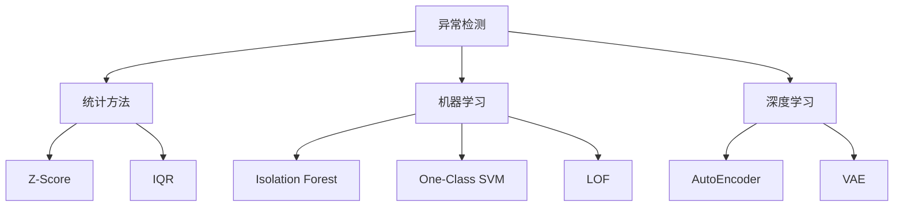

# 异常检测详解

异常检测识别与正常模式显著不同的数据点。

## 方法分类



## 统计方法

```python
import numpy as np
from scipy import stats

# Z-Score
def zscore_anomaly(data, threshold=3):
    z_scores = np.abs(stats.zscore(data))
    return z_scores > threshold

# IQR
def iqr_anomaly(data, k=1.5):
    Q1, Q3 = np.percentile(data, [25, 75])
    IQR = Q3 - Q1
    lower = Q1 - k * IQR
    upper = Q3 + k * IQR
    return (data < lower) | (data > upper)
```

## 机器学习方法

### Isolation Forest

```python
from sklearn.ensemble import IsolationForest

iso = IsolationForest(contamination=0.1, random_state=42)
predictions = iso.fit_predict(X)  # -1: 异常, 1: 正常
scores = iso.decision_function(X)  # 异常分数
```

### Local Outlier Factor

```python
from sklearn.neighbors import LocalOutlierFactor

lof = LocalOutlierFactor(n_neighbors=20, contamination=0.1)
predictions = lof.fit_predict(X)
scores = -lof.negative_outlier_factor_
```

### One-Class SVM

```python
from sklearn.svm import OneClassSVM

ocsvm = OneClassSVM(kernel='rbf', gamma='scale', nu=0.1)
predictions = ocsvm.fit_predict(X)
```

## 深度学习方法

### AutoEncoder

```python
import torch.nn as nn

class AnomalyAutoEncoder(nn.Module):
    def __init__(self, input_dim, latent_dim=32):
        super().__init__()
        self.encoder = nn.Sequential(
            nn.Linear(input_dim, 64),
            nn.ReLU(),
            nn.Linear(64, latent_dim)
        )
        self.decoder = nn.Sequential(
            nn.Linear(latent_dim, 64),
            nn.ReLU(),
            nn.Linear(64, input_dim)
        )

    def forward(self, x):
        z = self.encoder(x)
        return self.decoder(z)

    def anomaly_score(self, x):
        recon = self.forward(x)
        return ((x - recon) ** 2).mean(dim=1)

# 重建误差大 → 异常
scores = model.anomaly_score(X)
threshold = np.percentile(scores, 95)
anomalies = scores > threshold
```

### VAE 异常检测

```python
class VAEAD(nn.Module):
    def anomaly_score(self, x):
        mu, log_var = self.encode(x)
        z = self.reparameterize(mu, log_var)
        recon = self.decode(z)

        # 重建误差 + KL 散度
        recon_loss = ((x - recon) ** 2).sum(dim=1)
        kl_loss = -0.5 * (1 + log_var - mu.pow(2) - log_var.exp()).sum(dim=1)

        return recon_loss + kl_loss
```

## 时间序列异常检测

```python
from pyod.models.knn import KNN
from pyod.models.copod import COPOD

# 滑动窗口特征
def create_features(series, window=10):
    features = []
    for i in range(window, len(series)):
        features.append([
            series[i-window:i].mean(),
            series[i-window:i].std(),
            series[i] - series[i-1]
        ])
    return np.array(features)

# 检测
detector = COPOD()
detector.fit(features)
scores = detector.decision_scores_
```

## 评估指标

```python
from sklearn.metrics import precision_recall_curve, auc

# 由于异常稀少，使用 PR-AUC
precision, recall, _ = precision_recall_curve(y_true, scores)
pr_auc = auc(recall, precision)
```

| 指标     | 描述                  |
| -------- | --------------------- |
| PR-AUC   | 精确率-召回率 AUC     |
| F1@K     | 前 K 个预测的 F1      |
| Hit Rate | 真实异常在前 K 的比例 |
