# AutoML

AutoML 自动化机器学习流程，减少手动调参工作。

## AutoML 流程

```mermaid
graph LR
    A[数据] --> B[特征工程]
    B --> C[模型选择]
    C --> D[超参数优化]
    D --> E[集成]
    E --> F[最优模型]
```



## Auto-sklearn

```python
import autosklearn.classification

automl = autosklearn.classification.AutoSklearnClassifier(
    time_left_for_this_task=3600,  # 总时间（秒）
    per_run_time_limit=300,         # 单次运行时间
    n_jobs=-1
)

automl.fit(X_train, y_train)
predictions = automl.predict(X_test)

# 查看最佳模型
print(automl.leaderboard())
print(automl.show_models())
```

## TPOT

```python
from tpot import TPOTClassifier

tpot = TPOTClassifier(
    generations=10,
    population_size=50,
    cv=5,
    random_state=42,
    verbosity=2
)

tpot.fit(X_train, y_train)
print(tpot.score(X_test, y_test))

# 导出最佳 Pipeline
tpot.export('best_pipeline.py')
```

## H2O AutoML

```python
import h2o
from h2o.automl import H2OAutoML

h2o.init()

# 转换数据
train = h2o.H2OFrame(df_train)
test = h2o.H2OFrame(df_test)

# 运行 AutoML
aml = H2OAutoML(max_runtime_secs=3600, seed=42)
aml.train(x=features, y=target, training_frame=train)

# 查看排行榜
lb = aml.leaderboard
print(lb)

# 最佳模型
best = aml.leader
predictions = best.predict(test)
```

## AutoGluon

```python
from autogluon.tabular import TabularPredictor

predictor = TabularPredictor(label='target').fit(
    train_data,
    time_limit=3600,
    presets='best_quality'
)

predictions = predictor.predict(test_data)
leaderboard = predictor.leaderboard()
```

## 神经架构搜索 (NAS)

```python
# 使用 Optuna 简单 NAS
import optuna

def objective(trial):
    n_layers = trial.suggest_int('n_layers', 1, 5)
    layers = []
    in_features = input_dim

    for i in range(n_layers):
        out_features = trial.suggest_int(f'n_units_{i}', 32, 256)
        layers.append(nn.Linear(in_features, out_features))
        layers.append(nn.ReLU())
        in_features = out_features

    layers.append(nn.Linear(in_features, num_classes))
    model = nn.Sequential(*layers)

    # 训练并返回验证准确率
    return train_and_evaluate(model)

study = optuna.create_study(direction='maximize')
study.optimize(objective, n_trials=100)
```

## 工具对比

| 工具         | 特点         | 适用场景      |
| ------------ | ------------ | ------------- |
| Auto-sklearn | 基于 sklearn | 表格数据      |
| TPOT         | 遗传算法     | Pipeline 优化 |
| H2O          | 企业级       | 生产环境      |
| AutoGluon    | 简单易用     | 快速原型      |
| AutoKeras    | 神经网络     | 深度学习      |

## 最佳实践

1. **设置合理时间限制**：平衡搜索质量和时间
2. **数据预处理要做好**：AutoML 不能替代数据清洗
3. **理解最终模型**：不要盲目使用黑盒结果
4. **验证集独立**：避免过拟合验证集
