# 持续学习

持续学习使模型能够学习新任务而不遗忘旧知识（避免灾难性遗忘）。

## 灾难性遗忘

```mermaid
graph LR
    A[学习任务A] --> B[任务A表现好]
    B --> C[学习任务B]
    C --> D[任务B表现好]
    D --> E[任务A表现下降!]
```



## 解决方案

### 正则化方法 (EWC)

```python
import torch
import torch.nn as nn

class EWC:
    def __init__(self, model, dataloader, importance=1000):
        self.model = model
        self.importance = importance

        # 计算 Fisher 信息矩阵
        self.fisher = {}
        self.old_params = {}

        self._compute_fisher(dataloader)

    def _compute_fisher(self, dataloader):
        self.model.eval()
        for name, param in self.model.named_parameters():
            self.fisher[name] = torch.zeros_like(param)
            self.old_params[name] = param.clone()

        for x, y in dataloader:
            self.model.zero_grad()
            output = self.model(x)
            loss = nn.functional.cross_entropy(output, y)
            loss.backward()

            for name, param in self.model.named_parameters():
                self.fisher[name] += param.grad ** 2 / len(dataloader)

    def penalty(self):
        loss = 0
        for name, param in self.model.named_parameters():
            loss += (self.fisher[name] * (param - self.old_params[name]) ** 2).sum()
        return self.importance * loss
```

### 回放方法

```python
class ReplayBuffer:
    def __init__(self, capacity):
        self.buffer = []
        self.capacity = capacity

    def add(self, samples):
        self.buffer.extend(samples)
        if len(self.buffer) > self.capacity:
            # 随机保留
            indices = np.random.choice(len(self.buffer), self.capacity, replace=False)
            self.buffer = [self.buffer[i] for i in indices]

    def sample(self, n):
        return random.sample(self.buffer, min(n, len(self.buffer)))

# 训练时混合新旧数据
def train_with_replay(model, new_data, replay_buffer, replay_ratio=0.5):
    replay_size = int(len(new_data) * replay_ratio)
    replay_data = replay_buffer.sample(replay_size)
    combined = new_data + replay_data
    train(model, combined)
    replay_buffer.add(new_data)
```

### 架构方法

```python
class ProgressiveNetwork(nn.Module):
    def __init__(self, input_dim, hidden_dim):
        super().__init__()
        self.columns = nn.ModuleList()
        self.laterals = nn.ModuleList()
        self.input_dim = input_dim
        self.hidden_dim = hidden_dim

    def add_column(self, output_dim):
        # 新任务添加新列
        column = nn.Sequential(
            nn.Linear(self.input_dim, self.hidden_dim),
            nn.ReLU(),
            nn.Linear(self.hidden_dim, output_dim)
        )

        # 冻结旧列
        for old_col in self.columns:
            for param in old_col.parameters():
                param.requires_grad = False

        self.columns.append(column)
```

## 方法对比

| 方法     | 思想             | 优点         | 缺点               |
| -------- | ---------------- | ------------ | ------------------ |
| EWC      | 保护重要参数     | 无需存储数据 | 任务数增加效果下降 |
| 回放     | 保留旧数据样本   | 简单有效     | 需要存储空间       |
| 架构扩展 | 每任务新网络     | 不遗忘       | 模型持续增大       |
| 知识蒸馏 | 旧模型指导新模型 | 灵活         | 计算开销           |
