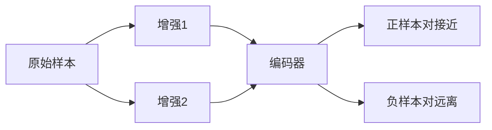

# 对比学习与自监督学习

对比学习通过比较相似和不相似的样本来学习表示，无需人工标签。

## 核心思想



## SimCLR

```python
import torch
import torch.nn as nn
import torchvision.transforms as T

# 数据增强
augmentation = T.Compose([
    T.RandomResizedCrop(224),
    T.RandomHorizontalFlip(),
    T.ColorJitter(0.4, 0.4, 0.4, 0.1),
    T.RandomGrayscale(p=0.2),
    T.GaussianBlur(kernel_size=23),
    T.ToTensor(),
    T.Normalize(mean=[0.485, 0.456, 0.406], std=[0.229, 0.224, 0.225])
])

class SimCLR(nn.Module):
    def __init__(self, encoder, projection_dim=128):
        super().__init__()
        self.encoder = encoder
        self.projector = nn.Sequential(
            nn.Linear(encoder.output_dim, 512),
            nn.ReLU(),
            nn.Linear(512, projection_dim)
        )

    def forward(self, x):
        h = self.encoder(x)
        z = self.projector(h)
        return nn.functional.normalize(z, dim=1)

# NT-Xent 损失
def nt_xent_loss(z1, z2, temperature=0.5):
    batch_size = z1.size(0)
    z = torch.cat([z1, z2], dim=0)
    sim = torch.mm(z, z.t()) / temperature

    # 正样本对的位置
    pos_mask = torch.zeros(2 * batch_size, 2 * batch_size, dtype=torch.bool)
    pos_mask[:batch_size, batch_size:] = torch.eye(batch_size, dtype=torch.bool)
    pos_mask[batch_size:, :batch_size] = torch.eye(batch_size, dtype=torch.bool)

    # 排除自身
    self_mask = torch.eye(2 * batch_size, dtype=torch.bool)
    sim.masked_fill_(self_mask, float('-inf'))

    loss = -torch.log(torch.exp(sim[pos_mask]) / torch.exp(sim).sum(dim=1))
    return loss.mean()
```

## MoCo

```python
class MoCo(nn.Module):
    def __init__(self, encoder, dim=128, K=65536, m=0.999, T=0.07):
        super().__init__()
        self.K = K
        self.m = m
        self.T = T

        self.encoder_q = encoder
        self.encoder_k = copy.deepcopy(encoder)

        # 冻结动量编码器
        for param in self.encoder_k.parameters():
            param.requires_grad = False

        # 队列
        self.register_buffer("queue", torch.randn(dim, K))
        self.queue = nn.functional.normalize(self.queue, dim=0)

    @torch.no_grad()
    def momentum_update(self):
        for p_q, p_k in zip(self.encoder_q.parameters(), self.encoder_k.parameters()):
            p_k.data = self.m * p_k.data + (1 - self.m) * p_q.data
```

## CLIP

```python
class CLIP(nn.Module):
    def __init__(self, image_encoder, text_encoder, embed_dim):
        super().__init__()
        self.image_encoder = image_encoder
        self.text_encoder = text_encoder
        self.temperature = nn.Parameter(torch.ones([]) * 0.07)

    def forward(self, images, texts):
        image_features = self.image_encoder(images)
        text_features = self.text_encoder(texts)

        # 归一化
        image_features = nn.functional.normalize(image_features, dim=-1)
        text_features = nn.functional.normalize(text_features, dim=-1)

        # 计算相似度
        logits = image_features @ text_features.t() / self.temperature
        return logits
```

## 应用场景

| 方法   | 特点         | 应用                 |
| ------ | ------------ | -------------------- |
| SimCLR | 简单有效     | 图像表示预训练       |
| MoCo   | 大规模负样本 | 视觉表示学习         |
| CLIP   | 图文对齐     | 零样本分类、图像检索 |
| BERT   | 掩码语言模型 | NLP 预训练           |

## 下游任务微调

```python
# 加载预训练的对比学习模型
pretrained_encoder = load_pretrained()

# 添加分类头
classifier = nn.Sequential(
    pretrained_encoder,
    nn.Linear(encoder_dim, num_classes)
)

# 微调
for param in pretrained_encoder.parameters():
    param.requires_grad = False  # 冻结编码器，或设为 True 进行全量微调
```
