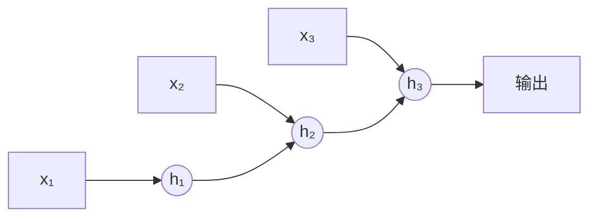

# 深度学习入门

深度学习是机器学习的一个分支，使用多层神经网络来学习数据的层次化表示。

## 卷积神经网络 (CNN)

CNN 特别擅长处理具有网格结构的数据，如图像。

### 核心组件


**卷积层**：提取局部特征

```python
import torch
import torch.nn as nn

# 卷积操作
conv = nn.Conv2d(
    in_channels=3,      # 输入通道数（RGB=3）
    out_channels=16,    # 输出通道数（卷积核数量）
    kernel_size=3,      # 卷积核大小
    stride=1,           # 步幅
    padding=1           # 填充
)

# 输出尺寸计算
# output_size = (input_size - kernel_size + 2*padding) / stride + 1
```

**池化层**：下采样，减少参数

```python
# 最大池化
max_pool = nn.MaxPool2d(kernel_size=2, stride=2)

# 平均池化
avg_pool = nn.AvgPool2d(kernel_size=2, stride=2)
```

### 经典 CNN 架构

```python
class SimpleCNN(nn.Module):
    def __init__(self, num_classes=10):
        super(SimpleCNN, self).__init__()

        # 卷积层
        self.conv_layers = nn.Sequential(
            nn.Conv2d(3, 32, kernel_size=3, padding=1),
            nn.ReLU(),
            nn.MaxPool2d(2),

            nn.Conv2d(32, 64, kernel_size=3, padding=1),
            nn.ReLU(),
            nn.MaxPool2d(2),

            nn.Conv2d(64, 128, kernel_size=3, padding=1),
            nn.ReLU(),
            nn.MaxPool2d(2),
        )

        # 全连接层
        self.fc_layers = nn.Sequential(
            nn.Flatten(),
            nn.Linear(128 * 4 * 4, 256),
            nn.ReLU(),
            nn.Dropout(0.5),
            nn.Linear(256, num_classes)
        )

    def forward(self, x):
        x = self.conv_layers(x)
        x = self.fc_layers(x)
        return x
```

### 使用预训练模型

```python
from torchvision import models

# 加载预训练的 ResNet
resnet = models.resnet18(pretrained=True)

# 冻结所有层
for param in resnet.parameters():
    param.requires_grad = False

# 替换最后的分类层
resnet.fc = nn.Linear(resnet.fc.in_features, num_classes)

# 只训练最后一层
optimizer = torch.optim.Adam(resnet.fc.parameters(), lr=0.001)
```

## 循环神经网络 (RNN)

RNN 擅长处理序列数据，如文本、时间序列。

### 基本 RNN



$$
h_t = \tanh(W_{hh} h_{t-1} + W_{xh} x_t + b)
$$

```python
# 基本 RNN
rnn = nn.RNN(
    input_size=100,     # 输入特征维度
    hidden_size=256,    # 隐藏状态维度
    num_layers=2,       # RNN 层数
    batch_first=True    # 输入形状 (batch, seq, feature)
)

# 前向传播
output, hidden = rnn(x)  # x: (batch, seq_len, input_size)
```

### LSTM (长短期记忆)

解决 RNN 的长期依赖问题。

```python
class LSTMClassifier(nn.Module):
    def __init__(self, vocab_size, embedding_dim, hidden_dim, num_classes):
        super(LSTMClassifier, self).__init__()

        self.embedding = nn.Embedding(vocab_size, embedding_dim)
        self.lstm = nn.LSTM(
            embedding_dim,
            hidden_dim,
            num_layers=2,
            batch_first=True,
            dropout=0.3,
            bidirectional=True
        )
        self.fc = nn.Linear(hidden_dim * 2, num_classes)  # *2 因为双向

    def forward(self, x):
        # x: (batch, seq_len)
        embedded = self.embedding(x)  # (batch, seq_len, embedding_dim)

        lstm_out, (hidden, cell) = self.lstm(embedded)

        # 取最后时刻的输出
        # 双向 LSTM：拼接两个方向的最后隐藏状态
        hidden_cat = torch.cat((hidden[-2], hidden[-1]), dim=1)

        return self.fc(hidden_cat)
```

### GRU (门控循环单元)

LSTM 的简化版本，参数更少。

```python
gru = nn.GRU(
    input_size=100,
    hidden_size=256,
    num_layers=2,
    batch_first=True,
    bidirectional=True
)
```

| 模型 | 参数量 | 长期依赖 | 训练速度 |
| ---- | ------ | -------- | -------- |
| RNN  | 少     | 差       | 快       |
| LSTM | 多     | 好       | 较慢     |
| GRU  | 中     | 较好     | 较快     |

## Transformer

Transformer 基于自注意力机制，是现代 NLP 和视觉模型的基础。

### 自注意力机制

$$
\text{Attention}(Q, K, V) = \text{softmax}\left(\frac{QK^T}{\sqrt{d_k}}\right)V
$$

```python
class SelfAttention(nn.Module):
    def __init__(self, embed_size, heads):
        super(SelfAttention, self).__init__()
        self.embed_size = embed_size
        self.heads = heads
        self.head_dim = embed_size // heads

        self.queries = nn.Linear(embed_size, embed_size)
        self.keys = nn.Linear(embed_size, embed_size)
        self.values = nn.Linear(embed_size, embed_size)
        self.fc_out = nn.Linear(embed_size, embed_size)

    def forward(self, x):
        N, seq_len, _ = x.shape

        # 线性变换
        Q = self.queries(x)
        K = self.keys(x)
        V = self.values(x)

        # 重塑为多头
        Q = Q.view(N, seq_len, self.heads, self.head_dim).transpose(1, 2)
        K = K.view(N, seq_len, self.heads, self.head_dim).transpose(1, 2)
        V = V.view(N, seq_len, self.heads, self.head_dim).transpose(1, 2)

        # 注意力分数
        scores = torch.matmul(Q, K.transpose(-2, -1)) / (self.head_dim ** 0.5)
        attention = torch.softmax(scores, dim=-1)

        # 加权求和
        out = torch.matmul(attention, V)
        out = out.transpose(1, 2).contiguous().view(N, seq_len, self.embed_size)

        return self.fc_out(out)
```

### 使用 PyTorch 内置 Transformer

```python
# Transformer 编码器层
encoder_layer = nn.TransformerEncoderLayer(
    d_model=512,
    nhead=8,
    dim_feedforward=2048,
    dropout=0.1,
    batch_first=True
)

# 堆叠多个编码器层
transformer_encoder = nn.TransformerEncoder(encoder_layer, num_layers=6)

# 使用
x = torch.randn(32, 100, 512)  # (batch, seq_len, d_model)
output = transformer_encoder(x)
```

## 深度学习实践要点

### 数据增强

```python
from torchvision import transforms

# 图像数据增强
train_transform = transforms.Compose([
    transforms.RandomResizedCrop(224),
    transforms.RandomHorizontalFlip(),
    transforms.RandomRotation(15),
    transforms.ColorJitter(brightness=0.2, contrast=0.2),
    transforms.ToTensor(),
    transforms.Normalize(mean=[0.485, 0.456, 0.406],
                        std=[0.229, 0.224, 0.225])
])
```

### 学习率调度

```python
from torch.optim.lr_scheduler import StepLR, CosineAnnealingLR, ReduceLROnPlateau

# 阶梯下降
scheduler = StepLR(optimizer, step_size=30, gamma=0.1)

# 余弦退火
scheduler = CosineAnnealingLR(optimizer, T_max=100)

# 自适应下降
scheduler = ReduceLROnPlateau(optimizer, mode='min', patience=10, factor=0.5)

# 训练中使用
for epoch in range(epochs):
    train(...)
    val_loss = validate(...)
    scheduler.step(val_loss)  # ReduceLROnPlateau
    # scheduler.step()         # 其他调度器
```

### 早停 (Early Stopping)

```python
class EarlyStopping:
    def __init__(self, patience=7, min_delta=0):
        self.patience = patience
        self.min_delta = min_delta
        self.counter = 0
        self.best_loss = None
        self.early_stop = False

    def __call__(self, val_loss):
        if self.best_loss is None:
            self.best_loss = val_loss
        elif val_loss > self.best_loss - self.min_delta:
            self.counter += 1
            if self.counter >= self.patience:
                self.early_stop = True
        else:
            self.best_loss = val_loss
            self.counter = 0
```

### 模型保存与加载

```python
# 保存模型
torch.save(model.state_dict(), 'model.pth')

# 保存完整检查点
torch.save({
    'epoch': epoch,
    'model_state_dict': model.state_dict(),
    'optimizer_state_dict': optimizer.state_dict(),
    'loss': loss,
}, 'checkpoint.pth')

# 加载模型
model.load_state_dict(torch.load('model.pth'))

# 加载检查点
checkpoint = torch.load('checkpoint.pth')
model.load_state_dict(checkpoint['model_state_dict'])
optimizer.load_state_dict(checkpoint['optimizer_state_dict'])
```

## 框架对比

| 框架       | 优点                       | 缺点         | 适用场景       |
| ---------- | -------------------------- | ------------ | -------------- |
| PyTorch    | 动态图、调试方便、研究友好 | 部署稍复杂   | 研究、原型开发 |
| TensorFlow | 生产部署成熟、TFLite       | 学习曲线陡峭 | 大规模生产部署 |
| JAX        | 高性能、函数式             | 生态较新     | 科学计算、研究 |
| Keras      | 简单易用                   | 灵活性较低   | 快速原型、教学 |
