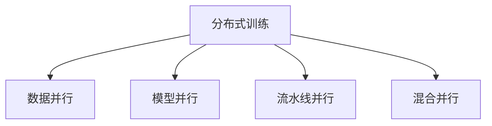

# 分布式训练

分布式训练在多 GPU/多机器上并行训练大模型。

## 并行策略



## 数据并行 (Data Parallel)

### PyTorch DataParallel

```python
import torch.nn as nn

# 单机多卡（简单但效率低）
model = nn.DataParallel(model)
model = model.cuda()
```

### PyTorch DDP (推荐)

```python
import torch.distributed as dist
from torch.nn.parallel import DistributedDataParallel as DDP

def setup(rank, world_size):
    dist.init_process_group("nccl", rank=rank, world_size=world_size)

def train(rank, world_size):
    setup(rank, world_size)

    model = MyModel().to(rank)
    model = DDP(model, device_ids=[rank])

    sampler = DistributedSampler(dataset, num_replicas=world_size, rank=rank)
    dataloader = DataLoader(dataset, sampler=sampler, batch_size=32)

    for epoch in range(epochs):
        sampler.set_epoch(epoch)
        for batch in dataloader:
            # 训练
            pass

# 启动
torch.multiprocessing.spawn(train, args=(world_size,), nprocs=world_size)
```

### torchrun 启动

```bash
torchrun --nproc_per_node=4 train.py
# 多机
torchrun --nnodes=2 --nproc_per_node=4 --node_rank=0 --master_addr=xxx train.py
```

## 模型并行

```python
class ModelParallel(nn.Module):
    def __init__(self):
        super().__init__()
        self.layer1 = nn.Linear(1024, 1024).to('cuda:0')
        self.layer2 = nn.Linear(1024, 1024).to('cuda:1')

    def forward(self, x):
        x = self.layer1(x.to('cuda:0'))
        x = self.layer2(x.to('cuda:1'))
        return x
```

## FSDP (Fully Sharded Data Parallel)

```python
from torch.distributed.fsdp import FullyShardedDataParallel as FSDP

model = FSDP(
    model,
    sharding_strategy=ShardingStrategy.FULL_SHARD,
    cpu_offload=CPUOffload(offload_params=True)
)
```

## DeepSpeed

```python
import deepspeed

model, optimizer, _, _ = deepspeed.initialize(
    model=model,
    model_parameters=model.parameters(),
    config={
        "train_batch_size": 32,
        "fp16": {"enabled": True},
        "zero_optimization": {"stage": 2}
    }
)
```

## Hugging Face Accelerate

```python
from accelerate import Accelerator

accelerator = Accelerator()
model, optimizer, dataloader = accelerator.prepare(model, optimizer, dataloader)

for batch in dataloader:
    outputs = model(**batch)
    loss = outputs.loss
    accelerator.backward(loss)
    optimizer.step()
```

## 混合精度训练

```python
from torch.cuda.amp import autocast, GradScaler

scaler = GradScaler()

for batch in dataloader:
    with autocast():
        output = model(batch)
        loss = criterion(output, target)

    scaler.scale(loss).backward()
    scaler.step(optimizer)
    scaler.update()
```

## 策略对比

| 策略       | 适用场景       | 通信开销 |
| ---------- | -------------- | -------- |
| 数据并行   | 模型能放入单卡 | 低       |
| 模型并行   | 单模型太大     | 高       |
| FSDP/ZeRO  | 大模型训练     | 中       |
| 流水线并行 | 超大模型       | 中       |
