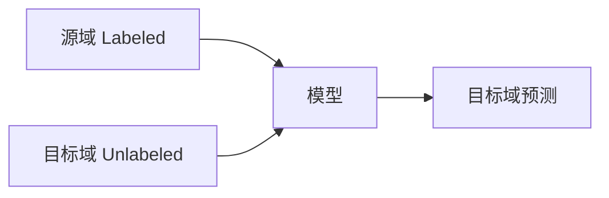

# 领域自适应

领域自适应解决源域和目标域分布不同的问题。

## 问题定义



域偏移类型：

- **协变量偏移**: P(X) 不同
- **标签偏移**: P(Y) 不同
- **概念偏移**: P(Y|X) 不同

## 方法分类

### 基于差异的方法 (MMD)

```python
import torch

def mmd_loss(source_features, target_features):
    """Maximum Mean Discrepancy"""
    def rbf_kernel(x, y, sigma=1.0):
        diff = x.unsqueeze(1) - y.unsqueeze(0)
        return torch.exp(-torch.sum(diff ** 2, dim=-1) / (2 * sigma ** 2))

    K_ss = rbf_kernel(source_features, source_features)
    K_tt = rbf_kernel(target_features, target_features)
    K_st = rbf_kernel(source_features, target_features)

    return K_ss.mean() + K_tt.mean() - 2 * K_st.mean()
```

### 对抗域自适应 (DANN)

```python
from torch.autograd import Function

class GradientReversal(Function):
    @staticmethod
    def forward(ctx, x, alpha):
        ctx.alpha = alpha
        return x.view_as(x)

    @staticmethod
    def backward(ctx, grad_output):
        return -ctx.alpha * grad_output, None

class DANN(nn.Module):
    def __init__(self, feature_extractor, classifier, domain_classifier):
        super().__init__()
        self.feature_extractor = feature_extractor
        self.classifier = classifier
        self.domain_classifier = domain_classifier

    def forward(self, x, alpha=1.0):
        features = self.feature_extractor(x)
        class_output = self.classifier(features)

        # 梯度反转
        reversed_features = GradientReversal.apply(features, alpha)
        domain_output = self.domain_classifier(reversed_features)

        return class_output, domain_output
```

### CORAL

```python
def coral_loss(source, target):
    """相关性对齐"""
    d = source.size(1)

    source_cov = torch.mm(source.t(), source) / (source.size(0) - 1)
    target_cov = torch.mm(target.t(), target) / (target.size(0) - 1)

    loss = torch.norm(source_cov - target_cov, p='fro') ** 2
    return loss / (4 * d * d)
```

## 训练流程

```python
def train_dann(model, source_loader, target_loader, epochs):
    for epoch in range(epochs):
        for (src_data, src_labels), (tgt_data, _) in zip(source_loader, target_loader):
            # 动态调整 alpha
            alpha = 2.0 / (1 + np.exp(-10 * epoch / epochs)) - 1

            # 源域
            class_out, domain_out = model(src_data, alpha)
            class_loss = F.cross_entropy(class_out, src_labels)
            domain_loss_src = F.binary_cross_entropy(domain_out, torch.zeros(len(src_data)))

            # 目标域
            _, domain_out = model(tgt_data, alpha)
            domain_loss_tgt = F.binary_cross_entropy(domain_out, torch.ones(len(tgt_data)))

            loss = class_loss + domain_loss_src + domain_loss_tgt
```

## 方法对比

| 方法  | 思想           | 优点     |
| ----- | -------------- | -------- |
| MMD   | 最小化分布距离 | 简单稳定 |
| DANN  | 对抗学习       | 效果好   |
| CORAL | 对齐协方差     | 计算高效 |
