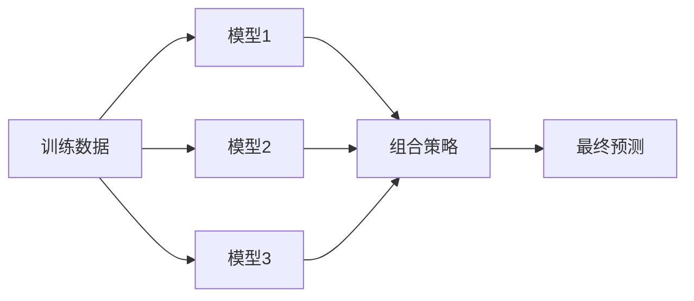

# 集成学习

集成学习通过组合多个模型来获得比单个模型更好的预测性能。

## 核心思想

> 三个臭皮匠，顶个诸葛亮



## Bagging (Bootstrap Aggregating)

通过**自助采样**构建多个独立模型，然后平均/投票。

### 核心原理

1. 从训练集中有放回地采样 N 个子集
2. 在每个子集上训练一个基模型
3. 预测时取平均（回归）或投票（分类）

```python
from sklearn.ensemble import BaggingClassifier, RandomForestClassifier

# 手动 Bagging
bagging = BaggingClassifier(
    estimator=DecisionTreeClassifier(),
    n_estimators=100,
    max_samples=0.8,    # 每次采样 80%
    bootstrap=True,      # 有放回采样
    n_jobs=-1
)
bagging.fit(X_train, y_train)

# 随机森林 = Bagging + 特征随机
rf = RandomForestClassifier(n_estimators=100, max_features='sqrt')
rf.fit(X_train, y_train)
```

### 随机森林

| 参数             | 描述             | 建议                    |
| ---------------- | ---------------- | ----------------------- |
| n_estimators     | 树的数量         | 100-500                 |
| max_depth        | 树的最大深度     | None 或 10-30           |
| max_features     | 每次分裂的特征数 | sqrt (分类), 1/3 (回归) |
| min_samples_leaf | 叶节点最小样本   | 1-5                     |

## Boosting

串行训练模型，每个新模型**专注于之前模型的错误**。

### AdaBoost

```python
from sklearn.ensemble import AdaBoostClassifier

ada = AdaBoostClassifier(
    estimator=DecisionTreeClassifier(max_depth=1),  # 弱分类器
    n_estimators=50,
    learning_rate=1.0
)
ada.fit(X_train, y_train)
```

### Gradient Boosting

```python
from sklearn.ensemble import GradientBoostingClassifier

gb = GradientBoostingClassifier(
    n_estimators=100,
    learning_rate=0.1,
    max_depth=3,
    subsample=0.8
)
gb.fit(X_train, y_train)
```

### XGBoost

```python
import xgboost as xgb

xgb_model = xgb.XGBClassifier(
    n_estimators=100,
    learning_rate=0.1,
    max_depth=6,
    subsample=0.8,
    colsample_bytree=0.8,
    reg_alpha=0.1,      # L1 正则化
    reg_lambda=1.0,     # L2 正则化
    use_label_encoder=False,
    eval_metric='logloss'
)

# 带早停的训练
xgb_model.fit(
    X_train, y_train,
    eval_set=[(X_val, y_val)],
    early_stopping_rounds=10,
    verbose=False
)
```

### LightGBM

```python
import lightgbm as lgb

lgb_model = lgb.LGBMClassifier(
    n_estimators=100,
    learning_rate=0.1,
    max_depth=-1,
    num_leaves=31,
    subsample=0.8,
    colsample_bytree=0.8
)
lgb_model.fit(X_train, y_train)
```

### CatBoost

```python
from catboost import CatBoostClassifier

cat_model = CatBoostClassifier(
    iterations=100,
    learning_rate=0.1,
    depth=6,
    cat_features=categorical_indices,  # 自动处理分类特征
    verbose=False
)
cat_model.fit(X_train, y_train)
```

## Bagging vs Boosting

| 特性       | Bagging  | Boosting          |
| ---------- | -------- | ----------------- |
| 训练方式   | 并行     | 串行              |
| 目标       | 降低方差 | 降低偏差          |
| 基模型     | 复杂模型 | 简单模型          |
| 数据采样   | 有放回   | 加权              |
| 过拟合风险 | 低       | 较高              |
| 代表算法   | 随机森林 | XGBoost, LightGBM |

## Stacking

用一个元模型来组合多个基模型的预测。

```python
from sklearn.ensemble import StackingClassifier

stacking = StackingClassifier(
    estimators=[
        ('rf', RandomForestClassifier(n_estimators=100)),
        ('xgb', xgb.XGBClassifier(n_estimators=100)),
        ('lgb', lgb.LGBMClassifier(n_estimators=100))
    ],
    final_estimator=LogisticRegression(),
    cv=5
)
stacking.fit(X_train, y_train)
```

## 算法选择

| 场景         | 推荐               |
| ------------ | ------------------ |
| 表格数据竞赛 | XGBoost / LightGBM |
| 大规模数据   | LightGBM           |
| 有分类特征   | CatBoost           |
| 需要解释性   | 随机森林           |
| 快速基线     | 随机森林           |
