# 进化算法

进化算法受生物进化启发，通过选择、交叉、变异来优化。

## 核心概念

```mermaid
graph LR
    A[初始种群] --> B[评估适应度]
    B --> C[选择]
    C --> D[交叉]
    D --> E[变异]
    E --> F[新种群]
    F --> B
```



## 遗传算法

```python
import numpy as np

class GeneticAlgorithm:
    def __init__(self, pop_size, gene_length, fitness_fn):
        self.pop_size = pop_size
        self.gene_length = gene_length
        self.fitness_fn = fitness_fn

    def initialize(self):
        return np.random.randint(0, 2, (self.pop_size, self.gene_length))

    def select(self, population, fitness, k=2):
        """锦标赛选择"""
        selected = []
        for _ in range(len(population)):
            candidates = np.random.choice(len(population), k)
            winner = candidates[np.argmax(fitness[candidates])]
            selected.append(population[winner])
        return np.array(selected)

    def crossover(self, parent1, parent2, rate=0.8):
        """单点交叉"""
        if np.random.random() < rate:
            point = np.random.randint(1, len(parent1))
            child1 = np.concatenate([parent1[:point], parent2[point:]])
            child2 = np.concatenate([parent2[:point], parent1[point:]])
            return child1, child2
        return parent1, parent2

    def mutate(self, individual, rate=0.01):
        """位翻转变异"""
        for i in range(len(individual)):
            if np.random.random() < rate:
                individual[i] = 1 - individual[i]
        return individual

    def evolve(self, generations):
        population = self.initialize()

        for gen in range(generations):
            fitness = np.array([self.fitness_fn(ind) for ind in population])

            # 精英保留
            elite_idx = np.argmax(fitness)
            elite = population[elite_idx].copy()

            # 选择、交叉、变异
            selected = self.select(population, fitness)
            new_pop = [elite]

            for i in range(0, len(selected) - 1, 2):
                c1, c2 = self.crossover(selected[i], selected[i+1])
                new_pop.extend([self.mutate(c1), self.mutate(c2)])

            population = np.array(new_pop[:self.pop_size])

        return population[np.argmax(fitness)]
```

## 进化策略 (ES)

```python
class EvolutionStrategy:
    def __init__(self, n_params, pop_size=50, sigma=0.1, lr=0.01):
        self.n_params = n_params
        self.pop_size = pop_size
        self.sigma = sigma
        self.lr = lr
        self.mean = np.zeros(n_params)

    def ask(self):
        """生成候选解"""
        self.noise = np.random.randn(self.pop_size, self.n_params)
        return self.mean + self.sigma * self.noise

    def tell(self, fitness):
        """更新分布"""
        # 标准化适应度
        fitness = (fitness - fitness.mean()) / (fitness.std() + 1e-8)

        # 加权更新
        grad = np.dot(self.noise.T, fitness) / (self.pop_size * self.sigma)
        self.mean += self.lr * grad
```

## 神经网络演化

```python
# 使用 ES 训练神经网络
def fitness_fn(params, env):
    model = create_model(params)
    total_reward = 0
    obs = env.reset()
    for _ in range(1000):
        action = model(obs)
        obs, reward, done, _ = env.step(action)
        total_reward += reward
        if done:
            break
    return total_reward

es = EvolutionStrategy(n_params=model.num_params)
for gen in range(100):
    candidates = es.ask()
    fitness = [fitness_fn(c, env) for c in candidates]
    es.tell(fitness)
```

## 应用场景

| 应用         | 方法       |
| ------------ | ---------- |
| 超参数优化   | GA, ES     |
| 神经架构搜索 | NEAT, ES   |
| 强化学习     | ES, CMA-ES |
| 特征选择     | GA         |
