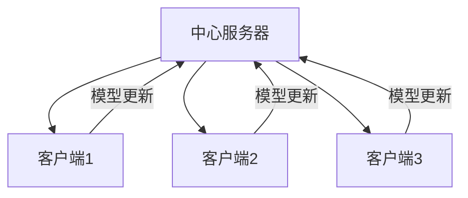

# 联邦学习

联邦学习在多个参与方之间协作训练模型，同时保护数据隐私。

## 核心思想



**关键点**：数据不离开本地，只传输模型参数。

## FedAvg 算法

```python
import torch
import copy

class FedAvg:
    def __init__(self, global_model, clients, rounds=100):
        self.global_model = global_model
        self.clients = clients
        self.rounds = rounds

    def train(self):
        for r in range(self.rounds):
            # 1. 分发全局模型
            client_models = [copy.deepcopy(self.global_model) for _ in self.clients]

            # 2. 本地训练
            for model, client in zip(client_models, self.clients):
                self.local_train(model, client.dataloader)

            # 3. 聚合
            self.aggregate(client_models)

    def local_train(self, model, dataloader, epochs=5):
        optimizer = torch.optim.SGD(model.parameters(), lr=0.01)
        for _ in range(epochs):
            for x, y in dataloader:
                optimizer.zero_grad()
                loss = nn.functional.cross_entropy(model(x), y)
                loss.backward()
                optimizer.step()

    def aggregate(self, client_models):
        # 简单平均
        global_dict = self.global_model.state_dict()
        for key in global_dict:
            global_dict[key] = torch.stack(
                [m.state_dict()[key].float() for m in client_models]
            ).mean(dim=0)
        self.global_model.load_state_dict(global_dict)
```

## 差分隐私

```python
def add_dp_noise(gradients, noise_scale, clip_norm):
    # 梯度裁剪
    total_norm = torch.norm(torch.stack([g.norm() for g in gradients]))
    clip_coef = min(1, clip_norm / (total_norm + 1e-6))
    clipped_grads = [g * clip_coef for g in gradients]

    # 添加噪声
    noisy_grads = [g + torch.randn_like(g) * noise_scale for g in clipped_grads]
    return noisy_grads
```

## 挑战与解决方案

| 挑战                 | 解决方案           |
| -------------------- | ------------------ |
| 数据异质性 (Non-IID) | FedProx, SCAFFOLD  |
| 通信效率             | 模型压缩、梯度压缩 |
| 隐私保护             | 差分隐私、安全聚合 |
| 拜占庭攻击           | 鲁棒聚合算法       |

## 应用场景

| 领域     | 应用             |
| -------- | ---------------- |
| 医疗     | 跨医院疾病预测   |
| 金融     | 反欺诈模型       |
| 移动设备 | 键盘预测、推荐   |
| IoT      | 边缘设备协同学习 |
