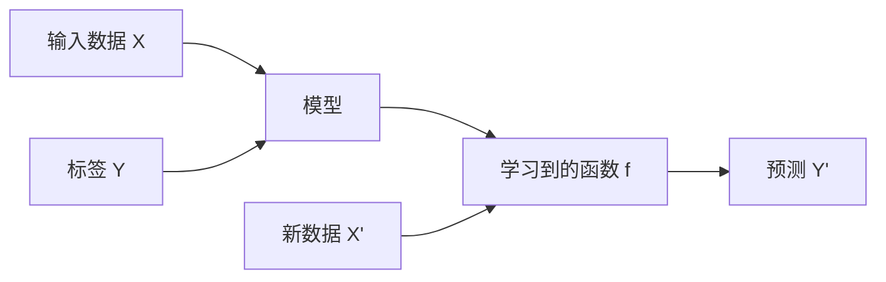
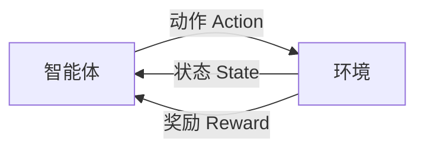
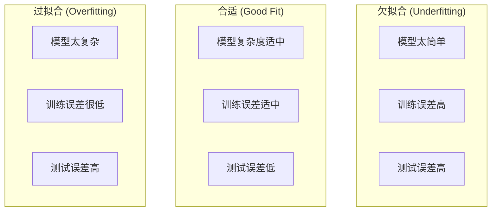
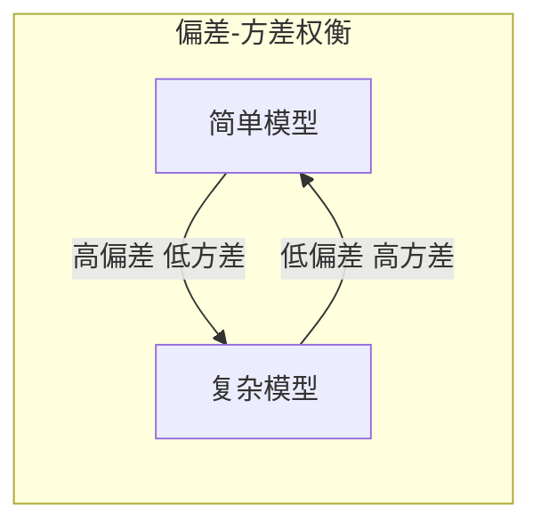
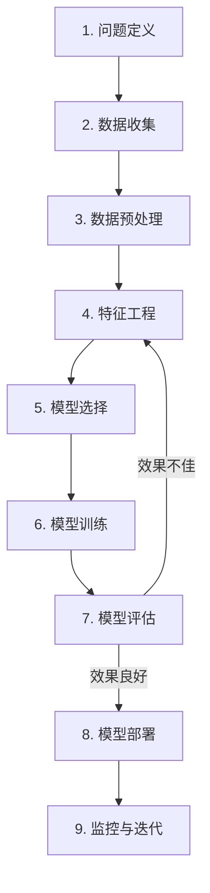

# 机器学习基础概念

## 什么是机器学习

机器学习是人工智能的一个分支，它使计算机系统能够从数据中学习并改进，而无需进行明确的编程。

```python
# 传统编程 vs 机器学习
# 传统编程：规则 + 数据 → 结果
# 机器学习：数据 + 结果 → 规则（模型）

from sklearn.linear_model import LinearRegression

# 数据和结果
X = [[1], [2], [3], [4]]  # 特征
y = [2, 4, 6, 8]          # 标签

# 机器学习：从数据中学习规则
model = LinearRegression()
model.fit(X, y)

# 模型学到的规则：y = 2x
print(f"系数: {model.coef_[0]}, 截距: {model.intercept_}")
```

## 机器学习的三大范式

### 1. 监督学习 (Supervised Learning)

从**带标签**的数据中学习，用于预测新数据的标签。



**常见任务**：

| 任务类型 | 描述         | 示例                   | 常用算法                |
| -------- | ------------ | ---------------------- | ----------------------- |
| 回归     | 预测连续值   | 房价预测、销量预测     | 线性回归、决策树回归    |
| 分类     | 预测离散类别 | 垃圾邮件检测、图像分类 | 逻辑回归、SVM、随机森林 |

```python
from sklearn.datasets import load_iris
from sklearn.model_selection import train_test_split
from sklearn.ensemble import RandomForestClassifier

# 加载数据
iris = load_iris()
X_train, X_test, y_train, y_test = train_test_split(
    iris.data, iris.target, test_size=0.2, random_state=42
)

# 训练分类模型
clf = RandomForestClassifier(n_estimators=100)
clf.fit(X_train, y_train)

# 预测
accuracy = clf.score(X_test, y_test)
print(f"准确率: {accuracy:.2%}")
```

### 2. 无监督学习 (Unsupervised Learning)

从**无标签**的数据中发现隐藏的结构和模式。


**常见任务**：

| 任务类型 | 描述             | 示例                 | 常用算法        |
| -------- | ---------------- | -------------------- | --------------- |
| 聚类     | 将相似数据分组   | 客户分群、文档聚类   | K-Means, DBSCAN |
| 降维     | 减少特征维度     | 数据可视化、特征压缩 | PCA, t-SNE      |
| 关联规则 | 发现数据间的关联 | 购物篮分析           | Apriori         |

```python
from sklearn.cluster import KMeans
import numpy as np

# 无标签数据
X = np.array([[1, 2], [1.5, 1.8], [5, 8], [8, 8], [1, 0.6], [9, 11]])

# 聚类
kmeans = KMeans(n_clusters=2, random_state=42, n_init='auto')
kmeans.fit(X)

print(f"聚类标签: {kmeans.labels_}")
print(f"聚类中心: {kmeans.cluster_centers_}")
```

### 3. 强化学习 (Reinforcement Learning)

智能体通过与环境**交互**，根据**奖励信号**学习最优策略。



**核心概念**：

| 概念        | 描述                   |
| ----------- | ---------------------- |
| Agent       | 学习和决策的主体       |
| Environment | 智能体交互的外部世界   |
| State       | 环境的当前状态         |
| Action      | 智能体可执行的操作     |
| Reward      | 环境给予的反馈信号     |
| Policy      | 从状态到动作的映射策略 |

**应用场景**：游戏 AI、机器人控制、推荐系统、自动驾驶

## 模型评估的核心问题

### 过拟合与欠拟合



**判断方法**：

```python
from sklearn.model_selection import learning_curve
import matplotlib.pyplot as plt

def plot_learning_curve(estimator, X, y):
    train_sizes, train_scores, val_scores = learning_curve(
        estimator, X, y, cv=5,
        train_sizes=np.linspace(0.1, 1.0, 10)
    )

    plt.figure(figsize=(10, 6))
    plt.plot(train_sizes, train_scores.mean(axis=1), label='训练分数')
    plt.plot(train_sizes, val_scores.mean(axis=1), label='验证分数')
    plt.xlabel('训练样本数')
    plt.ylabel('分数')
    plt.legend()
    plt.title('学习曲线')
    plt.show()
```

**解决方案**：

| 问题   | 原因       | 解决方案                                  |
| ------ | ---------- | ----------------------------------------- |
| 欠拟合 | 模型太简单 | 增加特征、使用更复杂模型、减少正则化      |
| 过拟合 | 模型太复杂 | 增加数据、正则化、Dropout、早停、交叉验证 |

### 偏差与方差

$$
\text{总误差} = \text{偏差}^2 + \text{方差} + \text{不可约误差}
$$

| 概念          | 描述                       | 高偏差表现 | 高方差表现 |
| ------------- | -------------------------- | ---------- | ---------- |
| 偏差 Bias     | 模型预测值与真实值的差距   | 欠拟合     | -          |
| 方差 Variance | 模型对不同训练集的敏感程度 | -          | 过拟合     |



## 机器学习工作流程



```python
# 完整的机器学习流程示例
from sklearn.datasets import load_breast_cancer
from sklearn.model_selection import train_test_split, cross_val_score
from sklearn.preprocessing import StandardScaler
from sklearn.ensemble import RandomForestClassifier
from sklearn.metrics import classification_report

# 1-2. 数据收集
data = load_breast_cancer()
X, y = data.data, data.target

# 3. 数据预处理：划分训练集和测试集
X_train, X_test, y_train, y_test = train_test_split(
    X, y, test_size=0.2, random_state=42
)

# 4. 特征工程：标准化
scaler = StandardScaler()
X_train_scaled = scaler.fit_transform(X_train)
X_test_scaled = scaler.transform(X_test)

# 5-6. 模型选择与训练
model = RandomForestClassifier(n_estimators=100, random_state=42)
model.fit(X_train_scaled, y_train)

# 7. 模型评估
cv_scores = cross_val_score(model, X_train_scaled, y_train, cv=5)
print(f"交叉验证分数: {cv_scores.mean():.2%} ± {cv_scores.std():.2%}")

y_pred = model.predict(X_test_scaled)
print(classification_report(y_test, y_pred, target_names=data.target_names))
```

## 常见术语表

| 术语     | 英文              | 描述                         |
| -------- | ----------------- | ---------------------------- |
| 特征     | Feature           | 输入变量，用于描述数据的属性 |
| 标签     | Label / Target    | 输出变量，需要预测的值       |
| 样本     | Sample / Instance | 一条数据记录                 |
| 训练集   | Training Set      | 用于训练模型的数据           |
| 验证集   | Validation Set    | 用于调参和模型选择的数据     |
| 测试集   | Test Set          | 用于最终评估模型性能的数据   |
| 超参数   | Hyperparameter    | 模型训练前设定的参数         |
| 损失函数 | Loss Function     | 衡量预测值与真实值差距的函数 |
| 梯度下降 | Gradient Descent  | 最小化损失函数的优化算法     |
