# 生成模型

生成模型学习数据的分布，用于生成新的数据样本。

## 模型分类

```mermaid
graph TB
    A[生成模型] --> B[显式密度]
    A --> C[隐式密度]
    B --> D[VAE]
    C --> E[GAN]
    A --> F[扩散模型]
```



## VAE (变分自编码器)

```python
import torch
import torch.nn as nn

class VAE(nn.Module):
    def __init__(self, input_dim, latent_dim):
        super().__init__()
        # 编码器
        self.encoder = nn.Sequential(
            nn.Linear(input_dim, 256),
            nn.ReLU()
        )
        self.fc_mu = nn.Linear(256, latent_dim)
        self.fc_var = nn.Linear(256, latent_dim)

        # 解码器
        self.decoder = nn.Sequential(
            nn.Linear(latent_dim, 256),
            nn.ReLU(),
            nn.Linear(256, input_dim),
            nn.Sigmoid()
        )

    def encode(self, x):
        h = self.encoder(x)
        return self.fc_mu(h), self.fc_var(h)

    def reparameterize(self, mu, log_var):
        std = torch.exp(0.5 * log_var)
        eps = torch.randn_like(std)
        return mu + eps * std

    def forward(self, x):
        mu, log_var = self.encode(x)
        z = self.reparameterize(mu, log_var)
        return self.decoder(z), mu, log_var

# 损失函数
def vae_loss(recon_x, x, mu, log_var):
    recon_loss = nn.functional.binary_cross_entropy(recon_x, x, reduction='sum')
    kl_loss = -0.5 * torch.sum(1 + log_var - mu.pow(2) - log_var.exp())
    return recon_loss + kl_loss
```

## GAN (生成对抗网络)

```python
class Generator(nn.Module):
    def __init__(self, latent_dim, output_dim):
        super().__init__()
        self.net = nn.Sequential(
            nn.Linear(latent_dim, 256),
            nn.LeakyReLU(0.2),
            nn.Linear(256, 512),
            nn.LeakyReLU(0.2),
            nn.Linear(512, output_dim),
            nn.Tanh()
        )

    def forward(self, z):
        return self.net(z)

class Discriminator(nn.Module):
    def __init__(self, input_dim):
        super().__init__()
        self.net = nn.Sequential(
            nn.Linear(input_dim, 512),
            nn.LeakyReLU(0.2),
            nn.Linear(512, 256),
            nn.LeakyReLU(0.2),
            nn.Linear(256, 1),
            nn.Sigmoid()
        )

    def forward(self, x):
        return self.net(x)

# 训练
def train_gan(G, D, dataloader, epochs):
    for epoch in range(epochs):
        for real_data in dataloader:
            # 训练判别器
            z = torch.randn(batch_size, latent_dim)
            fake_data = G(z)

            d_loss = -torch.mean(torch.log(D(real_data)) + torch.log(1 - D(fake_data)))

            # 训练生成器
            g_loss = -torch.mean(torch.log(D(G(z))))
```

## 扩散模型

```python
class DiffusionModel(nn.Module):
    def __init__(self, model, timesteps=1000):
        super().__init__()
        self.model = model
        self.timesteps = timesteps

        # 噪声调度
        self.betas = torch.linspace(1e-4, 0.02, timesteps)
        self.alphas = 1 - self.betas
        self.alpha_cumprod = torch.cumprod(self.alphas, dim=0)

    def forward_diffusion(self, x0, t):
        noise = torch.randn_like(x0)
        alpha_t = self.alpha_cumprod[t].view(-1, 1, 1, 1)
        return torch.sqrt(alpha_t) * x0 + torch.sqrt(1 - alpha_t) * noise, noise

    def train_step(self, x0):
        t = torch.randint(0, self.timesteps, (x0.size(0),))
        xt, noise = self.forward_diffusion(x0, t)
        predicted_noise = self.model(xt, t)
        return nn.functional.mse_loss(predicted_noise, noise)
```

## 模型对比

| 模型     | 优点               | 缺点       | 应用                     |
| -------- | ------------------ | ---------- | ------------------------ |
| VAE      | 稳定训练、概率解释 | 生成模糊   | 表示学习                 |
| GAN      | 生成质量高         | 训练不稳定 | 图像生成                 |
| 扩散模型 | 质量最高、稳定     | 生成慢     | DALL-E、Stable Diffusion |
