# 图神经网络 (GNN)

图神经网络用于处理图结构数据，如社交网络、分子结构、知识图谱。

## 图的基本概念

```python
import torch
from torch_geometric.data import Data

# 定义一个简单的图
edge_index = torch.tensor([
    [0, 1, 1, 2],  # 源节点
    [1, 0, 2, 1]   # 目标节点
], dtype=torch.long)

x = torch.tensor([[-1], [0], [1]], dtype=torch.float)  # 节点特征

data = Data(x=x, edge_index=edge_index)
```

## 消息传递范式

$$
h_v^{(l+1)} = \text{UPDATE}\left(h_v^{(l)}, \text{AGGREGATE}\left(\{h_u^{(l)} : u \in \mathcal{N}(v)\}\right)\right)
$$



```mermaid
graph LR
    A[邻居节点] -->|消息| B[聚合]
    B --> C[更新]
    C --> D[新节点表示]
```

## GCN (图卷积网络)

```python
import torch.nn as nn
from torch_geometric.nn import GCNConv

class GCN(nn.Module):
    def __init__(self, in_channels, hidden_channels, out_channels):
        super().__init__()
        self.conv1 = GCNConv(in_channels, hidden_channels)
        self.conv2 = GCNConv(hidden_channels, out_channels)

    def forward(self, x, edge_index):
        x = self.conv1(x, edge_index)
        x = torch.relu(x)
        x = nn.functional.dropout(x, p=0.5, training=self.training)
        x = self.conv2(x, edge_index)
        return x

# 节点分类
model = GCN(dataset.num_features, 16, dataset.num_classes)
```

## GAT (图注意力网络)

```python
from torch_geometric.nn import GATConv

class GAT(nn.Module):
    def __init__(self, in_channels, hidden_channels, out_channels, heads=8):
        super().__init__()
        self.conv1 = GATConv(in_channels, hidden_channels, heads=heads)
        self.conv2 = GATConv(hidden_channels * heads, out_channels, heads=1)

    def forward(self, x, edge_index):
        x = self.conv1(x, edge_index)
        x = torch.relu(x)
        x = self.conv2(x, edge_index)
        return x
```

## GraphSAGE

```python
from torch_geometric.nn import SAGEConv

class GraphSAGE(nn.Module):
    def __init__(self, in_channels, hidden_channels, out_channels):
        super().__init__()
        self.conv1 = SAGEConv(in_channels, hidden_channels)
        self.conv2 = SAGEConv(hidden_channels, out_channels)

    def forward(self, x, edge_index):
        x = self.conv1(x, edge_index)
        x = torch.relu(x)
        x = self.conv2(x, edge_index)
        return x
```

## 常见任务

| 任务     | 描述             | 输出           |
| -------- | ---------------- | -------------- |
| 节点分类 | 预测节点类别     | 每个节点的标签 |
| 链接预测 | 预测边是否存在   | 节点对的概率   |
| 图分类   | 预测整个图的类别 | 图级标签       |
| 节点聚类 | 发现社区结构     | 节点分组       |

## 应用场景

| 领域     | 应用                 |
| -------- | -------------------- |
| 社交网络 | 用户推荐、社区检测   |
| 生物医药 | 药物发现、蛋白质结构 |
| 知识图谱 | 关系预测、实体对齐   |
| 推荐系统 | 基于图的协同过滤     |
