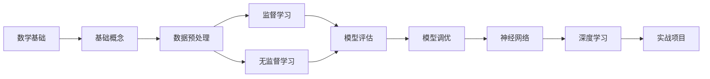
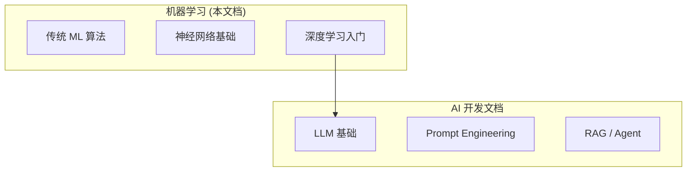

# 机器学习概览

欢迎来到机器学习学习文档。这里汇集了从入门到进阶的机器学习核心概念、算法原理和实战技巧。

## 文档导航

### 📖 基础入门

- [🎯 基础概念](./fundamentals) - 监督学习、无监督学习、强化学习；过拟合与欠拟合
- [📐 数学基础](./math-basics) - 线性代数、概率统计、微积分核心知识
- [🔧 数据预处理](./data-preprocessing) - 特征工程、数据清洗、归一化、编码

### 🎯 核心算法

- [📊 监督学习](./supervised-learning) - 回归、分类：线性回归、逻辑回归、决策树、SVM
- [🔍 无监督学习](./unsupervised-learning) - 聚类、降维：K-Means、PCA、t-SNE
- [🎭 集成学习](./ensemble-learning) - Bagging、Boosting、XGBoost、LightGBM
- [📊 贝叶斯方法](./bayesian-methods) - 朴素贝叶斯、高斯过程、贝叶斯优化
- [🎮 强化学习](./reinforcement-learning) - Q-Learning、DQN、Policy Gradient

### 🧠 深度学习

- [🔗 神经网络基础](./neural-networks) - 感知机、前馈网络、反向传播
- [🚀 深度学习入门](./deep-learning) - CNN、RNN、LSTM、Transformer

### 📊 应用领域

- [📈 时间序列](./time-series) - ARIMA、Prophet、LSTM 时序预测
- [🎯 推荐系统](./recommendation-system) - 协同过滤、矩阵分解
- [📝 NLP 基础](./nlp-basics) - 词向量、文本分类、NER
- [🖼️ 计算机视觉](./computer-vision) - 图像分类、目标检测、分割

### 🛠️ 工程实践

- [📏 模型评估](./model-evaluation) - 交叉验证、评估指标
- [⚙️ 模型调优](./model-tuning) - 超参数调优、正则化
- [🔍 可解释性](./interpretability) - SHAP、LIME
- [🤖 AutoML](./automl) - 自动机器学习
- [🚀 模型部署](./model-deployment) - 服务化、Docker、MLOps
- [💡 实战项目](./practical-projects) - 手写数字、房价预测

### 📚 参考指南

- [📋 快速参考](./quick-reference) - 算法选择指南、公式速查
- [❓ 常见问题](./faq) - FAQ 解答

### 🚀 进阶主题

- [🕸️ 图神经网络](./graph-neural-networks) - GCN、GAT、GraphSAGE
- [🎨 生成模型](./generative-models) - VAE、GAN、扩散模型
- [🔄 对比学习](./contrastive-learning) - SimCLR、MoCo、CLIP
- [🎯 多任务学习](./multi-task-learning) - 共享表示学习
- [🧬 元学习](./meta-learning) - Few-shot、MAML
- [🔒 联邦学习](./federated-learning) - 隐私保护分布式学习
- [⚖️ 因果推断](./causal-inference) - 因果效应估计
- [🎭 多模态学习](./multimodal-learning) - 图像+文本+音频融合
- [🎯 主动学习](./active-learning) - 智能标注样本选择
- [📊 在线学习](./online-learning) - 流式数据持续学习
- [🧠 持续学习](./continual-learning) - 避免灾难性遗忘
- [📦 模型压缩](./model-compression) - 量化、剪枝、蒸馏
- [🛡️ 对抗鲁棒性](./adversarial-robustness) - 对抗攻击与防御
- [📐 不确定性量化](./uncertainty-quantification) - 预测置信度估计
- [🔍 异常检测详解](./anomaly-detection) - 统计、ML、深度学习方法
- [🎮 强化学习进阶](./advanced-rl) - PPO、SAC、TD3
- [🔧 特征工程进阶](./advanced-feature-engineering) - 自动特征、特征存储
- [⚡ 分布式训练](./distributed-training) - DDP、FSDP、DeepSpeed
- [🔧 MLOps 工具链](./mlops-tools) - MLflow、DVC、W&B
- [🏷️ 数据标注](./data-labeling) - 标注工具、格式、质量控制
- [🏥 领域特定 ML](./domain-specific-ml) - 医疗、金融、工业、零售
- [🔄 迁移学习](./transfer-learning) - 特征提取、微调策略
- [🌐 领域自适应](./domain-adaptation) - MMD、DANN、CORAL
- [🔐 隐私计算](./privacy-computing) - 差分隐私、同态加密
- [🧬 进化算法](./evolutionary-algorithms) - 遗传算法、进化策略
- [🧩 神经符号结合](./neuro-symbolic) - 知识图谱嵌入、神经逻辑编程
- [⚖️ 可信 AI](./trustworthy-ai) - 公平性、透明度、安全性

## 学习路线

**推荐顺序**：

1. **数学基础**：掌握线性代数、概率统计的核心概念
2. **基础概念**：理解机器学习的基本范式和核心问题
3. **数据预处理**：学会处理真实世界的数据
4. **经典算法**：掌握监督学习和无监督学习的核心算法
5. **模型评估与调优**：学会评估模型性能并进行优化
6. **深度学习**：进入神经网络和深度学习领域
7. **实战项目**：通过项目巩固所学知识

## 技术栈推荐

| 类型         | 推荐                | 备选              |
| ------------ | ------------------- | ----------------- |
| **语言**     | Python 3.10+        | R, Julia          |
| **传统 ML**  | scikit-learn        | XGBoost, LightGBM |
| **深度学习** | PyTorch             | TensorFlow, JAX   |
| **数据处理** | Pandas, NumPy       | Polars            |
| **可视化**   | Matplotlib, Seaborn | Plotly            |
| **Notebook** | Jupyter Lab         | VS Code, Colab    |

## 与 AI 开发文档的关系

本文档聚焦于**传统机器学习**和**深度学习基础**，是理解现代 AI 技术的基石。

如果你对大语言模型 (LLM) 和生成式 AI 应用开发感兴趣，请参阅 [AI 开发文档](/docs/ai)。

