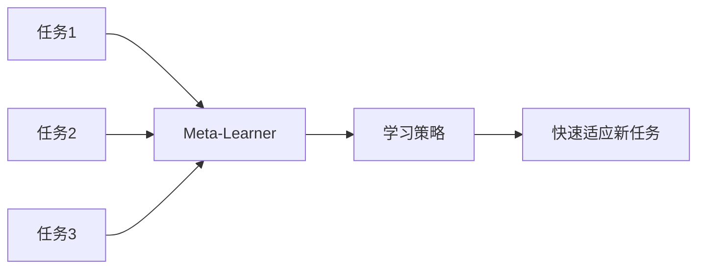

# 元学习 (Meta-Learning)

元学习是"学习如何学习"，使模型能够快速适应新任务。

## 核心思想



## Few-Shot Learning

给定少量样本学习新类别。

| 术语        | 描述               |
| ----------- | ------------------ |
| N-way       | N 个类别           |
| K-shot      | 每类 K 个样本      |
| Support Set | 用于学习的少量样本 |
| Query Set   | 用于评估的样本     |

## MAML (Model-Agnostic Meta-Learning)

```python
import torch
import torch.nn as nn
from copy import deepcopy

class MAML:
    def __init__(self, model, lr_inner=0.01, lr_outer=0.001):
        self.model = model
        self.lr_inner = lr_inner
        self.optimizer = torch.optim.Adam(model.parameters(), lr=lr_outer)

    def inner_loop(self, support_x, support_y, num_steps=5):
        # 复制模型参数
        fast_weights = {name: param.clone() for name, param in self.model.named_parameters()}

        for _ in range(num_steps):
            # 前向传播
            logits = self.model(support_x)
            loss = nn.functional.cross_entropy(logits, support_y)

            # 计算梯度并更新快参数
            grads = torch.autograd.grad(loss, fast_weights.values(), create_graph=True)
            fast_weights = {name: param - self.lr_inner * grad
                           for (name, param), grad in zip(fast_weights.items(), grads)}

        return fast_weights

    def outer_loop(self, tasks):
        meta_loss = 0

        for support_x, support_y, query_x, query_y in tasks:
            # 内循环：在支持集上快速适应
            fast_weights = self.inner_loop(support_x, support_y)

            # 外循环：在查询集上计算损失
            with torch.no_grad():
                # 临时使用 fast_weights
                pass
            logits = self.model(query_x)  # 使用 fast_weights
            meta_loss += nn.functional.cross_entropy(logits, query_y)

        # 更新元参数
        self.optimizer.zero_grad()
        meta_loss.backward()
        self.optimizer.step()
```

## Prototypical Networks

```python
class PrototypicalNetwork(nn.Module):
    def __init__(self, encoder):
        super().__init__()
        self.encoder = encoder

    def forward(self, support_x, support_y, query_x, n_way, k_shot):
        # 编码所有样本
        support_emb = self.encoder(support_x)  # (n_way * k_shot, dim)
        query_emb = self.encoder(query_x)

        # 计算每类的原型
        support_emb = support_emb.view(n_way, k_shot, -1)
        prototypes = support_emb.mean(dim=1)  # (n_way, dim)

        # 计算查询样本到各原型的距离
        distances = torch.cdist(query_emb, prototypes)  # (n_query, n_way)

        return -distances  # 负距离作为 logits
```

## Matching Networks

```python
class MatchingNetwork(nn.Module):
    def __init__(self, encoder):
        super().__init__()
        self.encoder = encoder

    def forward(self, support_x, support_y, query_x):
        support_emb = self.encoder(support_x)
        query_emb = self.encoder(query_x)

        # 余弦相似度
        support_emb = nn.functional.normalize(support_emb, dim=1)
        query_emb = nn.functional.normalize(query_emb, dim=1)
        similarity = torch.mm(query_emb, support_emb.t())

        # 注意力权重
        attention = nn.functional.softmax(similarity, dim=1)

        # 加权预测
        support_labels_onehot = nn.functional.one_hot(support_y)
        predictions = torch.mm(attention, support_labels_onehot.float())

        return predictions
```

## 方法对比

| 方法         | 类型 | 特点               |
| ------------ | ---- | ------------------ |
| MAML         | 优化 | 模型无关，二阶导数 |
| Prototypical | 度量 | 简单高效           |
| Matching     | 度量 | 基于注意力         |
| Reptile      | 优化 | MAML 的简化版      |
