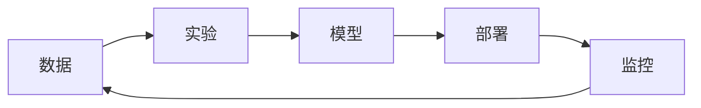

# MLOps 工具链

MLOps 工具帮助管理机器学习全生命周期。

## 工具生态



## MLflow

### 实验追踪

```python
import mlflow

mlflow.set_experiment("my-experiment")

with mlflow.start_run():
    mlflow.log_param("learning_rate", 0.01)
    mlflow.log_param("epochs", 100)

    for epoch in range(100):
        # 训练
        mlflow.log_metric("loss", loss, step=epoch)
        mlflow.log_metric("accuracy", acc, step=epoch)

    mlflow.sklearn.log_model(model, "model")
```

### 模型注册

```python
# 注册模型
mlflow.register_model("runs:/xxx/model", "my-model")

# 加载模型
model = mlflow.pyfunc.load_model("models:/my-model/Production")
```

## DVC (数据版本控制)

```bash
# 初始化
dvc init

# 追踪数据
dvc add data/dataset.csv
git add data/dataset.csv.dvc

# 推送到远程
dvc remote add -d storage s3://bucket/path
dvc push

# 拉取数据
dvc pull
```

### 管道定义

```yaml
# dvc.yaml
stages:
  preprocess:
    cmd: python preprocess.py
    deps:
      - data/raw
    outs:
      - data/processed

  train:
    cmd: python train.py
    deps:
      - data/processed
      - src/train.py
    outs:
      - models/model.pkl
    metrics:
      - metrics.json
```

## Weights & Biases

```python
import wandb

wandb.init(project="my-project")
wandb.config = {"lr": 0.01, "epochs": 100}

for epoch in range(100):
    wandb.log({"loss": loss, "accuracy": acc})

# 保存模型
wandb.save("model.pth")
```

## Hydra (配置管理)

```yaml
# config.yaml
model:
  name: resnet50
  pretrained: true
training:
  lr: 0.001
  batch_size: 32
  epochs: 100
```

```python
import hydra
from omegaconf import DictConfig

@hydra.main(config_path=".", config_name="config")
def train(cfg: DictConfig):
    model = build_model(cfg.model)
    train_model(model, cfg.training)

# 命令行覆盖
# python train.py training.lr=0.01 training.epochs=50
```

## 工具对比

| 工具     | 用途               | 特点          |
| -------- | ------------------ | ------------- |
| MLflow   | 实验追踪、模型注册 | 开源、全面    |
| W&B      | 实验追踪、可视化   | 云服务、UI 好 |
| DVC      | 数据/模型版本控制  | Git-like      |
| Hydra    | 配置管理           | 灵活          |
| Kubeflow | K8s 上的 ML 流水线 | 企业级        |
