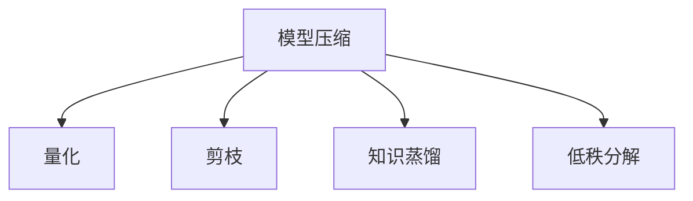

# 模型压缩

模型压缩减少模型大小和推理延迟，便于边缘部署。

## 技术概览



## 量化

### 训练后量化 (PTQ)

```python
import torch

# 动态量化
quantized_model = torch.quantization.quantize_dynamic(
    model, {torch.nn.Linear}, dtype=torch.qint8
)

# 静态量化
model.qconfig = torch.quantization.get_default_qconfig('fbgemm')
torch.quantization.prepare(model, inplace=True)
# 校准
with torch.no_grad():
    for x in calibration_data:
        model(x)
torch.quantization.convert(model, inplace=True)
```

### 量化感知训练 (QAT)

```python
model.qconfig = torch.quantization.get_default_qat_qconfig('fbgemm')
model_prepared = torch.quantization.prepare_qat(model)

# 正常训练
for epoch in range(epochs):
    train(model_prepared)

# 转换为量化模型
quantized = torch.quantization.convert(model_prepared)
```

## 剪枝

### 非结构化剪枝

```python
import torch.nn.utils.prune as prune

# 剪掉 30% 权重
prune.l1_unstructured(model.fc, name='weight', amount=0.3)

# 永久化
prune.remove(model.fc, 'weight')
```

### 结构化剪枝

```python
# 剪掉整个通道
prune.ln_structured(model.conv, name='weight', amount=0.3, n=2, dim=0)
```

### 迭代剪枝

```python
def iterative_pruning(model, target_sparsity, steps=5):
    current_sparsity = 0
    step_sparsity = target_sparsity / steps

    for step in range(steps):
        current_sparsity += step_sparsity
        for name, module in model.named_modules():
            if isinstance(module, nn.Linear):
                prune.l1_unstructured(module, 'weight', amount=step_sparsity)

        # 微调
        finetune(model)
```

## 知识蒸馏

```python
def distillation_loss(student_logits, teacher_logits, labels, T=4, alpha=0.5):
    # 软标签损失
    soft_loss = nn.KLDivLoss(reduction='batchmean')(
        nn.functional.log_softmax(student_logits / T, dim=1),
        nn.functional.softmax(teacher_logits / T, dim=1)
    ) * T * T

    # 硬标签损失
    hard_loss = nn.functional.cross_entropy(student_logits, labels)

    return alpha * soft_loss + (1 - alpha) * hard_loss

# 训练学生模型
for x, y in dataloader:
    with torch.no_grad():
        teacher_logits = teacher_model(x)
    student_logits = student_model(x)
    loss = distillation_loss(student_logits, teacher_logits, y)
```

## 效果对比

| 方法      | 压缩比 | 精度损失 | 需要重训练 |
| --------- | ------ | -------- | ---------- |
| INT8 量化 | 4x     | < 1%     | 否/可选    |
| 剪枝 50%  | 2x     | 1-2%     | 是         |
| 蒸馏      | 可变   | 1-3%     | 是         |
| 组合      | 10x+   | 2-5%     | 是         |
