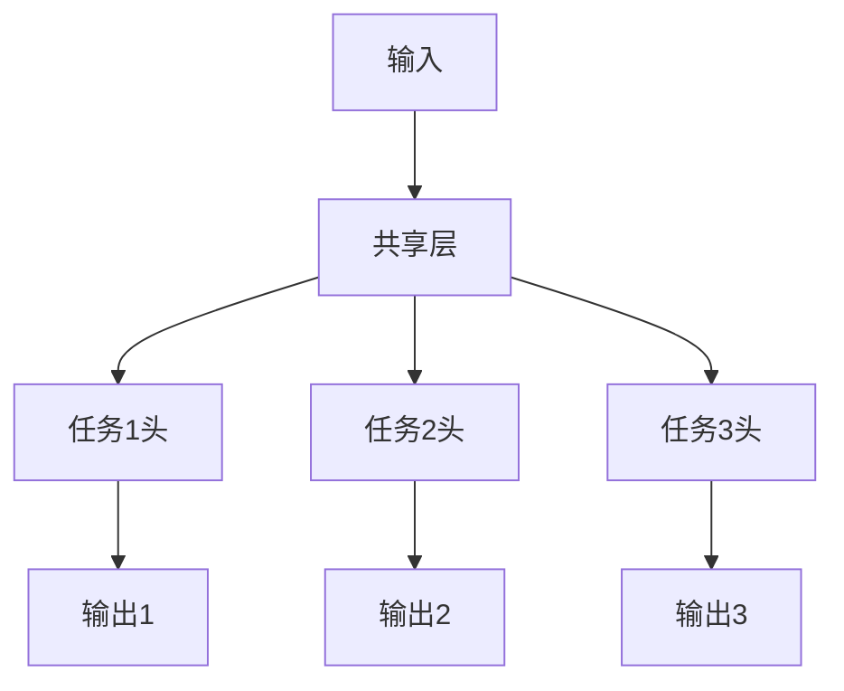

# 多任务学习

多任务学习同时学习多个相关任务，通过共享表示提升泛化能力。

## 核心思想



## 硬参数共享

```python
import torch.nn as nn

class HardSharingMTL(nn.Module):
    def __init__(self, input_dim, shared_dim, task_dims):
        super().__init__()
        # 共享层
        self.shared = nn.Sequential(
            nn.Linear(input_dim, shared_dim),
            nn.ReLU(),
            nn.Linear(shared_dim, shared_dim),
            nn.ReLU()
        )

        # 任务特定层
        self.task_heads = nn.ModuleList([
            nn.Linear(shared_dim, dim) for dim in task_dims
        ])

    def forward(self, x):
        shared_repr = self.shared(x)
        outputs = [head(shared_repr) for head in self.task_heads]
        return outputs
```

## 软参数共享

```python
class SoftSharingMTL(nn.Module):
    def __init__(self, input_dim, hidden_dim, task_dims):
        super().__init__()
        # 每个任务有独立的网络
        self.task_networks = nn.ModuleList([
            nn.Sequential(
                nn.Linear(input_dim, hidden_dim),
                nn.ReLU(),
                nn.Linear(hidden_dim, dim)
            ) for dim in task_dims
        ])

    def forward(self, x):
        return [net(x) for net in self.task_networks]

    def regularization_loss(self):
        # 鼓励参数相似
        reg = 0
        for i in range(len(self.task_networks)):
            for j in range(i + 1, len(self.task_networks)):
                for p1, p2 in zip(self.task_networks[i].parameters(),
                                  self.task_networks[j].parameters()):
                    reg += torch.norm(p1 - p2, p=2)
        return reg
```

## 损失函数权重

```python
# 静态权重
def static_weighted_loss(losses, weights):
    return sum(w * l for w, l in zip(weights, losses))

# 不确定性权重 (Uncertainty Weighting)
class UncertaintyWeighting(nn.Module):
    def __init__(self, num_tasks):
        super().__init__()
        self.log_vars = nn.Parameter(torch.zeros(num_tasks))

    def forward(self, losses):
        weighted = 0
        for i, loss in enumerate(losses):
            precision = torch.exp(-self.log_vars[i])
            weighted += precision * loss + self.log_vars[i]
        return weighted

# GradNorm
class GradNorm:
    def __init__(self, model, alpha=1.5):
        self.weights = nn.Parameter(torch.ones(num_tasks))
        self.alpha = alpha

    def update_weights(self, losses, shared_params):
        # 计算每个任务的梯度范数
        grads = []
        for loss in losses:
            grad = torch.autograd.grad(loss, shared_params, retain_graph=True)
            grads.append(torch.norm(torch.cat([g.flatten() for g in grad])))
        # 根据训练速度调整权重
        ...
```

## 应用场景

| 场景     | 任务组合                       |
| -------- | ------------------------------ |
| 自动驾驶 | 目标检测 + 语义分割 + 深度估计 |
| 推荐系统 | 点击预测 + 转化预测 + 时长预测 |
| NLP      | 情感分析 + 实体识别 + 关系抽取 |
| CV       | 人脸检测 + 关键点 + 属性识别   |
