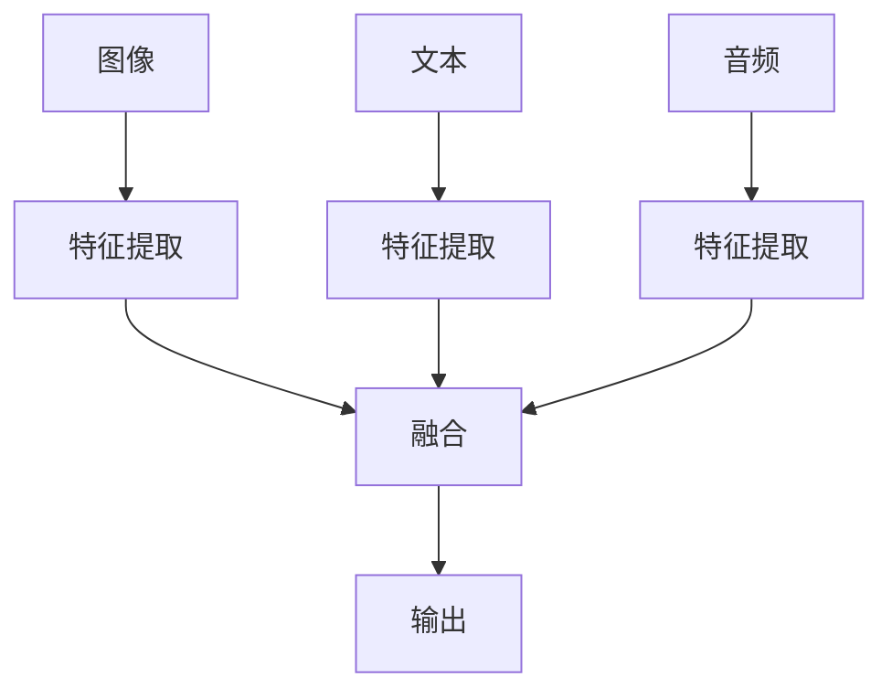

# 多模态学习

多模态学习处理和融合来自不同模态（图像、文本、音频等）的数据。

## 核心概念



## 融合策略

### 早期融合

```python
import torch
import torch.nn as nn

class EarlyFusion(nn.Module):
    def __init__(self, img_dim, text_dim, hidden_dim, num_classes):
        super().__init__()
        self.fc = nn.Sequential(
            nn.Linear(img_dim + text_dim, hidden_dim),
            nn.ReLU(),
            nn.Linear(hidden_dim, num_classes)
        )

    def forward(self, img_feat, text_feat):
        combined = torch.cat([img_feat, text_feat], dim=1)
        return self.fc(combined)
```

### 晚期融合

```python
class LateFusion(nn.Module):
    def __init__(self, img_dim, text_dim, hidden_dim, num_classes):
        super().__init__()
        self.img_branch = nn.Linear(img_dim, num_classes)
        self.text_branch = nn.Linear(text_dim, num_classes)

    def forward(self, img_feat, text_feat):
        img_out = self.img_branch(img_feat)
        text_out = self.text_branch(text_feat)
        return (img_out + text_out) / 2
```

### 注意力融合

```python
class AttentionFusion(nn.Module):
    def __init__(self, img_dim, text_dim, hidden_dim):
        super().__init__()
        self.img_proj = nn.Linear(img_dim, hidden_dim)
        self.text_proj = nn.Linear(text_dim, hidden_dim)
        self.attention = nn.MultiheadAttention(hidden_dim, num_heads=8)

    def forward(self, img_feat, text_feat):
        img_proj = self.img_proj(img_feat)
        text_proj = self.text_proj(text_feat)

        # 交叉注意力
        attn_out, _ = self.attention(img_proj, text_proj, text_proj)
        return attn_out
```

## 视觉-语言模型

### CLIP 使用

```python
from transformers import CLIPProcessor, CLIPModel

model = CLIPModel.from_pretrained("openai/clip-vit-base-patch32")
processor = CLIPProcessor.from_pretrained("openai/clip-vit-base-patch32")

# 图文匹配
inputs = processor(text=["a cat", "a dog"], images=image, return_tensors="pt")
outputs = model(**inputs)
similarity = outputs.logits_per_image  # 图像-文本相似度
```

### BLIP (图像描述)

```python
from transformers import BlipProcessor, BlipForConditionalGeneration

processor = BlipProcessor.from_pretrained("Salesforce/blip-image-captioning-base")
model = BlipForConditionalGeneration.from_pretrained("Salesforce/blip-image-captioning-base")

inputs = processor(image, return_tensors="pt")
caption = model.generate(**inputs)
```

## 应用场景

| 任务           | 模态             | 模型          |
| -------------- | ---------------- | ------------- |
| 图像描述       | 图像 → 文本      | BLIP, GIT     |
| 视觉问答 (VQA) | 图像+文本 → 文本 | BLIP-2, LLaVA |
| 图文检索       | 图像 ↔ 文本      | CLIP          |
| 视频理解       | 视频+音频 → 文本 | VideoMAE      |
| 语音识别       | 音频 → 文本      | Whisper       |
