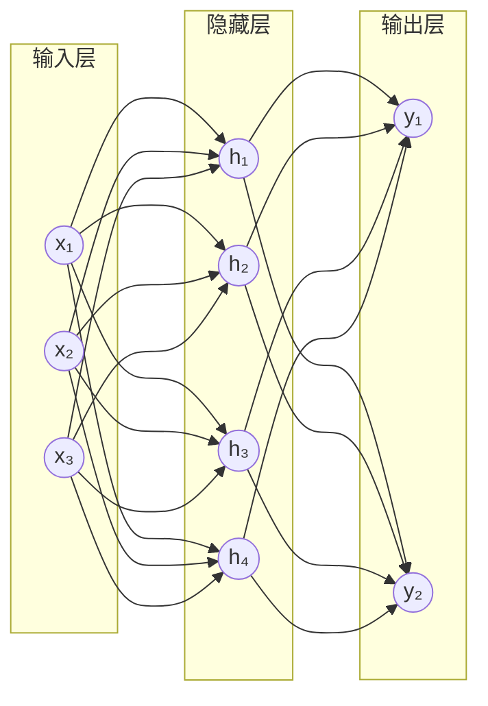
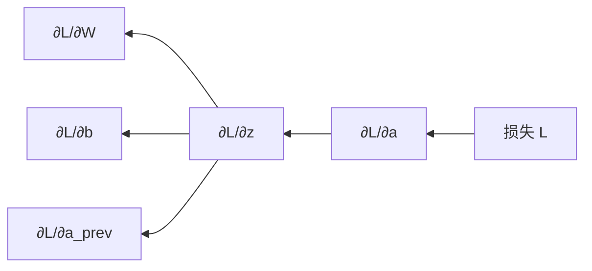

# 神经网络基础

神经网络是深度学习的基石，通过模拟生物神经元的工作方式来学习复杂的模式。

## 从感知机到神经网络

### 感知机 (Perceptron)

最简单的神经网络单元，实现二分类。

$$
y = \sigma(w_1 x_1 + w_2 x_2 + \ldots + w_n x_n + b) = \sigma(\mathbf{w}^T \mathbf{x} + b)
$$

```python
import numpy as np

class Perceptron:
    def __init__(self, learning_rate=0.01, n_iters=1000):
        self.lr = learning_rate
        self.n_iters = n_iters
        self.weights = None
        self.bias = None

    def fit(self, X, y):
        n_samples, n_features = X.shape
        self.weights = np.zeros(n_features)
        self.bias = 0

        # 确保标签为 0 或 1
        y_ = np.where(y > 0, 1, 0)

        for _ in range(self.n_iters):
            for idx, x_i in enumerate(X):
                linear_output = np.dot(x_i, self.weights) + self.bias
                y_pred = 1 if linear_output >= 0 else 0

                # 更新规则
                update = self.lr * (y_[idx] - y_pred)
                self.weights += update * x_i
                self.bias += update

    def predict(self, X):
        linear_output = np.dot(X, self.weights) + self.bias
        return np.where(linear_output >= 0, 1, 0)
```

### 多层感知机 (MLP)

通过堆叠多个层来学习非线性关系。



## 激活函数

激活函数为神经网络引入非线性，使其能够学习复杂的模式。

| 激活函数   | 公式                            | 特点                 | 适用场景         |
| ---------- | ------------------------------- | -------------------- | ---------------- |
| Sigmoid    | $\frac{1}{1+e^{-x}}$            | 输出 (0,1)，梯度消失 | 二分类输出层     |
| Tanh       | $\frac{e^x-e^{-x}}{e^x+e^{-x}}$ | 输出 (-1,1)，零中心  | 隐藏层（较少用） |
| ReLU       | $\max(0, x)$                    | 简单高效，可能死亡   | 隐藏层首选       |
| Leaky ReLU | $\max(0.01x, x)$                | 解决 ReLU 死亡问题   | 隐藏层           |
| Softmax    | $\frac{e^{x_i}}{\sum e^{x_j}}$  | 输出概率分布         | 多分类输出层     |

```python
import numpy as np

def sigmoid(x):
    return 1 / (1 + np.exp(-x))

def tanh(x):
    return np.tanh(x)

def relu(x):
    return np.maximum(0, x)

def leaky_relu(x, alpha=0.01):
    return np.where(x > 0, x, alpha * x)

def softmax(x):
    exp_x = np.exp(x - np.max(x))  # 数值稳定性
    return exp_x / exp_x.sum()
```

```python
# 可视化激活函数
import matplotlib.pyplot as plt

x = np.linspace(-5, 5, 100)

fig, axes = plt.subplots(2, 2, figsize=(10, 8))

axes[0, 0].plot(x, sigmoid(x))
axes[0, 0].set_title('Sigmoid')
axes[0, 0].grid(True)

axes[0, 1].plot(x, tanh(x))
axes[0, 1].set_title('Tanh')
axes[0, 1].grid(True)

axes[1, 0].plot(x, relu(x))
axes[1, 0].set_title('ReLU')
axes[1, 0].grid(True)

axes[1, 1].plot(x, leaky_relu(x))
axes[1, 1].set_title('Leaky ReLU')
axes[1, 1].grid(True)

plt.tight_layout()
plt.show()
```

## 前向传播

数据从输入层经过隐藏层到达输出层的过程。

$$
\mathbf{z}^{[l]} = \mathbf{W}^{[l]} \mathbf{a}^{[l-1]} + \mathbf{b}^{[l]}
$$

$$
\mathbf{a}^{[l]} = g^{[l]}(\mathbf{z}^{[l]})
$$

```python
class NeuralNetwork:
    def __init__(self, layer_sizes):
        """
        layer_sizes: 例如 [784, 128, 64, 10] 表示输入784，两个隐藏层，输出10类
        """
        self.layer_sizes = layer_sizes
        self.num_layers = len(layer_sizes)
        self.weights = []
        self.biases = []

        # 初始化权重（Xavier 初始化）
        for i in range(1, self.num_layers):
            w = np.random.randn(layer_sizes[i], layer_sizes[i-1]) * np.sqrt(2 / layer_sizes[i-1])
            b = np.zeros((layer_sizes[i], 1))
            self.weights.append(w)
            self.biases.append(b)

    def forward(self, X):
        """前向传播"""
        self.activations = [X]
        self.z_values = []

        a = X
        for i in range(self.num_layers - 1):
            z = np.dot(self.weights[i], a) + self.biases[i]
            self.z_values.append(z)

            # 最后一层用 softmax，其他用 ReLU
            if i == self.num_layers - 2:
                a = self._softmax(z)
            else:
                a = self._relu(z)

            self.activations.append(a)

        return a

    def _relu(self, z):
        return np.maximum(0, z)

    def _softmax(self, z):
        exp_z = np.exp(z - np.max(z, axis=0, keepdims=True))
        return exp_z / np.sum(exp_z, axis=0, keepdims=True)
```

## 反向传播

通过链式法则计算损失函数对每个参数的梯度。



$$
\frac{\partial L}{\partial W^{[l]}} = \frac{\partial L}{\partial z^{[l]}} \cdot (a^{[l-1]})^T
$$

$$
\frac{\partial L}{\partial b^{[l]}} = \frac{\partial L}{\partial z^{[l]}}
$$

```python
def backward(self, X, y):
    """反向传播"""
    m = X.shape[1]
    gradients = {'dW': [], 'db': []}

    # 输出层误差
    dz = self.activations[-1] - y

    for i in range(self.num_layers - 2, -1, -1):
        dw = (1/m) * np.dot(dz, self.activations[i].T)
        db = (1/m) * np.sum(dz, axis=1, keepdims=True)

        gradients['dW'].insert(0, dw)
        gradients['db'].insert(0, db)

        if i > 0:
            da = np.dot(self.weights[i].T, dz)
            dz = da * (self.z_values[i-1] > 0)  # ReLU 导数

    return gradients

def update_params(self, gradients, learning_rate):
    """更新参数"""
    for i in range(len(self.weights)):
        self.weights[i] -= learning_rate * gradients['dW'][i]
        self.biases[i] -= learning_rate * gradients['db'][i]
```

## 损失函数

| 损失函数             | 公式                                 | 适用场景 |
| -------------------- | ------------------------------------ | -------- |
| MSE                  | $\frac{1}{n}\sum(y-\hat{y})^2$       | 回归     |
| Cross-Entropy        | $-\sum y_i \log \hat{y}_i$           | 分类     |
| Binary Cross-Entropy | $-y\log\hat{y}-(1-y)\log(1-\hat{y})$ | 二分类   |

```python
def cross_entropy_loss(y_true, y_pred, epsilon=1e-15):
    """交叉熵损失"""
    y_pred = np.clip(y_pred, epsilon, 1 - epsilon)
    return -np.mean(np.sum(y_true * np.log(y_pred), axis=0))
```

## 权重初始化

| 方法   | 公式                               | 适用激活函数  |
| ------ | ---------------------------------- | ------------- |
| Xavier | $\mathcal{N}(0, \frac{1}{n_{in}})$ | Sigmoid, Tanh |
| He     | $\mathcal{N}(0, \frac{2}{n_{in}})$ | ReLU          |

```python
# Xavier 初始化
w = np.random.randn(n_out, n_in) * np.sqrt(1 / n_in)

# He 初始化
w = np.random.randn(n_out, n_in) * np.sqrt(2 / n_in)
```

## 使用 PyTorch 实现

```python
import torch
import torch.nn as nn
import torch.optim as optim
from torch.utils.data import DataLoader, TensorDataset

# 定义网络
class MLP(nn.Module):
    def __init__(self, input_size, hidden_sizes, num_classes):
        super(MLP, self).__init__()
        layers = []
        prev_size = input_size

        for hidden_size in hidden_sizes:
            layers.append(nn.Linear(prev_size, hidden_size))
            layers.append(nn.ReLU())
            layers.append(nn.Dropout(0.2))
            prev_size = hidden_size

        layers.append(nn.Linear(prev_size, num_classes))
        self.network = nn.Sequential(*layers)

    def forward(self, x):
        return self.network(x)

# 创建模型
model = MLP(input_size=784, hidden_sizes=[256, 128], num_classes=10)

# 损失函数和优化器
criterion = nn.CrossEntropyLoss()
optimizer = optim.Adam(model.parameters(), lr=0.001)

# 训练循环
def train(model, train_loader, epochs=10):
    model.train()
    for epoch in range(epochs):
        total_loss = 0
        for batch_x, batch_y in train_loader:
            optimizer.zero_grad()
            outputs = model(batch_x)
            loss = criterion(outputs, batch_y)
            loss.backward()
            optimizer.step()
            total_loss += loss.item()

        print(f"Epoch {epoch+1}/{epochs}, Loss: {total_loss/len(train_loader):.4f}")
```

## 使用 sklearn 快速实现

```python
from sklearn.neural_network import MLPClassifier
from sklearn.datasets import load_digits
from sklearn.model_selection import train_test_split

# 加载数据
digits = load_digits()
X_train, X_test, y_train, y_test = train_test_split(
    digits.data, digits.target, test_size=0.2, random_state=42
)

# 创建并训练 MLP
mlp = MLPClassifier(
    hidden_layer_sizes=(128, 64),
    activation='relu',
    solver='adam',
    learning_rate_init=0.001,
    max_iter=500,
    random_state=42
)

mlp.fit(X_train, y_train)
print(f"训练集准确率: {mlp.score(X_train, y_train):.2%}")
print(f"测试集准确率: {mlp.score(X_test, y_test):.2%}")
```

## 常见问题与解决

| 问题     | 原因                    | 解决方案                |
| -------- | ----------------------- | ----------------------- |
| 梯度消失 | Sigmoid/Tanh 在深层网络 | 使用 ReLU，残差连接     |
| 梯度爆炸 | 权重过大，学习率过高    | 梯度裁剪，权重初始化    |
| 过拟合   | 模型过于复杂            | Dropout，正则化，早停   |
| 训练缓慢 | 学习率不当              | 学习率调度，Adam 优化器 |
