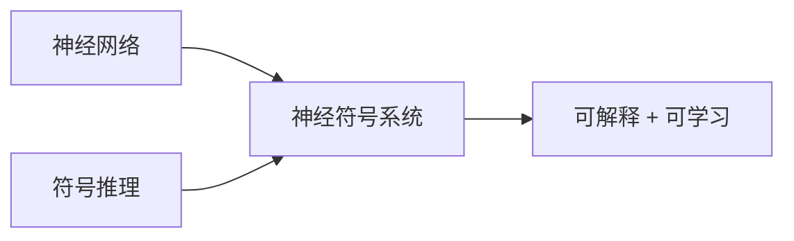

# 神经符号结合

神经符号 AI 结合神经网络的学习能力和符号 AI 的推理能力。

## 核心思想



| 方面     | 神经网络 | 符号 AI  |
| -------- | -------- | -------- |
| 学习     | 强       | 弱       |
| 推理     | 弱       | 强       |
| 可解释性 | 差       | 好       |
| 泛化     | 需要数据 | 规则泛化 |

## 知识图谱嵌入

```python
import torch
import torch.nn as nn

class TransE(nn.Module):
    def __init__(self, num_entities, num_relations, dim):
        super().__init__()
        self.entity_emb = nn.Embedding(num_entities, dim)
        self.relation_emb = nn.Embedding(num_relations, dim)

    def forward(self, head, relation, tail):
        h = self.entity_emb(head)
        r = self.relation_emb(relation)
        t = self.entity_emb(tail)

        # h + r ≈ t
        score = torch.norm(h + r - t, p=2, dim=1)
        return score

    def loss(self, pos_score, neg_score, margin=1.0):
        return torch.relu(margin + pos_score - neg_score).mean()
```

## 神经逻辑编程

```python
# Neural Logic Programming 示例
class NeuralLP:
    def __init__(self, rules, facts):
        self.rules = rules  # 逻辑规则
        self.facts = facts  # 事实

    def forward_chain(self, query):
        # 使用神经网络学习规则权重
        # 使用符号推理进行推导
        pass

# 规则示例
# grandfather(X, Z) :- father(X, Y), parent(Y, Z)
```

## 概念学习

```python
class ConceptLearner(nn.Module):
    def __init__(self, visual_encoder, concept_vocabulary):
        super().__init__()
        self.visual_encoder = visual_encoder
        self.concepts = nn.Embedding(len(concept_vocabulary), 256)

    def forward(self, image, concept_idx):
        visual_features = self.visual_encoder(image)
        concept_features = self.concepts(concept_idx)

        # 检查图像是否包含概念
        similarity = torch.cosine_similarity(visual_features, concept_features)
        return similarity
```

## 应用场景

| 应用         | 方法           |
| ------------ | -------------- |
| 知识图谱补全 | TransE, RotatE |
| 视觉问答     | 神经符号 VQA   |
| 程序合成     | 神经程序归纳   |
| 定理证明     | 神经定理证明器 |

## 优势

- **数据效率**: 利用先验知识减少数据需求
- **可解释性**: 符号规则可理解
- **泛化能力**: 组合泛化
- **可验证**: 符号推理可验证
