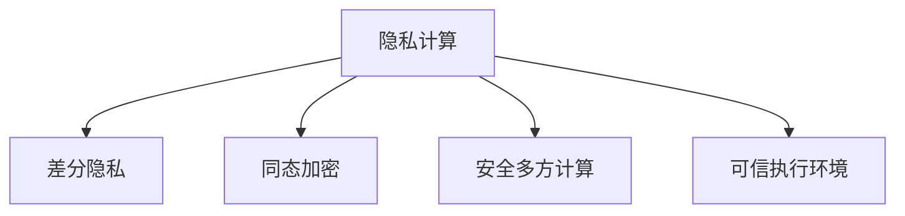

# 隐私计算

隐私计算在保护数据隐私的同时进行机器学习。

## 技术概览



## 差分隐私

### 核心概念

$$
\Pr[M(D) \in S] \leq e^\epsilon \cdot \Pr[M(D') \in S] + \delta
$$

- **ε (epsilon)**: 隐私预算，越小越隐私
- **δ (delta)**: 失败概率

### 实现

```python
import numpy as np

def laplace_mechanism(value, sensitivity, epsilon):
    """拉普拉斯机制"""
    noise = np.random.laplace(0, sensitivity / epsilon)
    return value + noise

def gaussian_mechanism(value, sensitivity, epsilon, delta):
    """高斯机制"""
    sigma = sensitivity * np.sqrt(2 * np.log(1.25 / delta)) / epsilon
    noise = np.random.normal(0, sigma)
    return value + noise

# DP-SGD
def dp_sgd_step(model, batch, epsilon, delta, max_grad_norm):
    grads = compute_per_sample_gradients(model, batch)

    # 梯度裁剪
    clipped_grads = [clip_gradient(g, max_grad_norm) for g in grads]

    # 聚合并加噪声
    aggregated = sum(clipped_grads) / len(clipped_grads)
    noisy_grad = gaussian_mechanism(aggregated, max_grad_norm, epsilon, delta)

    apply_gradient(model, noisy_grad)
```

### Opacus (PyTorch DP)

```python
from opacus import PrivacyEngine

model = MyModel()
optimizer = torch.optim.SGD(model.parameters(), lr=0.01)

privacy_engine = PrivacyEngine()
model, optimizer, dataloader = privacy_engine.make_private(
    module=model,
    optimizer=optimizer,
    data_loader=dataloader,
    noise_multiplier=1.0,
    max_grad_norm=1.0
)

# 正常训练，自动添加 DP
for batch in dataloader:
    loss = model(batch)
    loss.backward()
    optimizer.step()

# 获取隐私消耗
epsilon = privacy_engine.get_epsilon(delta=1e-5)
```

## 同态加密

```python
import tenseal as ts

# 创建上下文
context = ts.context(ts.SCHEME_TYPE.CKKS, poly_modulus_degree=8192)
context.generate_galois_keys()

# 加密数据
plain_vector = [1.0, 2.0, 3.0]
encrypted = ts.ckks_vector(context, plain_vector)

# 在密文上计算
result = encrypted * 2 + 1  # 仍是密文

# 解密
decrypted = result.decrypt()
```

## 安全多方计算

```python
# PySyft 示例
import syft as sy

# 创建虚拟工作者
alice = sy.VirtualWorker(hook, id="alice")
bob = sy.VirtualWorker(hook, id="bob")

# 秘密共享
x = torch.tensor([1, 2, 3])
x_shared = x.share(alice, bob)

# 在秘密共享上计算
y_shared = x_shared * 2
y = y_shared.get()  # 重建结果
```

## 技术对比

| 技术     | 原理     | 性能 | 安全性   |
| -------- | -------- | ---- | -------- |
| 差分隐私 | 添加噪声 | 高   | 可证明   |
| 同态加密 | 密文计算 | 低   | 强       |
| 安全多方 | 秘密共享 | 中   | 强       |
| TEE      | 硬件隔离 | 高   | 依赖硬件 |
