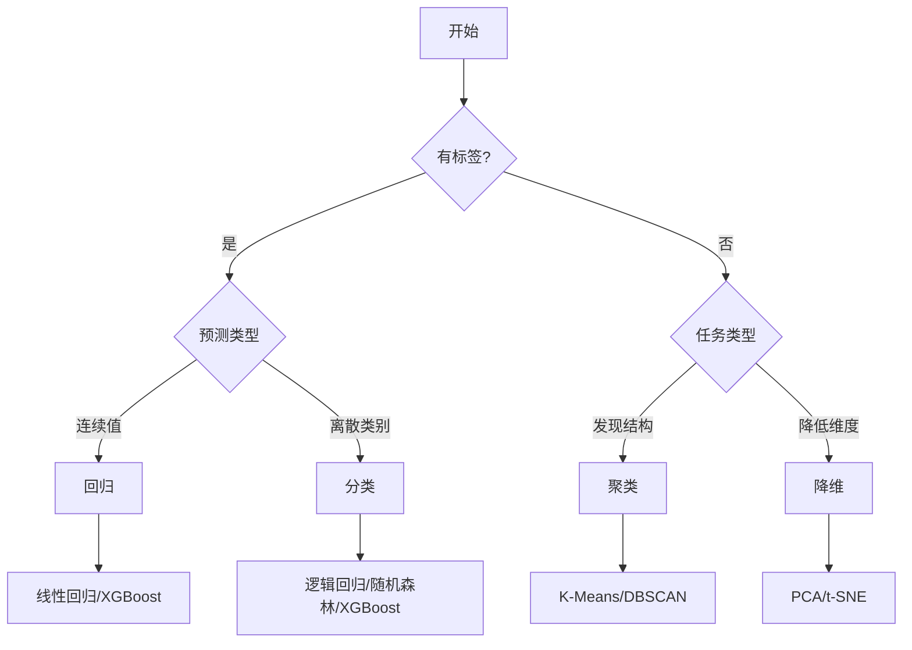

# 机器学习快速参考

## 算法选择流程



## 常用算法速查

| 算法     | 类型 | 优点             | 缺点         |
| -------- | ---- | ---------------- | ------------ |
| 线性回归 | 回归 | 简单可解释       | 只能拟合线性 |
| 逻辑回归 | 分类 | 快速、概率输出   | 线性边界     |
| 决策树   | 两者 | 可解释           | 易过拟合     |
| 随机森林 | 两者 | 鲁棒、不易过拟合 | 较慢         |
| XGBoost  | 两者 | 高性能           | 需调参       |
| SVM      | 两者 | 高维有效         | 大数据慢     |
| K-Means  | 聚类 | 简单快速         | 需指定 K     |
| PCA      | 降维 | 快速             | 仅线性       |

## sklearn 常用代码

```python
# 数据划分
from sklearn.model_selection import train_test_split
X_train, X_test, y_train, y_test = train_test_split(X, y, test_size=0.2)

# 标准化
from sklearn.preprocessing import StandardScaler
scaler = StandardScaler()
X_scaled = scaler.fit_transform(X)

# 交叉验证
from sklearn.model_selection import cross_val_score
scores = cross_val_score(model, X, y, cv=5)

# Pipeline
from sklearn.pipeline import Pipeline
pipe = Pipeline([('scaler', StandardScaler()), ('model', SVC())])
```

## 评估指标速查

| 任务 | 指标   | sklearn                             |
| ---- | ------ | ----------------------------------- |
| 分类 | 准确率 | `accuracy_score`                    |
| 分类 | F1     | `f1_score`                          |
| 分类 | AUC    | `roc_auc_score`                     |
| 回归 | RMSE   | `mean_squared_error(squared=False)` |
| 回归 | R²     | `r2_score`                          |

## 常见问题解决

| 问题       | 诊断           | 解决方案                  |
| ---------- | -------------- | ------------------------- |
| 过拟合     | 训练好、验证差 | 正则化、Dropout、更多数据 |
| 欠拟合     | 都不好         | 增加复杂度、更多特征      |
| 类别不平衡 | 少数类差       | SMOTE、类别权重           |
| 训练慢     | -              | 降采样、特征选择、GPU     |
