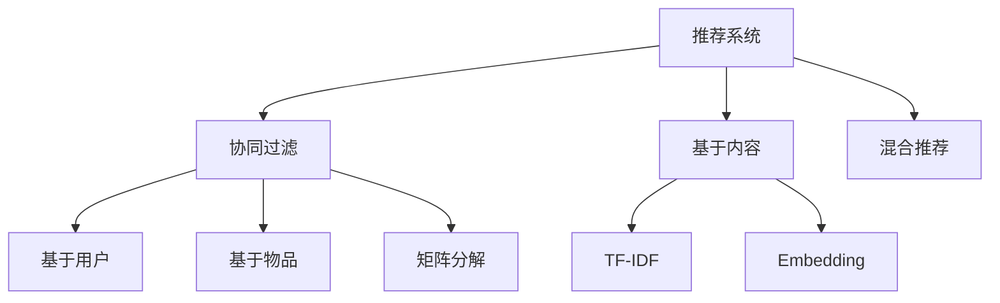

# 推荐系统

推荐系统根据用户的历史行为和偏好，向用户推荐可能感兴趣的物品。

## 推荐算法分类



## 协同过滤

### 基于用户的协同过滤

找到相似用户，推荐他们喜欢的物品。

```python
from sklearn.metrics.pairwise import cosine_similarity
import numpy as np

# 用户-物品评分矩阵
ratings = np.array([
    [5, 3, 0, 1],
    [4, 0, 0, 1],
    [1, 1, 0, 5],
    [0, 0, 5, 4],
])

# 计算用户相似度
user_similarity = cosine_similarity(ratings)

def predict_user_based(user_id, item_id, ratings, similarity, k=3):
    # 找到 k 个最相似且评过分的用户
    sim_users = np.argsort(similarity[user_id])[::-1][1:k+1]

    # 加权平均
    numerator = sum(similarity[user_id, u] * ratings[u, item_id] for u in sim_users if ratings[u, item_id] > 0)
    denominator = sum(abs(similarity[user_id, u]) for u in sim_users if ratings[u, item_id] > 0)

    return numerator / denominator if denominator > 0 else 0
```

### 基于物品的协同过滤

找到相似物品，推荐给喜欢该物品的用户。

```python
# 计算物品相似度
item_similarity = cosine_similarity(ratings.T)

def predict_item_based(user_id, item_id, ratings, similarity, k=3):
    # 用户评过分的物品
    rated_items = np.where(ratings[user_id] > 0)[0]

    # 找到最相似的 k 个物品
    sim_items = sorted(rated_items, key=lambda x: similarity[item_id, x], reverse=True)[:k]

    numerator = sum(similarity[item_id, i] * ratings[user_id, i] for i in sim_items)
    denominator = sum(abs(similarity[item_id, i]) for i in sim_items)

    return numerator / denominator if denominator > 0 else 0
```

### 矩阵分解 (SVD)

将用户-物品矩阵分解为低维潜在因子。

```python
from surprise import SVD, Dataset, Reader
from surprise.model_selection import cross_validate

# 准备数据
reader = Reader(rating_scale=(1, 5))
data = Dataset.load_from_df(df[['user_id', 'item_id', 'rating']], reader)

# SVD 模型
svd = SVD(n_factors=50, n_epochs=20, lr_all=0.005, reg_all=0.02)
cross_validate(svd, data, cv=5)

# 训练并预测
trainset = data.build_full_trainset()
svd.fit(trainset)
prediction = svd.predict(user_id, item_id)
```

## 基于内容的推荐

### 物品特征向量

```python
from sklearn.feature_extraction.text import TfidfVectorizer

# 物品描述
descriptions = ["动作冒险电影", "浪漫喜剧电影", "科幻动作电影"]

# TF-IDF 向量化
tfidf = TfidfVectorizer()
item_features = tfidf.fit_transform(descriptions)

# 物品相似度
item_sim = cosine_similarity(item_features)
```

### 用户画像

```python
def build_user_profile(user_id, ratings, item_features):
    # 用户评过分的物品
    rated_items = np.where(ratings[user_id] > 0)[0]

    # 加权平均物品特征
    profile = np.zeros(item_features.shape[1])
    for item in rated_items:
        profile += ratings[user_id, item] * item_features[item].toarray().flatten()

    return profile / len(rated_items)
```

## 深度学习推荐

### 神经协同过滤 (NCF)

```python
import torch
import torch.nn as nn

class NCF(nn.Module):
    def __init__(self, num_users, num_items, embed_dim=64):
        super().__init__()
        self.user_embed = nn.Embedding(num_users, embed_dim)
        self.item_embed = nn.Embedding(num_items, embed_dim)
        self.mlp = nn.Sequential(
            nn.Linear(embed_dim * 2, 128),
            nn.ReLU(),
            nn.Linear(128, 64),
            nn.ReLU(),
            nn.Linear(64, 1)
        )

    def forward(self, user_ids, item_ids):
        user_emb = self.user_embed(user_ids)
        item_emb = self.item_embed(item_ids)
        x = torch.cat([user_emb, item_emb], dim=1)
        return self.mlp(x).squeeze()
```

### 双塔模型

```python
class TwoTower(nn.Module):
    def __init__(self, num_users, num_items, embed_dim=64):
        super().__init__()
        # 用户塔
        self.user_tower = nn.Sequential(
            nn.Embedding(num_users, embed_dim),
            nn.Linear(embed_dim, 64),
            nn.ReLU()
        )
        # 物品塔
        self.item_tower = nn.Sequential(
            nn.Embedding(num_items, embed_dim),
            nn.Linear(embed_dim, 64),
            nn.ReLU()
        )

    def forward(self, user_ids, item_ids):
        user_vec = self.user_tower(user_ids)
        item_vec = self.item_tower(item_ids)
        return (user_vec * item_vec).sum(dim=1)  # 点积
```

## 评估指标

```python
# 准确率@K
def precision_at_k(recommended, relevant, k):
    recommended_k = recommended[:k]
    return len(set(recommended_k) & set(relevant)) / k

# 召回率@K
def recall_at_k(recommended, relevant, k):
    recommended_k = recommended[:k]
    return len(set(recommended_k) & set(relevant)) / len(relevant)

# NDCG@K
def ndcg_at_k(recommended, relevant, k):
    dcg = sum(1 / np.log2(i + 2) for i, item in enumerate(recommended[:k]) if item in relevant)
    idcg = sum(1 / np.log2(i + 2) for i in range(min(len(relevant), k)))
    return dcg / idcg if idcg > 0 else 0
```

## 方法选择

| 场景       | 推荐方法            |
| ---------- | ------------------- |
| 冷启动物品 | 基于内容            |
| 冷启动用户 | 热门推荐 / 基于内容 |
| 稀疏数据   | 矩阵分解            |
| 大规模数据 | 双塔模型 + ANN      |
| 序列行为   | Transformer         |
