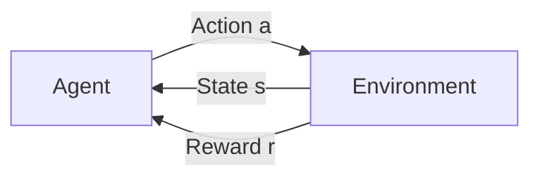

# 强化学习

强化学习是机器学习的第三大范式，智能体通过与环境交互来学习最优策略。

## 核心概念



| 概念     | 符号    | 描述               |
| -------- | ------- | ------------------ |
| 状态     | s       | 环境的当前情况     |
| 动作     | a       | 智能体可执行的操作 |
| 奖励     | r       | 环境反馈的即时信号 |
| 策略     | π(a\|s) | 从状态到动作的映射 |
| 价值函数 | V(s)    | 状态的长期价值     |
| Q 函数   | Q(s,a)  | 状态-动作对的价值  |

## 马尔可夫决策过程 (MDP)

$$
V^\pi(s) = \mathbb{E}\left[\sum_{t=0}^{\infty} \gamma^t r_t \mid s_0 = s\right]
$$

- **γ (gamma)**: 折扣因子，0 < γ ≤ 1

## 经典算法

### Q-Learning

```python
import numpy as np

class QLearning:
    def __init__(self, n_states, n_actions, lr=0.1, gamma=0.99, epsilon=0.1):
        self.q_table = np.zeros((n_states, n_actions))
        self.lr = lr
        self.gamma = gamma
        self.epsilon = epsilon

    def choose_action(self, state):
        if np.random.random() < self.epsilon:
            return np.random.randint(len(self.q_table[state]))
        return np.argmax(self.q_table[state])

    def update(self, state, action, reward, next_state):
        # Q(s,a) ← Q(s,a) + α[r + γ max Q(s',a') - Q(s,a)]
        best_next = np.max(self.q_table[next_state])
        td_target = reward + self.gamma * best_next
        td_error = td_target - self.q_table[state, action]
        self.q_table[state, action] += self.lr * td_error
```

### SARSA

```python
def sarsa_update(self, s, a, r, s_next, a_next):
    # Q(s,a) ← Q(s,a) + α[r + γ Q(s',a') - Q(s,a)]
    td_target = r + self.gamma * self.q_table[s_next, a_next]
    self.q_table[s, a] += self.lr * (td_target - self.q_table[s, a])
```

| 算法       | 类型       | 特点         |
| ---------- | ---------- | ------------ |
| Q-Learning | Off-policy | 学习最优策略 |
| SARSA      | On-policy  | 学习当前策略 |

## 深度强化学习

### DQN

```python
import torch
import torch.nn as nn

class DQN(nn.Module):
    def __init__(self, state_dim, action_dim):
        super().__init__()
        self.net = nn.Sequential(
            nn.Linear(state_dim, 128),
            nn.ReLU(),
            nn.Linear(128, 128),
            nn.ReLU(),
            nn.Linear(128, action_dim)
        )

    def forward(self, x):
        return self.net(x)

# 经验回放
class ReplayBuffer:
    def __init__(self, capacity):
        self.buffer = []
        self.capacity = capacity

    def push(self, transition):
        if len(self.buffer) >= self.capacity:
            self.buffer.pop(0)
        self.buffer.append(transition)

    def sample(self, batch_size):
        indices = np.random.choice(len(self.buffer), batch_size)
        return [self.buffer[i] for i in indices]
```

### Policy Gradient

```python
class PolicyNetwork(nn.Module):
    def __init__(self, state_dim, action_dim):
        super().__init__()
        self.net = nn.Sequential(
            nn.Linear(state_dim, 128),
            nn.ReLU(),
            nn.Linear(128, action_dim),
            nn.Softmax(dim=-1)
        )

    def forward(self, x):
        return self.net(x)

# REINFORCE 算法
def reinforce_loss(log_probs, rewards, gamma=0.99):
    returns = []
    G = 0
    for r in reversed(rewards):
        G = r + gamma * G
        returns.insert(0, G)
    returns = torch.tensor(returns)
    returns = (returns - returns.mean()) / (returns.std() + 1e-8)
    return -torch.sum(log_probs * returns)
```

### Actor-Critic

```python
class ActorCritic(nn.Module):
    def __init__(self, state_dim, action_dim):
        super().__init__()
        self.shared = nn.Linear(state_dim, 128)
        self.actor = nn.Linear(128, action_dim)
        self.critic = nn.Linear(128, 1)

    def forward(self, x):
        x = torch.relu(self.shared(x))
        policy = torch.softmax(self.actor(x), dim=-1)
        value = self.critic(x)
        return policy, value
```

## 常用库

```python
import gymnasium as gym

# 创建环境
env = gym.make('CartPole-v1')

state, _ = env.reset()
for _ in range(1000):
    action = env.action_space.sample()  # 随机动作
    next_state, reward, terminated, truncated, info = env.step(action)
    if terminated or truncated:
        break
```

## 算法分类

| 类型         | 算法            | 特点         |
| ------------ | --------------- | ------------ |
| Value-based  | DQN, Double DQN | 学习 Q 函数  |
| Policy-based | REINFORCE, A2C  | 直接学习策略 |
| Actor-Critic | PPO, SAC, TD3   | 结合两者     |
| Model-based  | MuZero, Dreamer | 学习环境模型 |
