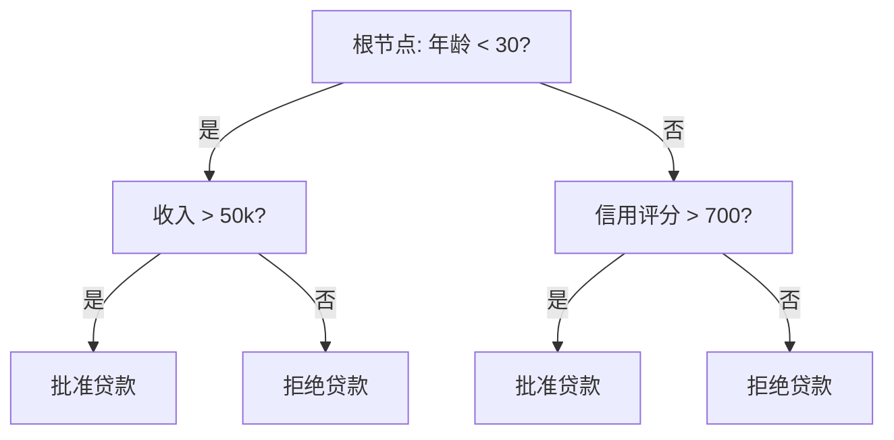
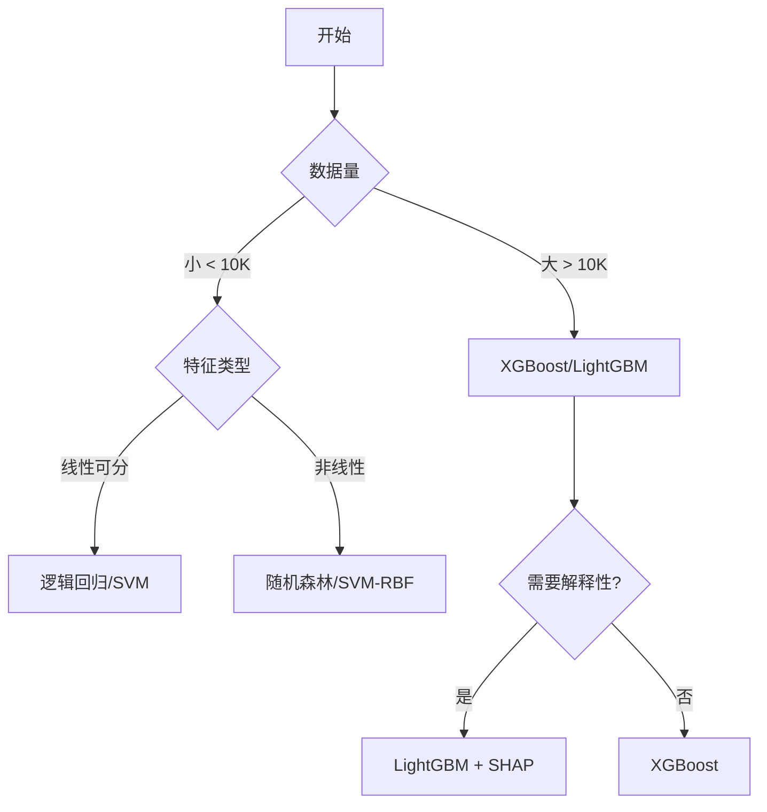

# 监督学习算法

监督学习是机器学习中最常见的范式，从带标签的数据中学习输入到输出的映射关系。

## 回归算法

### 线性回归 (Linear Regression)

寻找最佳拟合直线/超平面，使预测值与真实值的误差平方和最小。

$$
\hat{y} = \mathbf{w}^T \mathbf{x} + b
$$

$$
L = \frac{1}{n} \sum_{i=1}^{n} (y_i - \hat{y}_i)^2
$$

```python
from sklearn.linear_model import LinearRegression
from sklearn.model_selection import train_test_split
from sklearn.metrics import mean_squared_error, r2_score
import numpy as np

# 生成数据
np.random.seed(42)
X = np.random.randn(100, 1) * 10
y = 3 * X.flatten() + 5 + np.random.randn(100) * 2

X_train, X_test, y_train, y_test = train_test_split(X, y, test_size=0.2)

# 训练模型
model = LinearRegression()
model.fit(X_train, y_train)

# 预测与评估
y_pred = model.predict(X_test)
print(f"系数: {model.coef_[0]:.2f}, 截距: {model.intercept_:.2f}")
print(f"MSE: {mean_squared_error(y_test, y_pred):.2f}")
print(f"R²: {r2_score(y_test, y_pred):.2f}")
```

**正则化**：

```python
from sklearn.linear_model import Ridge, Lasso, ElasticNet

# Ridge (L2 正则化)
ridge = Ridge(alpha=1.0)
ridge.fit(X_train, y_train)

# Lasso (L1 正则化) - 可产生稀疏解
lasso = Lasso(alpha=0.1)
lasso.fit(X_train, y_train)

# ElasticNet (L1 + L2)
elastic = ElasticNet(alpha=0.1, l1_ratio=0.5)
elastic.fit(X_train, y_train)
```

| 方法             | 正则化  | 特点           | 适用场景     |
| ---------------- | ------- | -------------- | ------------ |
| LinearRegression | 无      | 简单快速       | 小数据集     |
| Ridge            | L2      | 缓解多重共线性 | 特征相关性高 |
| Lasso            | L1      | 特征选择       | 高维稀疏特征 |
| ElasticNet       | L1 + L2 | 结合两者优点   | 特征分组     |

### 多项式回归

```python
from sklearn.preprocessing import PolynomialFeatures
from sklearn.pipeline import make_pipeline

# 二次多项式回归
poly_model = make_pipeline(
    PolynomialFeatures(degree=2),
    LinearRegression()
)
poly_model.fit(X_train, y_train)
```

## 分类算法

### 逻辑回归 (Logistic Regression)

虽然名字叫"回归"，但实际用于分类。使用 Sigmoid 函数将输出映射到 [0, 1] 区间。

$$
P(y=1|x) = \sigma(w^T x + b) = \frac{1}{1 + e^{-(w^T x + b)}}
$$

```python
from sklearn.linear_model import LogisticRegression
from sklearn.datasets import load_breast_cancer
from sklearn.metrics import accuracy_score, classification_report

# 加载数据
data = load_breast_cancer()
X, y = data.data, data.target
X_train, X_test, y_train, y_test = train_test_split(X, y, test_size=0.2)

# 训练模型
lr = LogisticRegression(max_iter=1000)
lr.fit(X_train, y_train)

# 预测
y_pred = lr.predict(X_test)
y_prob = lr.predict_proba(X_test)[:, 1]

print(f"准确率: {accuracy_score(y_test, y_pred):.2%}")
print(classification_report(y_test, y_pred, target_names=data.target_names))
```

### 决策树 (Decision Tree)

通过递归地选择最优特征进行分裂，构建树形结构。



```python
from sklearn.tree import DecisionTreeClassifier, plot_tree
import matplotlib.pyplot as plt

# 训练决策树
dt = DecisionTreeClassifier(
    max_depth=5,           # 最大深度
    min_samples_split=10,  # 分裂所需最小样本数
    min_samples_leaf=5,    # 叶节点最小样本数
    random_state=42
)
dt.fit(X_train, y_train)

# 可视化
plt.figure(figsize=(20, 10))
plot_tree(dt, feature_names=data.feature_names, class_names=data.target_names, filled=True)
plt.show()

# 特征重要性
importance = pd.DataFrame({
    'feature': data.feature_names,
    'importance': dt.feature_importances_
}).sort_values('importance', ascending=False)
```

**分裂标准**：

| 标准        | 公式                             | 适用场景     |
| ----------- | -------------------------------- | ------------ |
| Gini 不纯度 | $1 - \sum p_i^2$                 | 分类（默认） |
| 信息熵      | $-\sum p_i \log p_i$             | 分类         |
| MSE         | $\frac{1}{n}\sum(y_i-\bar{y})^2$ | 回归         |

### 随机森林 (Random Forest)

多棵决策树的集成，通过投票或平均得出最终结果。

```python
from sklearn.ensemble import RandomForestClassifier

rf = RandomForestClassifier(
    n_estimators=100,      # 树的数量
    max_depth=10,          # 单棵树最大深度
    min_samples_split=5,
    max_features='sqrt',   # 每次分裂考虑的特征数
    n_jobs=-1,             # 并行计算
    random_state=42
)
rf.fit(X_train, y_train)

# 评估
print(f"训练集准确率: {rf.score(X_train, y_train):.2%}")
print(f"测试集准确率: {rf.score(X_test, y_test):.2%}")

# OOB (Out-of-Bag) 分数
rf_oob = RandomForestClassifier(n_estimators=100, oob_score=True, random_state=42)
rf_oob.fit(X_train, y_train)
print(f"OOB 分数: {rf_oob.oob_score_:.2%}")
```

### 支持向量机 (SVM)

寻找最大间隔超平面来分割数据。

```python
from sklearn.svm import SVC, SVR
from sklearn.preprocessing import StandardScaler
from sklearn.pipeline import make_pipeline

# 分类
svc = make_pipeline(
    StandardScaler(),
    SVC(kernel='rbf', C=1.0, gamma='scale')
)
svc.fit(X_train, y_train)
print(f"SVM 准确率: {svc.score(X_test, y_test):.2%}")

# 回归
svr = make_pipeline(
    StandardScaler(),
    SVR(kernel='rbf', C=1.0, epsilon=0.1)
)
```

**核函数**：

| 核函数     | 适用场景     | 参数         |
| ---------- | ------------ | ------------ |
| linear     | 线性可分     | -            |
| poly       | 多项式边界   | degree       |
| rbf (默认) | 非线性，通用 | gamma        |
| sigmoid    | 类似神经网络 | gamma, coef0 |

### K 近邻 (KNN)

基于"物以类聚"的原理，根据最近的 K 个邻居进行预测。

```python
from sklearn.neighbors import KNeighborsClassifier

# 选择最优 K 值
from sklearn.model_selection import cross_val_score

k_range = range(1, 31)
k_scores = []

for k in k_range:
    knn = KNeighborsClassifier(n_neighbors=k)
    scores = cross_val_score(knn, X_train, y_train, cv=5)
    k_scores.append(scores.mean())

best_k = k_range[np.argmax(k_scores)]
print(f"最优 K 值: {best_k}")

# 使用最优 K 训练
knn = KNeighborsClassifier(n_neighbors=best_k)
knn.fit(X_train, y_train)
print(f"KNN 准确率: {knn.score(X_test, y_test):.2%}")
```

### 梯度提升 (Gradient Boosting)

```python
from sklearn.ensemble import GradientBoostingClassifier

# sklearn 实现
gb = GradientBoostingClassifier(
    n_estimators=100,
    learning_rate=0.1,
    max_depth=3,
    random_state=42
)
gb.fit(X_train, y_train)

# XGBoost (推荐)
import xgboost as xgb

xgb_model = xgb.XGBClassifier(
    n_estimators=100,
    learning_rate=0.1,
    max_depth=3,
    use_label_encoder=False,
    eval_metric='logloss'
)
xgb_model.fit(X_train, y_train)

# LightGBM (大规模数据推荐)
import lightgbm as lgb

lgb_model = lgb.LGBMClassifier(
    n_estimators=100,
    learning_rate=0.1,
    max_depth=3
)
lgb_model.fit(X_train, y_train)
```

## 算法选择指南



| 算法              | 优点                 | 缺点             | 适用场景                 |
| ----------------- | -------------------- | ---------------- | ------------------------ |
| 线性回归/逻辑回归 | 简单、可解释、快速   | 只能拟合线性关系 | 基线模型、可解释性要求高 |
| 决策树            | 可解释、无需特征缩放 | 易过拟合         | 理解数据、特征选择       |
| 随机森林          | 不易过拟合、并行     | 内存占用大       | 通用分类/回归            |
| SVM               | 高维有效、泛化好     | 大数据慢、需调参 | 小中型数据、文本分类     |
| KNN               | 简单、无训练         | 预测慢、维度灾难 | 小数据集、推荐系统       |
| XGBoost/LightGBM  | 性能强、速度快       | 需调参           | 竞赛、生产环境           |
