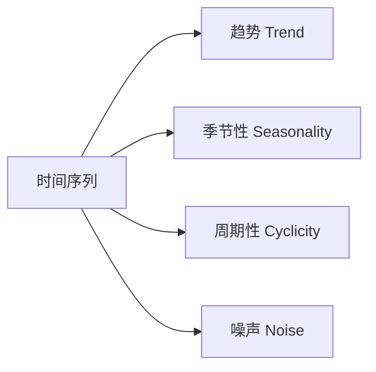

# 时间序列分析

时间序列是按时间顺序排列的数据点序列，广泛应用于金融、气象、销售预测等领域。

## 核心概念

### 时间序列组成



```python
from statsmodels.tsa.seasonal import seasonal_decompose
import matplotlib.pyplot as plt

# 分解时间序列
result = seasonal_decompose(ts, model='additive', period=12)

fig, axes = plt.subplots(4, 1, figsize=(12, 8))
result.observed.plot(ax=axes[0], title='原始')
result.trend.plot(ax=axes[1], title='趋势')
result.seasonal.plot(ax=axes[2], title='季节性')
result.resid.plot(ax=axes[3], title='残差')
plt.tight_layout()
```

### 平稳性检验

```python
from statsmodels.tsa.stattools import adfuller

def test_stationarity(series):
    result = adfuller(series)
    print(f'ADF 统计量: {result[0]:.4f}')
    print(f'p-value: {result[1]:.4f}')
    if result[1] < 0.05:
        print('序列是平稳的')
    else:
        print('序列是非平稳的，需要差分')
```

## 传统方法

### ARIMA

$$
ARIMA(p, d, q)
$$

- **p**: 自回归阶数
- **d**: 差分次数
- **q**: 移动平均阶数

```python
from statsmodels.tsa.arima.model import ARIMA
from pmdarima import auto_arima

# 自动选择参数
auto_model = auto_arima(
    ts,
    seasonal=False,
    stepwise=True,
    suppress_warnings=True
)
print(auto_model.summary())

# 手动 ARIMA
model = ARIMA(ts, order=(2, 1, 2))
fitted = model.fit()

# 预测
forecast = fitted.forecast(steps=30)
```

### SARIMA (季节性 ARIMA)

```python
from statsmodels.tsa.statespace.sarimax import SARIMAX

# SARIMA(p,d,q)(P,D,Q,m)
model = SARIMAX(
    ts,
    order=(1, 1, 1),
    seasonal_order=(1, 1, 1, 12)  # 月度季节性
)
fitted = model.fit()
forecast = fitted.forecast(steps=12)
```

### Prophet

Facebook 开源的时间序列预测库，对缺失值和异常值鲁棒。

```python
from prophet import Prophet
import pandas as pd

# 准备数据（必须有 ds 和 y 列）
df = pd.DataFrame({'ds': dates, 'y': values})

# 训练
model = Prophet(
    yearly_seasonality=True,
    weekly_seasonality=True,
    daily_seasonality=False
)
model.fit(df)

# 预测
future = model.make_future_dataframe(periods=30)
forecast = model.predict(future)

# 可视化
model.plot(forecast)
model.plot_components(forecast)
```

## 机器学习方法

### 特征工程

```python
def create_time_features(df, date_col):
    df['year'] = df[date_col].dt.year
    df['month'] = df[date_col].dt.month
    df['day'] = df[date_col].dt.day
    df['dayofweek'] = df[date_col].dt.dayofweek
    df['is_weekend'] = df['dayofweek'] >= 5

    # 滞后特征
    for lag in [1, 7, 30]:
        df[f'lag_{lag}'] = df['value'].shift(lag)

    # 滚动统计
    df['rolling_mean_7'] = df['value'].rolling(7).mean()
    df['rolling_std_7'] = df['value'].rolling(7).std()

    return df
```

### XGBoost 时序预测

```python
import xgboost as xgb

# 创建特征
df = create_time_features(df, 'date')
df = df.dropna()

# 划分（时序不能随机划分！）
train = df[df['date'] < '2024-01-01']
test = df[df['date'] >= '2024-01-01']

feature_cols = ['month', 'dayofweek', 'lag_1', 'lag_7', 'rolling_mean_7']

model = xgb.XGBRegressor(n_estimators=100)
model.fit(train[feature_cols], train['value'])
predictions = model.predict(test[feature_cols])
```

## 深度学习方法

### LSTM

```python
import torch
import torch.nn as nn

class LSTMPredictor(nn.Module):
    def __init__(self, input_size, hidden_size, num_layers, output_size):
        super().__init__()
        self.lstm = nn.LSTM(input_size, hidden_size, num_layers, batch_first=True)
        self.fc = nn.Linear(hidden_size, output_size)

    def forward(self, x):
        out, _ = self.lstm(x)
        out = self.fc(out[:, -1, :])  # 取最后时刻
        return out

# 创建序列数据
def create_sequences(data, seq_length):
    X, y = [], []
    for i in range(len(data) - seq_length):
        X.append(data[i:i+seq_length])
        y.append(data[i+seq_length])
    return np.array(X), np.array(y)
```

## 评估指标

```python
from sklearn.metrics import mean_absolute_error, mean_squared_error

# MAE
mae = mean_absolute_error(y_true, y_pred)

# RMSE
rmse = mean_squared_error(y_true, y_pred, squared=False)

# MAPE
mape = np.mean(np.abs((y_true - y_pred) / y_true)) * 100
```

## 方法选择

| 场景             | 推荐方法                       |
| ---------------- | ------------------------------ |
| 快速基线         | ARIMA                          |
| 复杂季节性       | Prophet / SARIMA               |
| 多变量、复杂特征 | XGBoost / LightGBM             |
| 长序列依赖       | LSTM / Transformer             |
| 生产环境         | Prophet (易用)、XGBoost (性能) |
