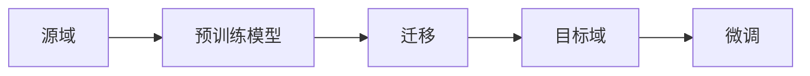

# 迁移学习

迁移学习将从源任务学到的知识应用到目标任务。

## 核心概念



| 术语   | 描述                 |
| ------ | -------------------- |
| 源域   | 有大量标注数据的领域 |
| 目标域 | 数据较少的目标领域   |
| 域偏移 | 源域和目标域分布不同 |

## 迁移策略

### 特征提取

```python
import torch
import torchvision.models as models

# 加载预训练模型
model = models.resnet50(pretrained=True)

# 冻结所有层
for param in model.parameters():
    param.requires_grad = False

# 替换分类头
model.fc = torch.nn.Linear(model.fc.in_features, num_classes)
```

### 微调

```python
# 部分微调 - 解冻后几层
for name, param in model.named_parameters():
    if 'layer4' in name or 'fc' in name:
        param.requires_grad = True
    else:
        param.requires_grad = False

# 使用不同学习率
optimizer = torch.optim.Adam([
    {'params': model.fc.parameters(), 'lr': 1e-3},
    {'params': model.layer4.parameters(), 'lr': 1e-4}
])
```

### 渐进式解冻

```python
def progressive_unfreeze(model, epoch):
    layers = ['layer4', 'layer3', 'layer2', 'layer1']
    if epoch < len(layers):
        layer_name = layers[epoch]
        for name, param in model.named_parameters():
            if layer_name in name:
                param.requires_grad = True
```

## Hugging Face 迁移学习

```python
from transformers import AutoModelForSequenceClassification, Trainer

# 加载预训练模型
model = AutoModelForSequenceClassification.from_pretrained(
    'bert-base-uncased',
    num_labels=2
)

# 微调
trainer = Trainer(
    model=model,
    train_dataset=train_dataset,
    eval_dataset=eval_dataset
)
trainer.train()
```

## 迁移学习类型

| 类型       | 条件                     | 方法         |
| ---------- | ------------------------ | ------------ |
| 归纳迁移   | 相同任务，不同域         | 微调         |
| 直推迁移   | 源域有标签，目标域无标签 | 域自适应     |
| 无监督迁移 | 两边都无标签             | 自监督预训练 |

## 何时使用

| 场景                | 建议           |
| ------------------- | -------------- |
| 目标数据 < 1000     | 特征提取       |
| 目标数据 1000-10000 | 微调顶层       |
| 目标数据 > 10000    | 全量微调       |
| 域差异大            | 可能需重新训练 |
