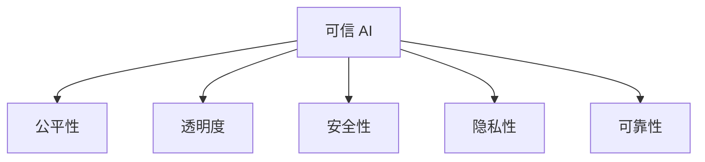

# 可信 AI

可信 AI 关注模型的公平性、透明度、安全性和隐私保护。

## 核心维度



## 公平性

### 偏见检测

```python
from fairlearn.metrics import demographic_parity_difference, equalized_odds_difference

# 人口统计均等
dp = demographic_parity_difference(
    y_true, y_pred, sensitive_features=sensitive
)

# 均等化赔率
eo = equalized_odds_difference(
    y_true, y_pred, sensitive_features=sensitive
)
```

### 偏见缓解

```python
from fairlearn.reductions import ExponentiatedGradient, DemographicParity

# 训练公平分类器
constraint = DemographicParity()
mitigator = ExponentiatedGradient(
    estimator=clf,
    constraints=constraint
)
mitigator.fit(X, y, sensitive_features=sensitive)
```

## 透明度与可解释性

```python
import shap

# SHAP 解释
explainer = shap.TreeExplainer(model)
shap_values = explainer.shap_values(X)

# 生成解释报告
def generate_explanation(instance, shap_values, feature_names):
    explanation = "模型预测基于以下因素：\n"
    sorted_idx = np.argsort(np.abs(shap_values))[::-1]

    for i in sorted_idx[:5]:
        direction = "增加" if shap_values[i] > 0 else "减少"
        explanation += f"- {feature_names[i]}: {direction}预测概率\n"

    return explanation
```

## 安全性

### 模型水印

```python
def embed_watermark(model, trigger_pattern, watermark_label):
    """在模型中嵌入水印"""
    # 训练时混入触发样本
    watermark_data = create_trigger_samples(trigger_pattern)
    watermark_labels = [watermark_label] * len(watermark_data)

    # 正常数据 + 水印数据一起训练
    combined_data = normal_data + watermark_data
    combined_labels = normal_labels + watermark_labels

    model.fit(combined_data, combined_labels)

def verify_watermark(model, trigger_pattern, expected_label):
    """验证水印"""
    trigger_data = create_trigger_samples(trigger_pattern)
    predictions = model.predict(trigger_data)
    return (predictions == expected_label).mean() > 0.9
```

## 可靠性评估

```python
# 校准测试
from sklearn.calibration import calibration_curve

prob_true, prob_pred = calibration_curve(y_true, y_prob, n_bins=10)

# 分布偏移检测
def detect_distribution_shift(train_data, test_data):
    from scipy.stats import ks_2samp

    for col in train_data.columns:
        stat, p_value = ks_2samp(train_data[col], test_data[col])
        if p_value < 0.05:
            print(f"{col}: 检测到分布偏移")
```

## 评估框架

| 维度     | 指标                     | 工具              |
| -------- | ------------------------ | ----------------- |
| 公平性   | 人口统计均等、均等化赔率 | Fairlearn, AIF360 |
| 可解释性 | SHAP, LIME               | SHAP, LIME        |
| 鲁棒性   | 对抗准确率               | AutoAttack        |
| 隐私     | ε-差分隐私               | Opacus            |

## 法规要求

| 法规   | 地区 | 要求               |
| ------ | ---- | ------------------ |
| GDPR   | 欧盟 | 解释权、数据删除权 |
| AI Act | 欧盟 | 高风险 AI 监管     |
| CCPA   | 美国 | 数据隐私保护       |
