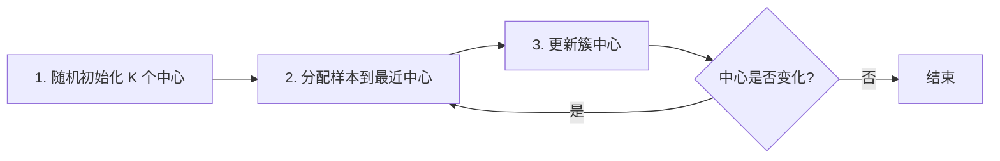

# 无监督学习算法

无监督学习从无标签数据中发现隐藏的结构和模式。

## 聚类算法

### K-Means

将数据划分为 K 个簇，使每个样本到其所属簇中心的距离最小。



```python
from sklearn.cluster import KMeans
import numpy as np
import matplotlib.pyplot as plt

# 生成数据
from sklearn.datasets import make_blobs
X, _ = make_blobs(n_samples=300, centers=4, cluster_std=0.6, random_state=42)

# K-Means 聚类
kmeans = KMeans(n_clusters=4, random_state=42, n_init='auto')
labels = kmeans.fit_predict(X)

# 可视化
plt.figure(figsize=(10, 5))
plt.subplot(1, 2, 1)
plt.scatter(X[:, 0], X[:, 1], c=labels, cmap='viridis')
plt.scatter(kmeans.cluster_centers_[:, 0], kmeans.cluster_centers_[:, 1],
            c='red', marker='X', s=200, label='中心')
plt.title('K-Means 聚类结果')
plt.legend()
plt.show()
```

**选择最优 K 值**：

```python
# 肘部法则 (Elbow Method)
inertias = []
K_range = range(1, 11)

for k in K_range:
    kmeans = KMeans(n_clusters=k, random_state=42, n_init='auto')
    kmeans.fit(X)
    inertias.append(kmeans.inertia_)

plt.figure(figsize=(8, 5))
plt.plot(K_range, inertias, 'bo-')
plt.xlabel('K 值')
plt.ylabel('Inertia (簇内平方和)')
plt.title('肘部法则选择 K')
plt.show()

# 轮廓系数 (Silhouette Score)
from sklearn.metrics import silhouette_score

silhouette_scores = []
for k in range(2, 11):
    kmeans = KMeans(n_clusters=k, random_state=42, n_init='auto')
    labels = kmeans.fit_predict(X)
    score = silhouette_score(X, labels)
    silhouette_scores.append(score)
    print(f"K={k}: 轮廓系数={score:.3f}")
```

### DBSCAN

基于密度的聚类，能发现任意形状的簇并自动识别噪声点。

```python
from sklearn.cluster import DBSCAN

# DBSCAN 聚类
dbscan = DBSCAN(eps=0.5, min_samples=5)
labels = dbscan.fit_predict(X)

# -1 表示噪声点
n_clusters = len(set(labels)) - (1 if -1 in labels else 0)
n_noise = list(labels).count(-1)
print(f"聚类数: {n_clusters}, 噪声点: {n_noise}")

# 可视化
plt.scatter(X[:, 0], X[:, 1], c=labels, cmap='viridis')
plt.title(f'DBSCAN (clusters={n_clusters}, noise={n_noise})')
plt.show()
```

| 参数        | 描述             | 调参建议               |
| ----------- | ---------------- | ---------------------- |
| eps         | 邻域半径         | 使用 k-distance 图确定 |
| min_samples | 核心点最小邻居数 | 通常 >= 2 × 维度       |

### 层次聚类 (Hierarchical Clustering)

自底向上（凝聚）或自顶向下（分裂）构建聚类层次结构。

```python
from sklearn.cluster import AgglomerativeClustering
from scipy.cluster.hierarchy import dendrogram, linkage

# 凝聚聚类
agg = AgglomerativeClustering(n_clusters=4, linkage='ward')
labels = agg.fit_predict(X)

# 树状图
Z = linkage(X, method='ward')
plt.figure(figsize=(12, 5))
dendrogram(Z)
plt.title('层次聚类树状图')
plt.xlabel('样本索引')
plt.ylabel('距离')
plt.show()
```

| 链接方法 | 描述       | 特点                   |
| -------- | ---------- | ---------------------- |
| ward     | 最小化方差 | 倾向于产生大小相似的簇 |
| complete | 最大距离   | 倾向于产生紧凑的簇     |
| average  | 平均距离   | 介于两者之间           |
| single   | 最小距离   | 可能产生链状簇         |

## 聚类算法对比

| 算法     | 簇形状 | 需要指定 K | 噪声处理 | 时间复杂度 | 适用场景           |
| -------- | ------ | ---------- | -------- | ---------- | ------------------ |
| K-Means  | 球形   | 是         | 敏感     | O(nKt)     | 大数据、球形簇     |
| DBSCAN   | 任意   | 否         | 能识别   | O(n²)      | 噪声数据、任意形状 |
| 层次聚类 | 任意   | 可选       | 敏感     | O(n²log n) | 小数据、需要层次   |
| GMM      | 椭圆   | 是         | 敏感     | O(nKdt)    | 概率聚类           |

## 降维算法

### PCA (主成分分析)

通过线性变换将数据投影到方差最大的方向上，实现降维。

```python
from sklearn.decomposition import PCA
from sklearn.datasets import load_iris

# 加载数据
iris = load_iris()
X = iris.data

# PCA 降维
pca = PCA(n_components=2)
X_pca = pca.fit_transform(X)

# 可视化
plt.figure(figsize=(10, 5))
plt.subplot(1, 2, 1)
for i, target in enumerate(iris.target_names):
    mask = iris.target == i
    plt.scatter(X_pca[mask, 0], X_pca[mask, 1], label=target, alpha=0.7)
plt.xlabel('PC1')
plt.ylabel('PC2')
plt.legend()
plt.title('PCA 降维可视化')

# 方差解释比
plt.subplot(1, 2, 2)
pca_full = PCA()
pca_full.fit(X)
plt.bar(range(1, len(pca_full.explained_variance_ratio_) + 1),
        pca_full.explained_variance_ratio_)
plt.xlabel('主成分')
plt.ylabel('方差解释比')
plt.title('各主成分方差贡献')
plt.show()

print(f"前 2 个主成分解释方差: {sum(pca.explained_variance_ratio_):.2%}")
```

**选择主成分数量**：

```python
# 保留 95% 方差
pca_95 = PCA(n_components=0.95)
X_reduced = pca_95.fit_transform(X)
print(f"保留 95% 方差需要 {pca_95.n_components_} 个主成分")
```

### t-SNE

非线性降维，擅长可视化高维数据的局部结构。

```python
from sklearn.manifold import TSNE

# t-SNE 降维（通常用于可视化）
tsne = TSNE(n_components=2, perplexity=30, random_state=42)
X_tsne = tsne.fit_transform(X)

plt.figure(figsize=(8, 6))
for i, target in enumerate(iris.target_names):
    mask = iris.target == i
    plt.scatter(X_tsne[mask, 0], X_tsne[mask, 1], label=target, alpha=0.7)
plt.legend()
plt.title('t-SNE 可视化')
plt.show()
```

| 参数          | 描述     | 建议          |
| ------------- | -------- | ------------- |
| perplexity    | 近邻数量 | 5-50，通常 30 |
| n_iter        | 迭代次数 | >= 1000       |
| learning_rate | 学习率   | 10-1000，auto |

### UMAP

比 t-SNE 更快，且能更好地保留全局结构。

```python
import umap

# UMAP 降维
reducer = umap.UMAP(n_components=2, random_state=42)
X_umap = reducer.fit_transform(X)

plt.figure(figsize=(8, 6))
for i, target in enumerate(iris.target_names):
    mask = iris.target == i
    plt.scatter(X_umap[mask, 0], X_umap[mask, 1], label=target, alpha=0.7)
plt.legend()
plt.title('UMAP 可视化')
plt.show()
```

## 降维算法对比

| 算法  | 类型         | 速度 | 保留结构  | 适用场景       |
| ----- | ------------ | ---- | --------- | -------------- |
| PCA   | 线性         | 快   | 全局      | 特征降维、去噪 |
| t-SNE | 非线性       | 慢   | 局部      | 高维数据可视化 |
| UMAP  | 非线性       | 较快 | 全局+局部 | 可视化、降维   |
| LDA   | 线性（监督） | 快   | 类间      | 分类特征提取   |

## 异常检测

### Isolation Forest

通过随机分割来隔离异常点。

```python
from sklearn.ensemble import IsolationForest

# 异常检测
iso_forest = IsolationForest(contamination=0.1, random_state=42)
predictions = iso_forest.fit_predict(X)  # 1: 正常, -1: 异常

# 可视化
plt.scatter(X[:, 0], X[:, 1], c=predictions, cmap='coolwarm')
plt.title('Isolation Forest 异常检测')
plt.show()

n_outliers = sum(predictions == -1)
print(f"检测到 {n_outliers} 个异常点")
```

### One-Class SVM

学习正常数据的边界，超出边界的视为异常。

```python
from sklearn.svm import OneClassSVM

# 训练 One-Class SVM
oc_svm = OneClassSVM(kernel='rbf', gamma='scale', nu=0.1)
predictions = oc_svm.fit_predict(X)

# nu 参数控制异常比例的上界
```

## 关联规则学习

发现数据中的频繁模式和关联规则。

```python
from mlxtend.frequent_patterns import apriori, association_rules

# 准备事务数据（每行一个购物篮）
transactions = pd.DataFrame({
    '牛奶': [1, 1, 0, 1, 0],
    '面包': [1, 1, 1, 0, 1],
    '黄油': [0, 1, 0, 1, 0],
    '啤酒': [0, 0, 1, 0, 1],
    '尿布': [0, 0, 1, 0, 1]
})

# 挖掘频繁项集
frequent_itemsets = apriori(transactions, min_support=0.4, use_colnames=True)
print("频繁项集:")
print(frequent_itemsets)

# 生成关联规则
rules = association_rules(frequent_itemsets, metric='lift', min_threshold=1.0)
print("\n关联规则:")
print(rules[['antecedents', 'consequents', 'support', 'confidence', 'lift']])
```

| 指标   | 公式         | 含义                      |
| ------ | ------------ | ------------------------- |
| 支持度 | P(A∩B)       | 规则出现的频率            |
| 置信度 | P(B\|A)      | A 出现时 B 也出现的概率   |
| 提升度 | P(B\|A)/P(B) | 关联强度（>1 表示正相关） |
