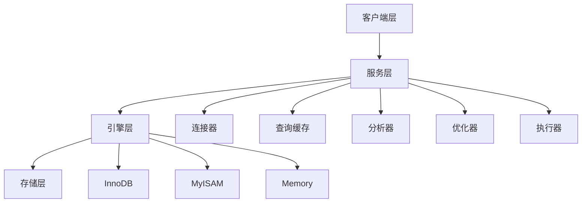

# MySQL 基础概念

> [!TIP] > **学习重点**: 理解 MySQL 的基础架构、存储引擎和字符集是掌握 MySQL 的第一步。本文将帮助你建立完整的 MySQL 基础知识体系。

## MySQL 简介

MySQL 是最流行的开源关系型数据库管理系统之一，由瑞典 MySQL AB 公司开发，目前属于 Oracle 公司。

### 主要特点

- **开源免费** - 社区版完全免费
- **高性能** - 支持高并发访问
- **跨平台** - 支持 Windows、Linux、macOS 等
- **易用性** - 安装配置简单，学习曲线平缓
- **可扩展** - 支持集群、主从复制等扩展方案

## MySQL 架构

### 整体架构

MySQL 采用分层架构设计，主要分为以下几层：



#### 1. 连接层 (客户端层)

负责处理客户端连接，包括：

- 连接处理
- 授权认证
- 安全管理

```sql
-- 查看当前连接
SHOW PROCESSLIST;

-- 查看连接状态
SHOW STATUS LIKE 'Threads_connected';
```

#### 2. 服务层

MySQL 的核心功能层，包括：

- **连接器** - 管理连接、权限验证
- **查询缓存** - 缓存查询结果（MySQL 8.0 已移除）
- **分析器** - 词法分析、语法分析
- **优化器** - 生成执行计划
- **执行器** - 执行 SQL 语句

#### 3. 存储引擎层

负责数据的存储和提取，不同的存储引擎有不同的特点。

#### 4. 存储层

实际的物理存储，包括数据文件、日志文件等。

### SQL 执行流程


1. **连接器** - 验证用户名密码，获取权限
2. **分析器** - 词法分析和语法分析
3. **优化器** - 选择索引，生成执行计划
4. **执行器** - 调用存储引擎接口执行
5. **存储引擎** - 读取或写入数据

## 存储引擎

存储引擎是 MySQL 的核心组件，负责数据的存储和检索。

### 查看存储引擎

```sql
-- 查看支持的存储引擎
SHOW ENGINES;

-- 查看默认存储引擎
SHOW VARIABLES LIKE 'default_storage_engine';

-- 查看表的存储引擎
SHOW TABLE STATUS FROM database_name;
```

### InnoDB 存储引擎

MySQL 5.5+ 的默认存储引擎，也是最常用的引擎。

#### 主要特点

- ✅ **支持事务** - 完全支持 ACID 事务
- ✅ **行级锁** - 并发性能好
- ✅ **外键约束** - 支持外键
- ✅ **崩溃恢复** - 自动崩溃恢复机制
- ✅ **MVCC** - 多版本并发控制

#### 适用场景

- 需要事务支持的应用
- 高并发读写场景
- 需要外键约束的场景
- 需要自动崩溃恢复的场景

#### 示例

```sql
-- 创建 InnoDB 表
CREATE TABLE users (
    id INT PRIMARY KEY AUTO_INCREMENT,
    username VARCHAR(50) NOT NULL,
    email VARCHAR(100),
    created_at TIMESTAMP DEFAULT CURRENT_TIMESTAMP
) ENGINE=InnoDB DEFAULT CHARSET=utf8mb4;
```

### MyISAM 存储引擎

MySQL 5.5 之前的默认引擎，现在较少使用。

#### 主要特点

- ❌ **不支持事务**
- ❌ **表级锁** - 并发性能较差
- ❌ **不支持外键**
- ✅ **全文索引** - 支持全文搜索（MySQL 5.6+ InnoDB 也支持）
- ✅ **压缩存储** - 支持表压缩

#### 适用场景

- 只读或读多写少的场景
- 不需要事务的场景
- 需要全文索引的场景（仅限旧版本）

### Memory 存储引擎

数据存储在内存中，速度极快但不持久化。

#### 主要特点

- ✅ **速度快** - 数据在内存中
- ❌ **不持久化** - 重启后数据丢失
- ❌ **不支持事务**
- ❌ **表级锁**

#### 适用场景

- 临时表
- 缓存表
- 会话数据

### 存储引擎对比

| 特性     | InnoDB    | MyISAM    | Memory   |
| -------- | --------- | --------- | -------- |
| 事务支持 | ✅        | ❌        | ❌       |
| 锁粒度   | 行锁      | 表锁      | 表锁     |
| 外键     | ✅        | ❌        | ❌       |
| 全文索引 | ✅ (5.6+) | ✅        | ❌       |
| 崩溃恢复 | ✅        | ❌        | ❌       |
| MVCC     | ✅        | ❌        | ❌       |
| 适用场景 | 通用 OLTP | 只读/读多 | 临时数据 |

### 修改表的存储引擎

```sql
-- 修改表的存储引擎
ALTER TABLE table_name ENGINE = InnoDB;

-- 注意：这会重建整个表，可能耗时较长
```

## 字符集与排序规则

### 字符集 (Character Set)

字符集定义了字符的编码方式。

#### 常用字符集

- **utf8mb4** - 推荐使用，支持完整的 UTF-8 字符（包括 emoji）
- **utf8** - 旧版 UTF-8，最多支持 3 字节字符（不推荐）
- **latin1** - 西欧字符集
- **gbk** - 中文字符集

```sql
-- 查看支持的字符集
SHOW CHARACTER SET;

-- 查看数据库字符集
SHOW VARIABLES LIKE 'character_set%';
```

#### 设置字符集

```sql
-- 创建数据库时指定字符集
CREATE DATABASE mydb
CHARACTER SET utf8mb4
COLLATE utf8mb4_unicode_ci;

-- 创建表时指定字符集
CREATE TABLE users (
    id INT PRIMARY KEY,
    name VARCHAR(50)
) CHARACTER SET utf8mb4;

-- 修改数据库字符集
ALTER DATABASE mydb CHARACTER SET utf8mb4;

-- 修改表字符集
ALTER TABLE users CONVERT TO CHARACTER SET utf8mb4;
```

### 排序规则 (Collation)

排序规则定义了字符的比较和排序方式。

#### 常用排序规则

- **utf8mb4_unicode_ci** - 推荐使用，正确处理各种语言
- **utf8mb4_general_ci** - 性能更好，但某些语言支持不完整
- **utf8mb4_bin** - 二进制比较，区分大小写

```sql
-- 查看支持的排序规则
SHOW COLLATION LIKE 'utf8mb4%';

-- 指定排序规则
CREATE TABLE users (
    id INT PRIMARY KEY,
    username VARCHAR(50) COLLATE utf8mb4_unicode_ci
);
```

#### 排序规则对比

```sql
-- 示例：大小写敏感性
CREATE TABLE test (
    name VARCHAR(50) COLLATE utf8mb4_bin
);

INSERT INTO test VALUES ('ABC'), ('abc');

-- 使用 utf8mb4_bin，区分大小写
SELECT * FROM test WHERE name = 'abc';  -- 只返回 'abc'

-- 使用 utf8mb4_general_ci，不区分大小写
SELECT * FROM test WHERE name = 'abc' COLLATE utf8mb4_general_ci;
-- 返回 'ABC' 和 'abc'
```

## 数据库和表

### 数据库操作

```sql
-- 创建数据库
CREATE DATABASE mydb;

-- 创建数据库（如果不存在）
CREATE DATABASE IF NOT EXISTS mydb;

-- 查看所有数据库
SHOW DATABASES;

-- 使用数据库
USE mydb;

-- 查看当前数据库
SELECT DATABASE();

-- 删除数据库
DROP DATABASE mydb;

-- 删除数据库（如果存在）
DROP DATABASE IF EXISTS mydb;
```

### 表操作

```sql
-- 创建表
CREATE TABLE users (
    id INT PRIMARY KEY AUTO_INCREMENT,
    username VARCHAR(50) NOT NULL,
    email VARCHAR(100) UNIQUE,
    age INT DEFAULT 0,
    created_at TIMESTAMP DEFAULT CURRENT_TIMESTAMP,
    updated_at TIMESTAMP DEFAULT CURRENT_TIMESTAMP ON UPDATE CURRENT_TIMESTAMP
);

-- 查看所有表
SHOW TABLES;

-- 查看表结构
DESC users;
DESCRIBE users;
SHOW COLUMNS FROM users;

-- 查看建表语句
SHOW CREATE TABLE users;

-- 修改表结构
ALTER TABLE users ADD COLUMN phone VARCHAR(20);
ALTER TABLE users MODIFY COLUMN age TINYINT;
ALTER TABLE users CHANGE COLUMN phone mobile VARCHAR(20);
ALTER TABLE users DROP COLUMN mobile;

-- 重命名表
RENAME TABLE users TO members;
ALTER TABLE members RENAME TO users;

-- 删除表
DROP TABLE users;
DROP TABLE IF EXISTS users;

-- 清空表（保留结构）
TRUNCATE TABLE users;
```

## 最佳实践

### 字符集选择

> [!IMPORTANT] > **推荐配置**: 始终使用 `utf8mb4` 字符集和 `utf8mb4_unicode_ci` 排序规则，避免使用旧的 `utf8` 字符集。

```sql
-- 推荐的数据库创建方式
CREATE DATABASE mydb
CHARACTER SET utf8mb4
COLLATE utf8mb4_unicode_ci;
```

### 存储引擎选择

> [!TIP] > **引擎选择**: 除非有特殊需求，否则始终使用 InnoDB 存储引擎。它提供了最好的功能和性能平衡。

### 表设计规范

- 每个表都应该有主键
- 使用自增主键（AUTO_INCREMENT）
- 合理使用 NOT NULL 约束
- 添加默认值（DEFAULT）
- 使用时间戳字段记录创建和更新时间

```sql
-- 规范的表设计示例
CREATE TABLE products (
    id BIGINT PRIMARY KEY AUTO_INCREMENT,
    name VARCHAR(100) NOT NULL COMMENT '产品名称',
    price DECIMAL(10,2) NOT NULL DEFAULT 0.00 COMMENT '价格',
    stock INT NOT NULL DEFAULT 0 COMMENT '库存',
    status TINYINT NOT NULL DEFAULT 1 COMMENT '状态: 1-上架 0-下架',
    created_at TIMESTAMP NOT NULL DEFAULT CURRENT_TIMESTAMP COMMENT '创建时间',
    updated_at TIMESTAMP NOT NULL DEFAULT CURRENT_TIMESTAMP ON UPDATE CURRENT_TIMESTAMP COMMENT '更新时间',
    INDEX idx_name (name),
    INDEX idx_status (status)
) ENGINE=InnoDB DEFAULT CHARSET=utf8mb4 COLLATE=utf8mb4_unicode_ci COMMENT='产品表';
```

## 总结

本文介绍了 MySQL 的基础概念：

- ✅ MySQL 整体架构和 SQL 执行流程
- ✅ 存储引擎的选择（推荐 InnoDB）
- ✅ 字符集和排序规则（推荐 utf8mb4）
- ✅ 数据库和表的基本操作
- ✅ 最佳实践和设计规范

掌握这些基础知识后，你就可以开始学习 [数据类型](./data-types) 和 [SQL 语法](./sql-syntax) 了！
