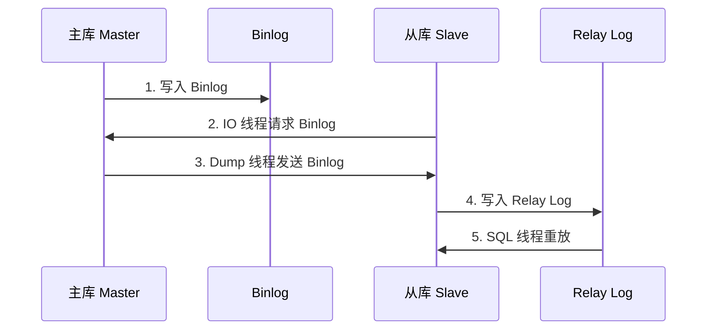

# MySQL 主从复制

> [!TIP] > **核心高可用技术**: 主从复制是 MySQL 高可用和读写分离的基础。掌握复制原理和配置是 DBA 的必备技能。

## 复制原理

### 基本架构



### 核心组件

| 组件        | 位置 | 作用                        |
| ----------- | ---- | --------------------------- |
| Binlog      | 主库 | 记录所有数据变更            |
| Dump Thread | 主库 | 发送 Binlog 给从库          |
| IO Thread   | 从库 | 接收 Binlog，写入 Relay Log |
| SQL Thread  | 从库 | 读取 Relay Log，执行 SQL    |

## 复制模式

### 异步复制（默认）

主库提交事务后立即返回，无需等待从库确认。

```sql
-- 默认就是异步复制，无需特殊配置
-- 优点：性能最好
-- 缺点：主库宕机可能丢失数据
```

### 半同步复制

主库提交事务后，至少等待一个从库确认收到 Binlog。

```sql
-- 主库安装插件
INSTALL PLUGIN rpl_semi_sync_master SONAME 'semisync_master.so';

-- 从库安装插件
INSTALL PLUGIN rpl_semi_sync_slave SONAME 'semisync_slave.so';

-- 主库启用
SET GLOBAL rpl_semi_sync_master_enabled = 1;
SET GLOBAL rpl_semi_sync_master_timeout = 10000;  -- 10秒超时

-- 从库启用
SET GLOBAL rpl_semi_sync_slave_enabled = 1;

-- 重启从库 IO 线程
STOP SLAVE IO_THREAD;
START SLAVE IO_THREAD;

-- 查看状态
SHOW STATUS LIKE 'Rpl_semi_sync%';
```

### 增强半同步（MySQL 5.7+）

```sql
-- AFTER_SYNC：等从库收到 Binlog 后再提交
SET GLOBAL rpl_semi_sync_master_wait_point = 'AFTER_SYNC';

-- AFTER_COMMIT：提交后等从库确认（老模式）
SET GLOBAL rpl_semi_sync_master_wait_point = 'AFTER_COMMIT';
```

## 基于位置的复制

### 主库配置

```ini
# my.cnf
[mysqld]
server-id = 1
log-bin = mysql-bin
binlog-format = ROW
sync-binlog = 1
```

### 从库配置

```ini
# my.cnf
[mysqld]
server-id = 2
relay-log = mysql-relay-bin
log-slave-updates = 1
read-only = 1
```

### 配置主从关系

```sql
-- 主库：创建复制用户
CREATE USER 'repl'@'192.168.1.%' IDENTIFIED BY 'password';
GRANT REPLICATION SLAVE ON *.* TO 'repl'@'192.168.1.%';
FLUSH PRIVILEGES;

-- 主库：获取 Binlog 位置
SHOW MASTER STATUS;
-- +------------------+----------+
-- | File             | Position |
-- +------------------+----------+
-- | mysql-bin.000003 |      154 |
-- +------------------+----------+

-- 从库：配置主从关系
CHANGE MASTER TO
    MASTER_HOST = '192.168.1.100',
    MASTER_USER = 'repl',
    MASTER_PASSWORD = 'password',
    MASTER_LOG_FILE = 'mysql-bin.000003',
    MASTER_LOG_POS = 154;

-- 从库：启动复制
START SLAVE;

-- 从库：检查状态
SHOW SLAVE STATUS\G
```

### 状态检查

```sql
-- 关键指标
SHOW SLAVE STATUS\G

-- 重点关注
-- Slave_IO_Running: Yes
-- Slave_SQL_Running: Yes
-- Seconds_Behind_Master: 0 (延迟秒数)
-- Last_Error: (错误信息)
```

## GTID 复制（推荐）

### 什么是 GTID

GTID（Global Transaction Identifier）是全局唯一的事务标识符。

```
GTID = source_id:transaction_id
例如: 3E11FA47-71CA-11E1-9E33-C80AA9429562:23
```

### 开启 GTID

```ini
# my.cnf（主库和从库都要配置）
[mysqld]
gtid-mode = ON
enforce-gtid-consistency = ON
log-bin = mysql-bin
log-slave-updates = 1
```

### 配置 GTID 复制

```sql
-- 从库配置
CHANGE MASTER TO
    MASTER_HOST = '192.168.1.100',
    MASTER_USER = 'repl',
    MASTER_PASSWORD = 'password',
    MASTER_AUTO_POSITION = 1;

START SLAVE;
```

### GTID 优势

- ✅ 自动定位复制位置
- ✅ 主从切换更简单
- ✅ 便于故障恢复
- ✅ 便于跟踪事务

## Binlog 格式

### 三种格式对比

| 格式      | 说明          | 优点   | 缺点                 |
| --------- | ------------- | ------ | -------------------- |
| STATEMENT | 记录 SQL 语句 | 空间小 | 某些函数不能正确复制 |
| ROW       | 记录行变化    | 最安全 | 空间大               |
| MIXED     | 混合模式      | 折中   | 复杂                 |

### 推荐配置

```sql
-- 查看当前格式
SHOW VARIABLES LIKE 'binlog_format';

-- 设置为 ROW 格式（推荐）
SET GLOBAL binlog_format = 'ROW';

-- 配置文件
[mysqld]
binlog-format = ROW
```

## 复制延迟处理

### 监控延迟

```sql
-- 查看延迟
SHOW SLAVE STATUS\G
-- Seconds_Behind_Master: 延迟秒数

-- 使用 pt-heartbeat 精确监控
pt-heartbeat -D test --update -h master
pt-heartbeat -D test --monitor -h slave
```

### 延迟原因

1. **主库事务大** - 大事务需要长时间回放
2. **从库性能差** - 从库配置低于主库
3. **单线程回放** - SQL 线程单线程处理
4. **网络延迟** - 主从网络不稳定
5. **锁等待** - 从库存在锁冲突

### 优化方案

```sql
-- 1. 启用并行复制（MySQL 5.7+）
SET GLOBAL slave_parallel_workers = 8;
SET GLOBAL slave_parallel_type = 'LOGICAL_CLOCK';

-- 2. 配置文件
[mysqld]
slave-parallel-workers = 8
slave-parallel-type = LOGICAL_CLOCK
slave-preserve-commit-order = 1

-- 3. 从库优化
-- 增加 buffer pool
-- 使用 SSD
-- 与主库相同或更高配置
```

## 主从切换

### 计划内切换

```sql
-- 1. 主库停止写入
SET GLOBAL read_only = 1;
FLUSH TABLES WITH READ LOCK;

-- 2. 等待从库同步完成
-- Seconds_Behind_Master = 0

-- 3. 从库停止复制
STOP SLAVE;
RESET SLAVE ALL;

-- 4. 从库变为主库
SET GLOBAL read_only = 0;

-- 5. 原主库变为从库
CHANGE MASTER TO ...;
START SLAVE;
```

### 故障切换

```sql
-- 1. 选择数据最新的从库
-- 对比 Executed_Gtid_Set

-- 2. 新主库停止复制
STOP SLAVE;
RESET SLAVE ALL;
SET GLOBAL read_only = 0;

-- 3. 其他从库指向新主库
STOP SLAVE;
CHANGE MASTER TO
    MASTER_HOST = '新主库IP',
    MASTER_AUTO_POSITION = 1;
START SLAVE;
```

## 常见故障处理

### 复制中断

```sql
-- 查看错误
SHOW SLAVE STATUS\G
-- Last_SQL_Error: ...

-- 跳过一个错误
SET GLOBAL sql_slave_skip_counter = 1;
START SLAVE;

-- GTID 模式跳过
SET GTID_NEXT = 'xxx:N';
BEGIN; COMMIT;
SET GTID_NEXT = 'AUTOMATIC';
START SLAVE;
```

### 主键冲突

```sql
-- 错误示例
-- Error 'Duplicate entry '123' for key 'PRIMARY''

-- 解决方案1：跳过
SET GLOBAL sql_slave_skip_counter = 1;
START SLAVE;

-- 解决方案2：删除冲突数据
DELETE FROM table WHERE id = 123;
START SLAVE;
```

### 从库数据丢失

```sql
-- 重建从库
-- 1. 使用 mysqldump 或 xtrabackup 备份主库
-- 2. 恢复到从库
-- 3. 配置复制关系
```

## 最佳实践

> [!IMPORTANT] > **主从复制最佳实践**:
>
> 1. ✅ 使用 GTID 复制
> 2. ✅ 使用 ROW 格式的 Binlog
> 3. ✅ 开启半同步复制（重要业务）
> 4. ✅ 从库配置 read_only
> 5. ✅ 开启并行复制
> 6. ✅ 监控复制延迟
> 7. ✅ 定期验证主从数据一致性
> 8. ❌ 避免从库执行大事务

## 总结

本文介绍了 MySQL 主从复制：

- ✅ 复制原理和架构
- ✅ 异步、半同步复制
- ✅ 基于位置和 GTID 复制
- ✅ Binlog 格式配置
- ✅ 复制延迟处理
- ✅ 主从切换和故障处理

继续学习 [高可用架构](/docs/mysql/high-availability) 和 [备份恢复](/docs/mysql/backup-recovery)！
