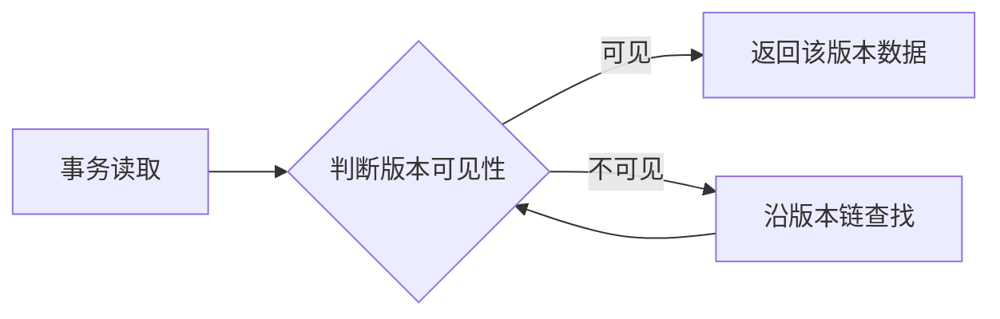
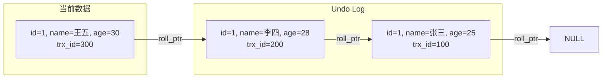
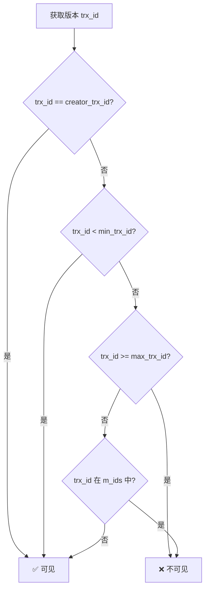
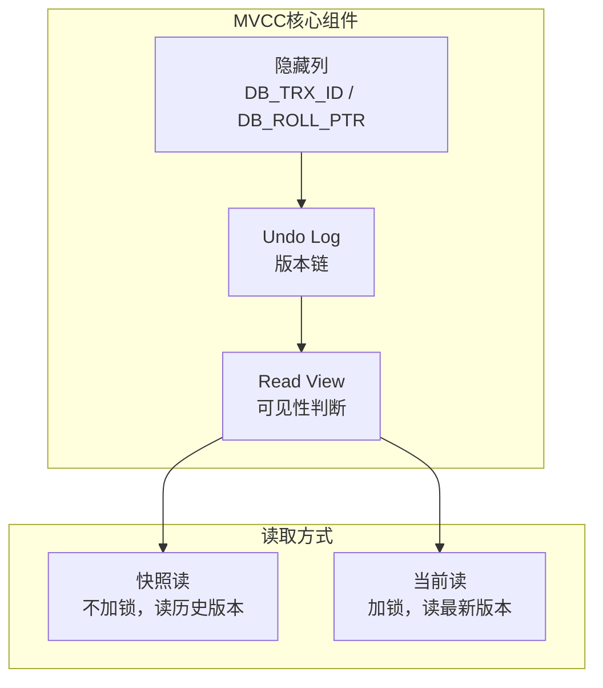
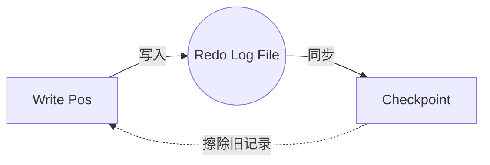
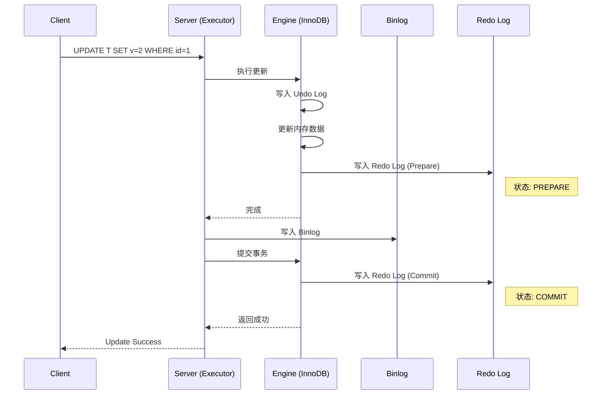

# MySQL 事务处理

> [!TIP] > **数据一致性保障**: 事务是保证数据一致性和完整性的核心机制。理解 ACID 特性、隔离级别和锁机制是掌握 MySQL 的关键。

## 事务基础

### 什么是事务

事务是一组 SQL 操作的集合，要么全部成功，要么全部失败。经典例子：银行转账。

```sql
-- 转账示例
START TRANSACTION;

UPDATE accounts SET balance = balance - 100 WHERE user_id = 1;  -- 扣款
UPDATE accounts SET balance = balance + 100 WHERE user_id = 2;  -- 入账

COMMIT;  -- 提交事务
```

### ACID 特性

#### Atomicity (原子性)

事务是不可分割的最小单位，要么全部成功，要么全部失败。

```sql
START TRANSACTION;

INSERT INTO orders (user_id, amount) VALUES (1, 100);
INSERT INTO order_items (order_id, product_id) VALUES (LAST_INSERT_ID(), 10);

-- 如果任何一条失败，整个事务回滚
ROLLBACK;  -- 或 COMMIT;
```

#### Consistency (一致性)

事务前后，数据保持一致状态。

```sql
-- 转账前后，总金额不变
-- A: 1000, B: 500, Total: 1500
-- A: 900,  B: 600, Total: 1500 (一致)
```

#### Isolation (隔离性)

并发事务之间相互隔离，互不干扰。

```sql
-- 事务1
START TRANSACTION;
UPDATE accounts SET balance = balance - 100 WHERE id = 1;
-- ... 其他操作

-- 事务2 看不到事务1未提交的修改
START TRANSACTION;
SELECT balance FROM accounts WHERE id = 1;  -- 看到原始值
```

#### Durability (持久性)

事务一旦提交，修改永久保存。

```sql
COMMIT;  -- 提交后，即使数据库崩溃，数据也不会丢失
```

## 事务操作

### 开启事务

```sql
-- 方式1：显式开启
START TRANSACTION;
-- 或
BEGIN;

-- 方式2：设置自动提交
SET autocommit = 0;  -- 关闭自动提交
-- 之后每条 SQL 都在事务中
```

### 提交事务

```sql
COMMIT;  -- 提交所有修改
```

### 回滚事务

```sql
ROLLBACK;  -- 撤销所有修改
```

### 保存点

```sql
START TRANSACTION;

INSERT INTO users (username) VALUES ('张三');
SAVEPOINT sp1;  -- 保存点1

INSERT INTO users (username) VALUES ('李四');
SAVEPOINT sp2;  -- 保存点2

INSERT INTO users (username) VALUES ('王五');

ROLLBACK TO sp2;  -- 回滚到保存点2（撤销"王五"）
ROLLBACK TO sp1;  -- 回滚到保存点1（撤销"李四"和"王五"）

COMMIT;  -- 只提交"张三"
```

## 事务隔离级别

### 四大隔离级别

| 隔离级别         | 脏读 | 不可重复读 | 幻读 | 说明                   |
| ---------------- | ---- | ---------- | ---- | ---------------------- |
| READ UNCOMMITTED | ✓    | ✓          | ✓    | 读未提交               |
| READ COMMITTED   | ✗    | ✓          | ✓    | 读已提交               |
| REPEATABLE READ  | ✗    | ✗          | ✓    | 可重复读（MySQL 默认） |
| SERIALIZABLE     | ✗    | ✗          | ✗    | 串行化                 |

### 并发问题

#### 脏读 (Dirty Read)

读取到其他事务未提交的数据。

```sql
-- 事务A
START TRANSACTION;
UPDATE accounts SET balance = 1000 WHERE id = 1;
-- 未提交

-- 事务B（READ UNCOMMITTED）
START TRANSACTION;
SELECT balance FROM accounts WHERE id = 1;  -- 读到1000（脏读）

-- 事务A回滚
ROLLBACK;  -- balance 恢复原值，事务B读到的数据无效
```

#### 不可重复读 (Non-Repeatable Read)

同一事务中，多次读取同一数据结果不同。

```sql
-- 事务A
START TRANSACTION;
SELECT balance FROM accounts WHERE id = 1;  -- 读到500

-- 事务B
START TRANSACTION;
UPDATE accounts SET balance = 1000 WHERE id = 1;
COMMIT;

-- 事务A
SELECT balance FROM accounts WHERE id = 1;  -- 读到1000（不可重复读）
```

#### 幻读 (Phantom Read)

同一事务中，多次查询记录数不同。

```sql
-- 事务A
START TRANSACTION;
SELECT COUNT(*) FROM users WHERE age > 18;  -- 结果：100

-- 事务B
START TRANSACTION;
INSERT INTO users (age) VALUES (20);
COMMIT;

-- 事务A
SELECT COUNT(*) FROM users WHERE age > 18;  -- 结果：101（幻读）
```

### 设置隔离级别

```sql
-- 查看全局隔离级别
SELECT @@global.transaction_isolation;

-- 查看会话隔离级别
SELECT @@transaction_isolation;

-- 设置会话隔离级别
SET SESSION TRANSACTION ISOLATION LEVEL READ COMMITTED;
SET SESSION TRANSACTION ISOLATION LEVEL REPEATABLE READ;
SET SESSION TRANSACTION ISOLATION LEVEL SERIALIZABLE;

-- 设置全局隔离级别
SET GLOBAL TRANSACTION ISOLATION LEVEL REPEATABLE READ;
```

### 隔离级别示例

#### READ UNCOMMITTED

```sql
-- 会话1
SET SESSION TRANSACTION ISOLATION LEVEL READ UNCOMMITTED;
START TRANSACTION;
SELECT balance FROM accounts WHERE id = 1;  -- 500

-- 会话2
START TRANSACTION;
UPDATE accounts SET balance = 1000 WHERE id = 1;  -- 未提交

-- 会话1
SELECT balance FROM accounts WHERE id = 1;  -- 1000（脏读）
```

#### READ COMMITTED

```sql
-- 会话1
SET SESSION TRANSACTION ISOLATION LEVEL READ COMMITTED;
START TRANSACTION;
SELECT balance FROM accounts WHERE id = 1;  -- 500

-- 会话2
START TRANSACTION;
UPDATE accounts SET balance = 1000 WHERE id = 1;
COMMIT;

-- 会话1
SELECT balance FROM accounts WHERE id = 1;  -- 1000（不可重复读，但不是脏读）
```

#### REPEATABLE READ (MySQL 默认)

```sql
-- 会话1
SET SESSION TRANSACTION ISOLATION LEVEL REPEATABLE READ;
START TRANSACTION;
SELECT balance FROM accounts WHERE id = 1;  -- 500

-- 会话2
START TRANSACTION;
UPDATE accounts SET balance = 1000 WHERE id = 1;
COMMIT;

-- 会话1
SELECT balance FROM accounts WHERE id = 1;  -- 仍然是 500（可重复读）
```

## 锁机制

### 锁的分类

#### 按锁粒度分类

- **表锁** - 锁定整张表
- **行锁** - 锁定特定行（InnoDB 支持）
- **页锁** - 锁定数据页

#### 按锁模式分类

- **共享锁 (S 锁)** - 读锁，多个事务可以同时持有
- **排它锁 (X 锁)** - 写锁，独占访问

### 表锁

```sql
-- 加读锁
LOCK TABLES users READ;
SELECT * FROM users;  -- 允许
UPDATE users SET age = 25;  -- 报错（只读）
UNLOCK TABLES;

-- 加写锁
LOCK TABLES users WRITE;
SELECT * FROM users;  -- 允许
UPDATE users SET age = 25;  -- 允许
UNLOCK TABLES;
```

### 行锁 (InnoDB)

#### 共享锁 (S 锁)

```sql
-- 加共享锁
START TRANSACTION;
SELECT * FROM users WHERE id = 1 LOCK IN SHARE MODE;

-- 其他事务可以读，但不能写
-- 其他事务: SELECT * FROM users WHERE id = 1;  -- 成功
-- 其他事务: UPDATE users SET age = 25 WHERE id = 1;  -- 等待
```

#### 排它锁 (X 锁)

```sql
-- 加排它锁
START TRANSACTION;
SELECT * FROM users WHERE id = 1 FOR UPDATE;

-- 其他事务不能读（加锁读）也不能写
-- 其他事务: SELECT * FROM users WHERE id = 1 FOR UPDATE;  -- 等待
-- 其他事务: UPDATE users SET age = 25 WHERE id = 1;  -- 等待
```

#### 意向锁

- **意向共享锁 (IS)**
- **意向排它锁 (IX)**

```sql
-- InnoDB 自动加意向锁
-- 行锁之前先加表级意向锁
```

### 间隙锁 (Gap Lock)

防止幻读，锁定索引范围。

```sql
-- REPEATABLE READ 隔离级别下
START TRANSACTION;
SELECT * FROM users WHERE id BETWEEN 10 AND 20 FOR UPDATE;

-- 锁定 (10, 20) 范围，其他事务无法插入 id=15 的记录
-- 其他事务: INSERT INTO users (id, username) VALUES (15, '张三');  -- 等待
```

### Next-Key Lock

行锁 + 间隙锁，InnoDB 默认使用。

```sql
-- 锁定记录 + 记录前的间隙
START TRANSACTION;
SELECT * FROM users WHERE id >= 10 FOR UPDATE;
-- 锁定 id=10 的记录 + (前一条记录, 10] 的间隙
```

## 死锁

### 什么是死锁

两个或多个事务互相等待对方释放锁，形成循环等待。

```sql
-- 事务A
START TRANSACTION;
UPDATE accounts SET balance = balance - 100 WHERE id = 1;  -- 锁定 id=1
-- 等待锁定 id=2
UPDATE accounts SET balance = balance + 100 WHERE id = 2;

-- 事务B
START TRANSACTION;
UPDATE accounts SET balance = balance - 50 WHERE id = 2;  -- 锁定 id=2
-- 等待锁定 id=1
UPDATE accounts SET balance = balance + 50 WHERE id = 1;

-- 死锁！MySQL 会自动检测并回滚其中一个事务
```

### 查看死锁

```sql
-- 查看最近一次 InnoDB 死锁信息
SHOW ENGINE INNODB STATUS\G

-- 查看锁等待情况
SELECT * FROM performance_schema.data_locks;
SELECT * FROM performance_schema.data_lock_waits;
```

### 避免死锁

> [!IMPORTANT] > **死锁预防策略**:
>
> 1. 按相同顺序访问表和行
> 2. 尽量使用索引访问数据
> 3. 减少事务持有锁的时间
> 4. 使用较低的隔离级别
> 5. 合理设置锁等待超时

```sql
-- 设置锁等待超时
SET innodb_lock_wait_timeout = 50;  -- 50秒

-- 统一访问顺序
-- ✅ 好：按 ID 升序访问
START TRANSACTION;
UPDATE accounts SET balance = balance - 100 WHERE id = 1;
UPDATE accounts SET balance = balance + 100 WHERE id = 2;
COMMIT;

-- ❌ 不好：不同事务按不同顺序访问
-- 事务A: 先1后2
-- 事务B: 先2后1  -- 可能死锁
```

## MVCC (多版本并发控制)

> [!TIP]
> **核心概念**: MVCC（Multi-Version Concurrency Control）是 InnoDB 实现高并发的核心机制，通过保存数据的多个版本，让读写操作互不阻塞。

### MVCC 原理

InnoDB 使用 MVCC 实现非锁定读，提高并发性能：

- **多版本存储** - 每行记录保存多个历史版本
- **版本可见性判断** - 事务根据规则判断哪个版本可见
- **读写不阻塞** - 读操作不加锁，与写操作互不干扰



### 隐藏列

InnoDB 为每行记录自动添加三个隐藏列：

| 隐藏列 | 大小 | 说明 |
|--------|------|------|
| **DB_TRX_ID** | 6 字节 | 最近修改该行的事务 ID |
| **DB_ROLL_PTR** | 7 字节 | 回滚指针，指向 Undo Log 中的前一个版本 |
| **DB_ROW_ID** | 6 字节 | 隐藏主键（仅当表没有主键时生成） |

```sql
-- 实际存储结构示意
-- | id | name | age | DB_TRX_ID | DB_ROLL_PTR | DB_ROW_ID |
-- | 1  | 张三 | 25  | 100       | 0x12345     | 1         |
```

### 版本链与 Undo Log

每次更新记录时，InnoDB 会：

1. 将旧版本写入 Undo Log
2. 用 DB_ROLL_PTR 指向旧版本
3. 形成版本链（链表结构）



**版本链查找过程**：

1. 从最新版本开始
2. 检查该版本对当前事务是否可见
3. 如果不可见，沿 roll_ptr 找上一个版本
4. 直到找到可见版本或到达链尾

### Read View（读视图）

Read View 是事务进行快照读时产生的读视图，用于判断版本可见性。

#### Read View 核心字段

| 字段 | 说明 |
|------|------|
| **m_ids** | 创建 Read View 时，活跃（未提交）的事务 ID 列表 |
| **min_trx_id** | m_ids 中的最小值，小于它的事务都已提交 |
| **max_trx_id** | 创建 Read View 时，系统应分配给下一个事务的 ID |
| **creator_trx_id** | 创建该 Read View 的事务 ID |

#### 可见性判断算法

对于某个数据版本，其 `trx_id` 的可见性判断规则：

```
1. 如果 trx_id == creator_trx_id
   → 可见（自己修改的数据）

2. 如果 trx_id < min_trx_id
   → 可见（该事务在创建 Read View 前已提交）

3. 如果 trx_id >= max_trx_id
   → 不可见（该事务在创建 Read View 后才开始）

4. 如果 min_trx_id <= trx_id < max_trx_id
   → 如果 trx_id 在 m_ids 中：不可见（该事务还未提交）
   → 如果 trx_id 不在 m_ids 中：可见（该事务已提交）
```



#### 可见性判断示例

```sql
-- 假设当前活跃事务：trx_id = 100, 200, 300
-- 事务 300 创建 Read View 时：
--   m_ids = [100, 200, 300]
--   min_trx_id = 100
--   max_trx_id = 301
--   creator_trx_id = 300

-- 判断不同版本的可见性：
-- trx_id = 50  → 50 < 100 → 可见（早已提交）
-- trx_id = 100 → 100 在 m_ids 中 → 不可见（未提交）
-- trx_id = 150 → 150 不在 m_ids 中 → 可见（已提交）
-- trx_id = 300 → 等于 creator_trx_id → 可见（自己的修改）
-- trx_id = 400 → 400 >= 301 → 不可见（未来事务）
```

### 快照读 vs 当前读

MVCC 中有两种读取方式：

| 类型 | 说明 | 是否加锁 | SQL 示例 |
|------|------|----------|----------|
| **快照读** | 读取 Read View 可见的版本 | ❌ 不加锁 | `SELECT * FROM t` |
| **当前读** | 读取最新已提交的版本 | ✅ 加锁 | `SELECT ... FOR UPDATE` |

#### 快照读（Snapshot Read）

普通的 SELECT 语句，不加锁，读取历史版本：

```sql
-- 快照读示例
START TRANSACTION;
SELECT * FROM users WHERE id = 1;  -- 快照读，不加锁
-- 即使其他事务修改了 id=1 的数据并提交，这里仍读取旧版本
```

**特点**：

- 不加任何锁
- 可能读取历史版本
- 并发性能最好
- REPEATABLE READ 下实现可重复读

#### 当前读（Current Read）

需要读取最新数据并加锁的操作：

```sql
-- 当前读示例
SELECT * FROM users WHERE id = 1 LOCK IN SHARE MODE;  -- 加 S 锁
SELECT * FROM users WHERE id = 1 FOR UPDATE;          -- 加 X 锁
UPDATE users SET age = 26 WHERE id = 1;               -- 加 X 锁
DELETE FROM users WHERE id = 1;                       -- 加 X 锁
INSERT INTO users VALUES (...);                       -- 加 X 锁
```

**特点**：

- 读取最新已提交版本
- 会加锁（共享锁或排它锁）
- 其他事务的写操作会被阻塞

#### 快照读与当前读对比示例

```sql
-- 会话 1
START TRANSACTION;  -- 事务开始，此时 age = 25
SELECT age FROM users WHERE id = 1;  -- 快照读：25

-- 会话 2
UPDATE users SET age = 30 WHERE id = 1;
COMMIT;  -- 提交修改

-- 会话 1（继续）
SELECT age FROM users WHERE id = 1;              -- 快照读：25（读历史版本）
SELECT age FROM users WHERE id = 1 FOR UPDATE;  -- 当前读：30（读最新版本）
```

### 不同隔离级别下的 MVCC

MVCC 的行为在不同隔离级别下有所不同：

#### READ COMMITTED (RC)

**每次 SELECT 都创建新的 Read View**：

```sql
-- RC 隔离级别
SET SESSION TRANSACTION ISOLATION LEVEL READ COMMITTED;

START TRANSACTION;  -- trx_id = 100

SELECT * FROM users WHERE id = 1;  -- Read View 1：看到当前已提交的数据

-- 其他事务提交了修改

SELECT * FROM users WHERE id = 1;  -- Read View 2：能看到新提交的数据（不可重复读）
```

**特点**：

- 每次查询都能看到最新已提交的数据
- 存在不可重复读问题
- 不存在脏读问题

#### REPEATABLE READ (RR)

**第一次 SELECT 时创建 Read View，后续复用**：

```sql
-- RR 隔离级别（MySQL 默认）
SET SESSION TRANSACTION ISOLATION LEVEL REPEATABLE READ;

START TRANSACTION;  -- trx_id = 100

SELECT * FROM users WHERE id = 1;  -- 创建 Read View，并复用

-- 其他事务提交了修改

SELECT * FROM users WHERE id = 1;  -- 使用同一个 Read View，结果不变（可重复读）

COMMIT;
```

**特点**：

- 事务内多次读取结果一致
- 解决不可重复读问题
- 通过 Next-Key Lock 解决部分幻读问题

#### RC vs RR 对比示例

```sql
-- 初始数据：users 表 id=1, name='张三', age=25

-- ============ READ COMMITTED ============
-- 会话1 (RC)                          -- 会话2
SET SESSION TRANSACTION ISOLATION      
LEVEL READ COMMITTED;                  
START TRANSACTION;                     
SELECT age FROM users WHERE id=1;      
-- 结果: 25                            
                                       UPDATE users SET age=30 WHERE id=1;
                                       COMMIT;
SELECT age FROM users WHERE id=1;      
-- 结果: 30 (能看到会话2的提交)        

-- ============ REPEATABLE READ ============
-- 会话1 (RR)                          -- 会话2
SET SESSION TRANSACTION ISOLATION      
LEVEL REPEATABLE READ;                 
START TRANSACTION;                     
SELECT age FROM users WHERE id=1;      
-- 结果: 25                            
                                       UPDATE users SET age=30 WHERE id=1;
                                       COMMIT;
SELECT age FROM users WHERE id=1;      
-- 结果: 25 (可重复读，看不到会话2的提交)
```

### MVCC 解决的问题

| 问题 | MVCC 如何解决 |
|------|--------------|
| **脏读** | Read View 只能看到已提交事务的修改 |
| **不可重复读** | RR 级别下复用同一个 Read View |
| **幻读（部分）** | 快照读通过 Read View 解决；当前读通过 Next-Key Lock 解决 |

> [!WARNING]
> **MVCC 的局限性**：MVCC 只能解决快照读的幻读问题。对于当前读（`SELECT ... FOR UPDATE`），需要依赖 Next-Key Lock（间隙锁 + 行锁）来防止幻读。

### MVCC 总结



**MVCC 核心要点**：

1. ✅ 通过 **Undo Log** 保存历史版本，形成版本链
2. ✅ 通过 **隐藏列** 记录事务信息和版本指针
3. ✅ 通过 **Read View** 判断版本可见性
4. ✅ **快照读**不加锁，**当前读**需加锁
5. ✅ **RR** 复用 Read View，**RC** 每次创建新的 Read View

## 事务日志

MySQL 的强大之处不仅在于 SQL 处理，更在于其日志系统保证了数据的安全性和一致性。

### 三大日志对比

| 特性 | Undo Log (回滚日志) | Redo Log (重做日志) | Binlog (归档日志) |
| :--- | :--- | :--- | :--- |
| **作用** | 保证事务**原子性** (Atomicity) | 保证事务**持久性** (Durability) | 数据备份、主从复制 |
| **层级** | 存储引擎层 (InnoDB) | 存储引擎层 (InnoDB) | Server 层 (通用) |
| **内容** | **逻辑日志** (记录相反 SQL) | **物理日志** (记录页修改) | **逻辑日志** (SQL / 数据行) |
| **写入时机**| 事务进行中，甚至提交前 | 事务提交时 (Write-Ahead Log) | 事务提交时 |
| **释放** | 事务提交后 (MVCC 需保留) | 事务落盘后 | 设置的过期时间后 |

### Undo Log (回滚日志)

Undo Log 记录了事务修改数据的"反向操作"。

- **原子性保障**：如果事务执行失败或调用 ROLLBACK，MySQL 利用 Undo Log 将数据恢复到事务开始前的状态。
- **MVCC 支撑**：在 MVCC 中，Undo Log 存储了数据的历史版本（版本链），使得不同事务可以读取到不同时间点的数据快照。

```sql
-- 示例：Undo Log 逻辑
-- 执行：UPDATE users SET age = 20 WHERE id = 1;
-- 记录：UPDATE users SET age = 19 WHERE id = 1; (反向操作)
```

### Redo Log (重做日志)

Redo Log 是 InnoDB 特有的日志，用于保证 Crash-Safe 能力。

- **物理日志**：记录的是"在某个数据页上做了什么修改"。
- **WAL 技术**：Write-Ahead Logging，先写日志，再写磁盘。即便数据库异常重启，通过 Redo Log 也能恢复未落盘的数据。
- **循环写入**：Redo Log 文件组是固定大小的，循环写入。当写满时，需要将 Checkpoint 推进，强制将脏页刷新到磁盘。



### Binlog (二进制日志)

Binlog 记录了数据库所有 DDL 和 DML 语句（除了查询语句）。

- **主从复制**：从库通过读取主库的 Binlog 来同步数据。
- **数据恢复**：通过 mysqlbinlog 工具可以恢复数据到任意时间点。
- **格式**：
  - `STATEMENT`：记录 SQL 语句 (可能造成主从不一致，如 `rand()`)
  - `ROW`：记录每行数据的具体变更 (最安全，但日志量大)
  - `MIXED`：混合模式

### 写入流程 & 两阶段提交 (2PC)

为了保证 Redo Log 和 Binlog 的一致性，MySQL 使用了**两阶段提交 (Two-Phase Commit)**。

如果不使用 2PC：
- 先写 Redo 即使 Crash：Redo 有记录，Binlog 无 -> 主库有数据，从库丢失。
- 先写 Binlog 即使 Crash：Binlog 有记录，Redo 无 -> 主库没数据，从库多数据。

#### 2PC 流程详解



1. **Prepare 阶段**：Engine 将事务写入 Redo Log，并标记为 `PREPARE` 状态。
2. **Binlog 阶段**：Server 将事务写入 Binlog。
3. **Commit 阶段**：Server 通知 Engine 提交，Engine 将 Redo Log 标记为 `COMMIT` 状态。

**崩溃恢复规则**：
- 如果有 Binlog 且完整 -> 提交事务
- 如果没有 Binlog 或不完整 -> 回滚事务

## 最佳实践

### 事务使用规范

> [!IMPORTANT] > **事务最佳实践**:
>
> 1. 保持事务简短，减少锁持有时间
> 2. 避免在事务中执行耗时操作（如网络请求）
> 3. 合理选择隔离级别（一般用默认的 REPEATABLE READ）
> 4. 使用索引访问数据，减少锁范围
> 5. 统一访问顺序，避免死锁
> 6. 及时提交或回滚事务

### 示例：规范的事务处理

```sql
-- ✅ 好的事务
START TRANSACTION;
-- 1. 快速执行
UPDATE accounts SET balance = balance - 100 WHERE user_id = 1;
UPDATE accounts SET balance = balance + 100 WHERE user_id = 2;
-- 2. 及时提交
COMMIT;

-- ❌ 不好的事务
START TRANSACTION;
-- 1. 耗时操作
SELECT * FROM large_table;  -- 全表扫描
-- 2. 外部调用
-- 调用外部 API（网络延迟）
-- 3. 长时间持有锁
-- ... 其他操作
COMMIT;
```

### 错误处理

```sql
-- 使用存储过程处理事务和错误
DELIMITER //

CREATE PROCEDURE transfer_money(
    IN from_user_id INT,
    IN to_user_id INT,
    IN amount DECIMAL(10,2)
)
BEGIN
    DECLARE EXIT HANDLER FOR SQLEXCEPTION
    BEGIN
        ROLLBACK;  -- 发生错误时回滚
    END;

    START TRANSACTION;

    UPDATE accounts SET balance = balance - amount WHERE user_id = from_user_id;
    UPDATE accounts SET balance = balance + amount WHERE user_id = to_user_id;

    COMMIT;  -- 成功时提交
END//

DELIMITER ;
```

## 总结

本文详细介绍了 MySQL 事务处理：

- ✅ ACID 特性：原子性、一致性、隔离性、持久性
- ✅ 事务操作：BEGIN、COMMIT、ROLLBACK、SAVEPOINT
- ✅ 隔离级别：READ UNCOMMITTED、READ COMMITTED、REPEATABLE READ、SERIALIZABLE
- ✅ 锁机制：表锁、行锁、间隙锁、Next-Key Lock
- ✅ 死锁检测和避免
- ✅ MVCC 多版本并发控制
- ✅ 事务日志：Undo Log、Redo Log、Binlog

掌握事务处理后，可以继续学习 [性能优化](/docs/mysql/performance-optimization)！
