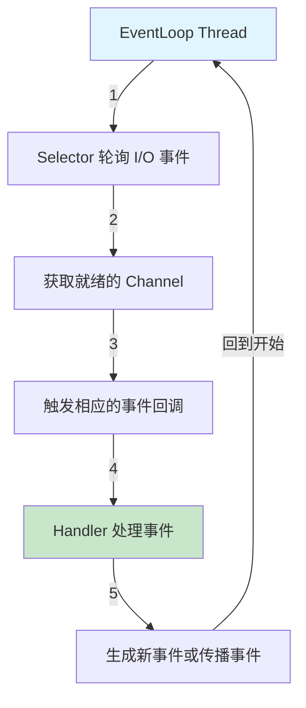
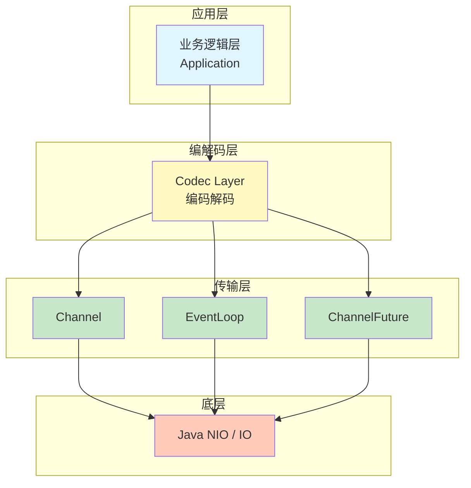
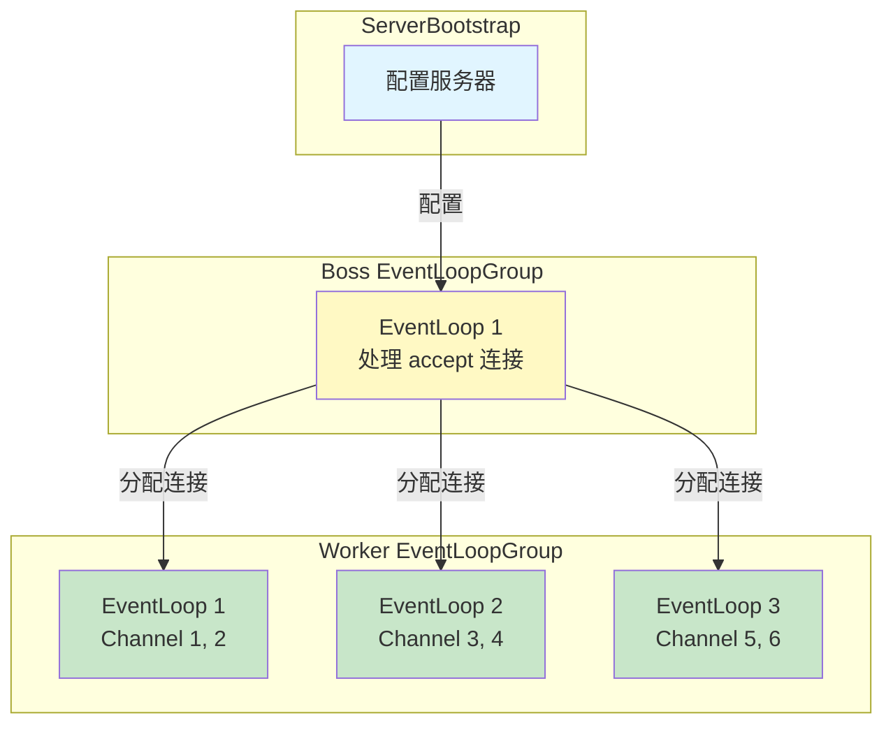
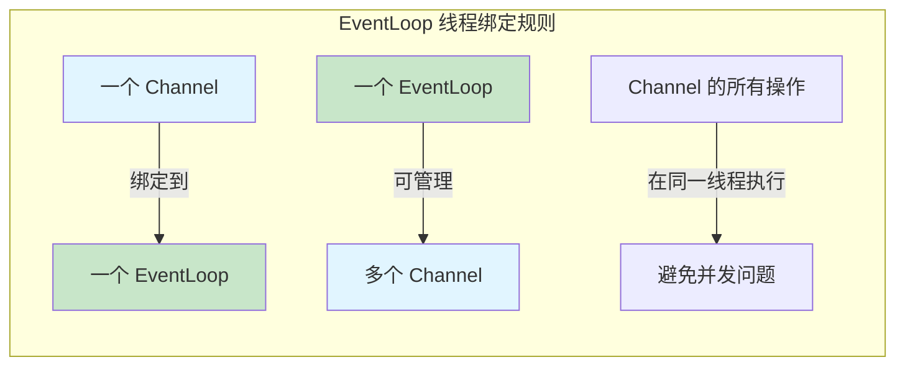

# Netty 基础概念

## NIO 基础

Netty 是建立在 Java NIO（非阻塞 I/O）之上的，理解 NIO 是学习 Netty 的前提。

### 阻塞 I/O vs 非阻塞 I/O

#### 传统阻塞 I/O (BIO)

```java
// 线程阻塞在 read 操作，直到有数据可读
ServerSocket serverSocket = new ServerSocket(8080);
Socket socket = serverSocket.accept(); // 阻塞
InputStream input = socket.getInputStream();
byte[] buffer = new byte[1024];
int read = input.read(buffer); // 阻塞，等待数据
```

**问题：**

- 每个连接需要一个线程
- 线程数受限，内存消耗大
- 大量连接时性能下降

#### NIO 非阻塞 I/O

```java
// 使用 Selector 监听多个 Channel
ServerSocketChannel serverChannel = ServerSocketChannel.open();
serverChannel.configureBlocking(false);
serverChannel.bind(new InetSocketAddress(8080));

Selector selector = Selector.open();
serverChannel.register(selector, SelectionKey.OP_ACCEPT);

while (true) {
    int readyChannels = selector.select(); // 阻塞在这里，但可处理多个连接
    if (readyChannels == 0) continue;

    Set<SelectionKey> selectedKeys = selector.selectedKeys();
    Iterator<SelectionKey> iterator = selectedKeys.iterator();
    
    while (iterator.hasNext()) {
        SelectionKey key = iterator.next();
        if (key.isAcceptable()) {
            // 处理新连接
        } else if (key.isReadable()) {
            // 处理可读
        }
        iterator.remove();
    }
}
```

**优势：**

- 一个线程可处理多个连接
- 充分利用 CPU 资源
- 扩展性好

## 事件驱动模型

Netty 采用事件驱动的异步模型：



> [!TIP]
> **事件驱动的优势:**
>
> - 非阻塞处理,提高吞吐量
> - 单线程处理多个连接
> - 简化并发编程模型

### 事件类型

- **I/O 事件** - channelRead、channelReadComplete、write、flush
- **连接事件** - channelActive、channelInactive
- **异常事件** - exceptionCaught
- **用户事件** - userEventTriggered

## Netty 核心架构

### 分层架构



### 核心概念图解



## 异步和 Future

Netty 中的异步操作返回 `ChannelFuture`：

```java
// 异步操作立即返回 Future
ChannelFuture future = bootstrap.bind(port);

// 方式1：添加监听器
future.addListener(f -> {
    if (f.isSuccess()) {
        System.out.println("绑定成功");
    } else {
        System.out.println("绑定失败: " + f.cause());
    }
});

// 方式2：同步等待
try {
    future.sync();
    System.out.println("绑定成功");
} catch (InterruptedException e) {
    System.out.println("被中断");
}

// 方式3：检查完成状态
if (future.isDone()) {
    if (future.isSuccess()) {
        System.out.println("成功");
    } else {
        future.cause().printStackTrace();
    }
}
```

### ChannelFuture 与 CompletableFuture

```java
// Netty ChannelFuture - 针对 Channel 操作优化
ChannelFuture writeFuture = ctx.writeAndFlush(msg);

// Java CompletableFuture - 更灵活的异步编程
CompletableFuture.supplyAsync(() -> {
    return getData();
}).thenApply(data -> {
    return processData(data);
}).exceptionally(ex -> {
    return defaultValue;
});
```

## 线程模型

### 线程分配策略

```java
// 方式1：共享线程池（不推荐）
EventLoopGroup group = new NioEventLoopGroup();
ServerBootstrap bootstrap = new ServerBootstrap();
bootstrap.group(group); // Boss 和 Worker 使用同一个 EventLoopGroup

// 方式2：分离线程池（推荐）
EventLoopGroup bossGroup = new NioEventLoopGroup(1); // 处理 accept
EventLoopGroup workerGroup = new NioEventLoopGroup(0); // 处理读写，0表示2*CPU核心数
ServerBootstrap bootstrap = new ServerBootstrap();
bootstrap.group(bossGroup, workerGroup);
```

> [!IMPORTANT]
> **为什么要分离 Boss 和 Worker？**
>
> - Boss 只负责接受新连接,数量通常为 1 即可
> - Worker 负责数据读写,需要多个线程并发处理
> - 分离可以避免连接处理影响数据处理性能

### 线程绑定规则



**重要原则：**

- ✅ 不要阻塞 EventLoop 线程
- ✅ 提交耗时任务到独立线程池
- ✅ 使用 `ctx.executor().execute()` 异步执行

```java
public class MyHandler extends ChannelInboundHandlerAdapter {
    @Override
    public void channelRead(ChannelHandlerContext ctx, Object msg) {
        // ✓ 正确：在独立线程执行耗时操作
        ctx.executor().execute(() -> {
            try {
                TimeUnit.SECONDS.sleep(1);
                ctx.write(msg);
                ctx.flush();
            } catch (InterruptedException e) {
                Thread.currentThread().interrupt();
            }
        });

        // ✗ 错误：阻塞 EventLoop 线程
        // Thread.sleep(1000);
        // ctx.write(msg);
    }
}
```

## 总结

| 概念 | 说明 |
|------|------|
| **NIO** | Java 非阻塞 I/O，Netty 的基础 |
| **事件驱动** | 基于事件的异步处理模型 |
| **[EventLoop](/docs/netty/core-components#eventloop)** | 处理 I/O 和任务的线程实体 |
| **[Channel](/docs/netty/core-components#channel)** | 客户端/服务器连接的抽象 |
| **[Pipeline](/docs/netty/core-components#channelpipeline)** | 处理链，串联多个 Handler |
| **Handler** | 处理具体业务逻辑的组件 |
| **ChannelFuture** | 异步操作的结果占位符 |
| **非阻塞** | 一个线程处理多个连接 |

---
[下一章：核心组件](/docs/netty/core-components)
